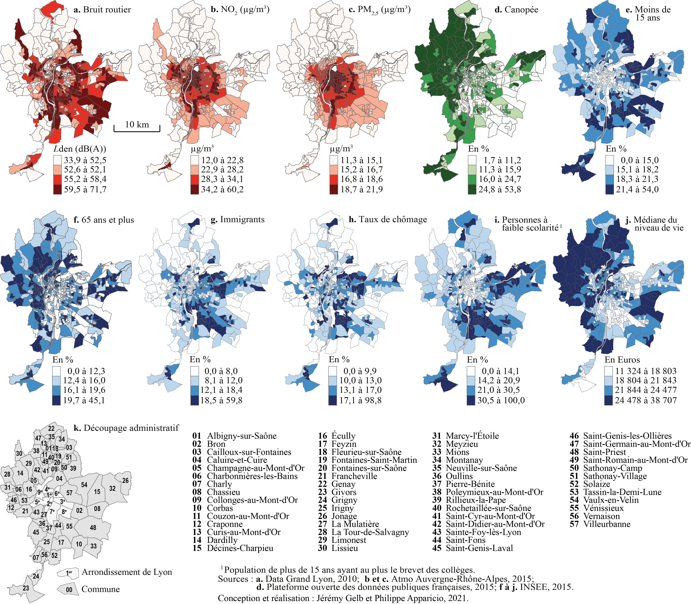
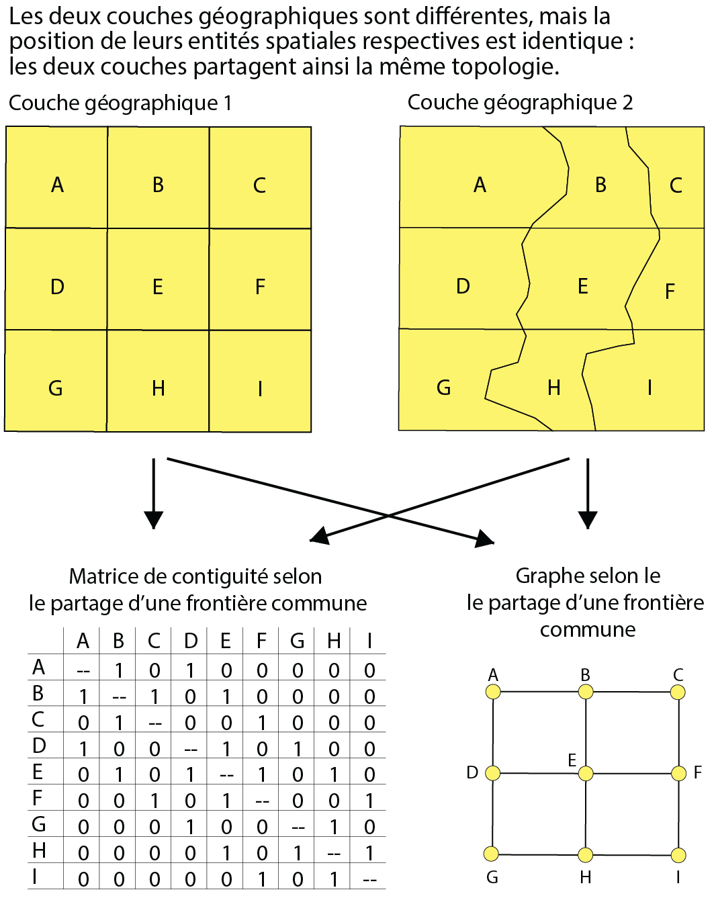
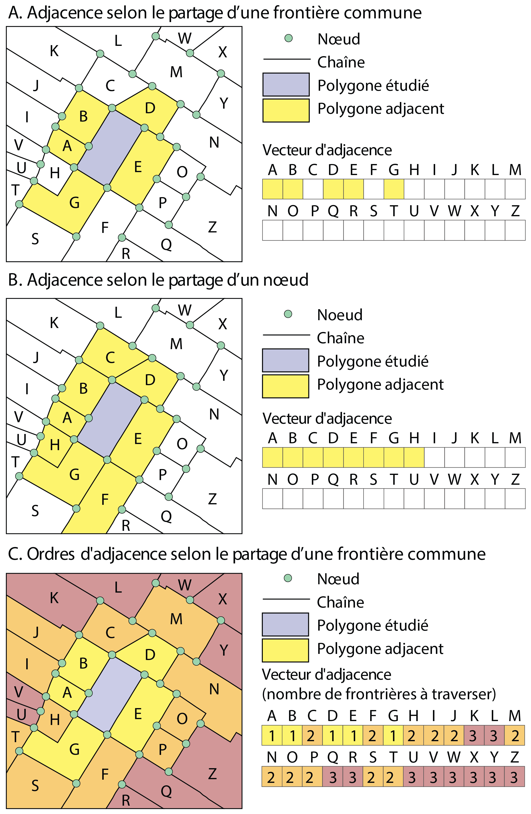
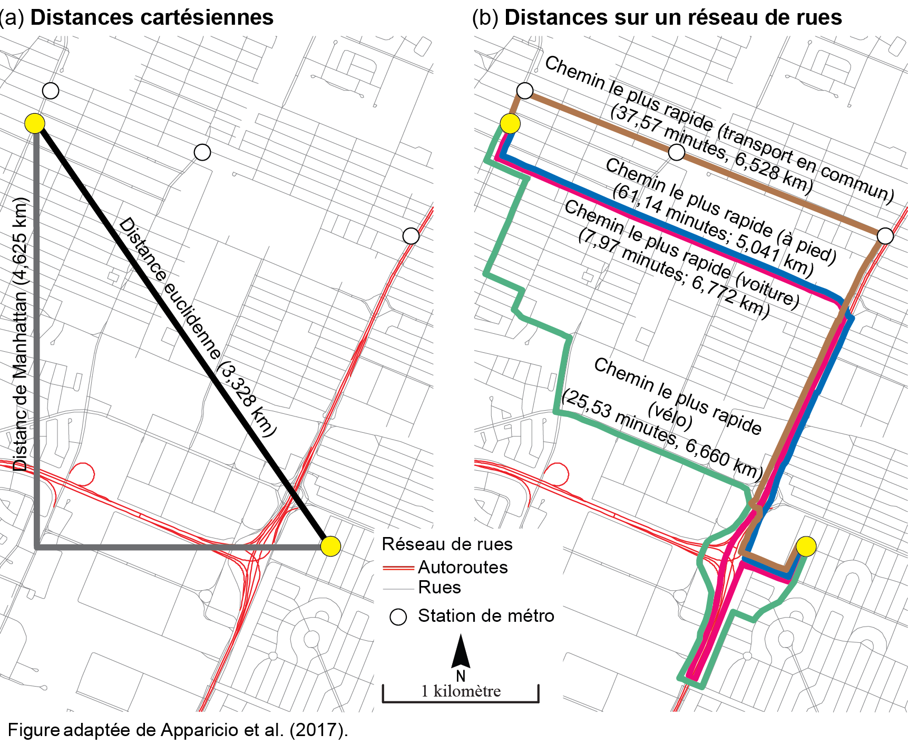
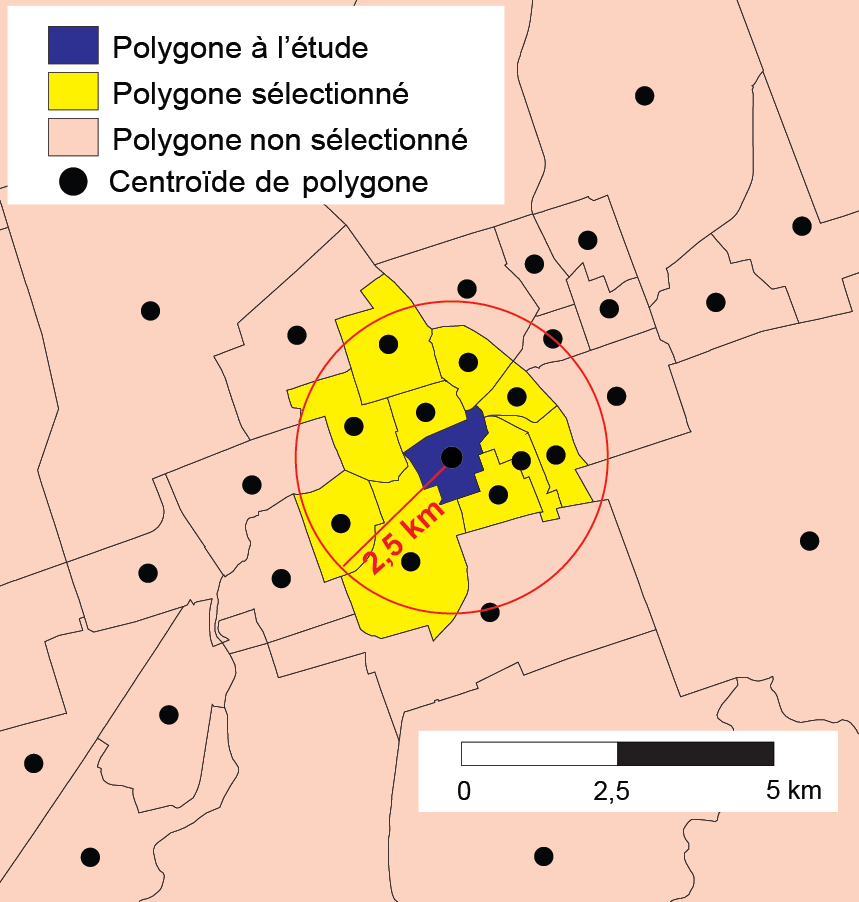
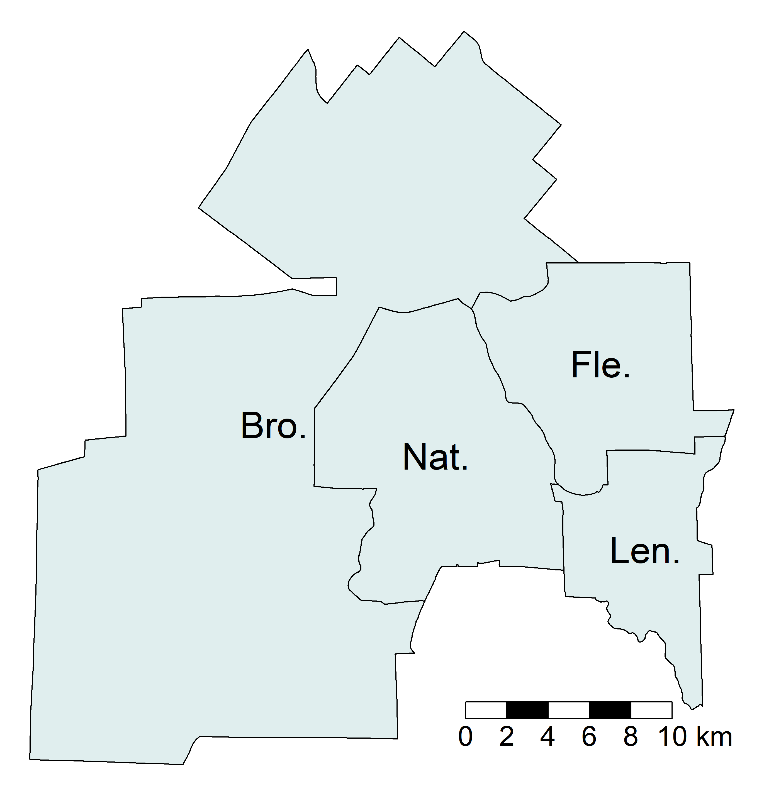
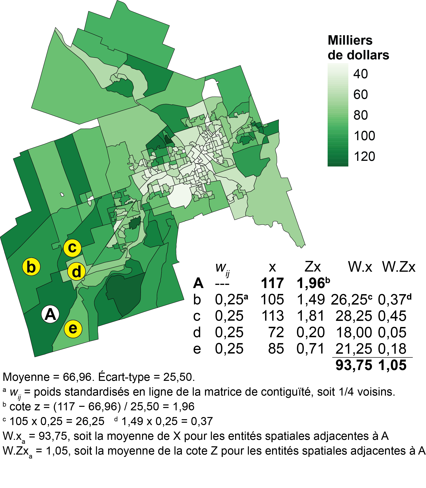

# Autocorrélation spatiale, dépendance spatiale et hétérogénéité spatiale d'un modèle de régression {#sec-chap01}

Avant d'explorer les différents types de régressions spatiales dans les chapitres suivants, il est primordial de comprendre plusieurs notions clés, comme l'autocorrélation spatiale, la dépendance spatiale et l'hétérogénéité spatiale. Aussi, de nombreuses méthodes de régression spatiale s'appuient sur l'utilisation de matrices de pondération spatiale. Nous proposons également un bref rappel sur la régression linéaire multiple.

::: bloc_objectif
::: bloc_objectif-header
::: bloc_objectif-icon
:::

**Objectifs d'apprentissage visés dans ce chapitre**
:::

::: bloc_objectif-body
À la fin de ce chapitre, vous devriez être en mesure de :

-   Connaître les principales matrices de pondérations spatiales.
-   Maîtriser les notions d'autocorrélation spatiale, de dépendance spatiale et d'hétérogénéité spatiale.
-   Comprendre la notion de variable spatialement décalée.
-   Calculer une mesure d'autocorrélation spatiale globale (*I* de Moran) dans R.
-   Évaluer la dépendance spatiale d'un modèle de régression multiple en calculant le *I* de Moran sur ses résidus.
:::
:::

::: bloc_package
::: bloc_package-header
::: bloc_package-icon
:::

**Liste des *packages* utilisés dans ce chapitre**
:::

::: bloc_package-body
-   Pour importer et manipuler des fichiers géographiques :
    -   `sf` pour importer et manipuler des données vectorielles.
-   Pour cartographier des données :
    -   `ggplot2` et `ggpubr` pour construire des graphiques.
    -   `tmap` pour construire des cartes thématiques.
    -   `RColorBrewer` pour construire une palette de couleur.
 -   Pour les mesures d'autocorrélation spatiale :
    -   `spdep` pour construire des matrices de pondération spatiales et calculer le *I* de Moran.
:::
:::

## Description des jeux de données utilisés dans le manuel {#sec-011}

Plusieurs jeux de données sont utilisés dans ce livre et sont déjà structurés et disponibles au format `.Rdata`.

::: bloc_attention
::: bloc_attention-header
::: bloc_attention-icon
:::

**Manipulation, structuration et cartographie de données spatiales**
:::

::: bloc_attention-body
Ce livre n'a pas pour objectif de traiter la phase préparatoire consistant à structurer les données spatiales dans R avant l'application de modèles de régression spatiale. Nous partons du principe que les lectrices et lecteurs maîtrisent déjà l'utilisation des *packages* `sf` et `tmap` pour manipuler, structurer et cartographier des données spatiales. Si ce n'est pas le cas, nous vous encourageons à consulter le chapitre intitulé [*Manipulation des données spatiales dans R*](https://serieboldr.github.io/MethodesAnalyseSpatiale/01-ManipulationDonneesSpatiales.html) [@RBoldAirMethodesAnalysesSpatiales].
:::
:::

### Jeu de données sur l'agglomération de Lyon {#sec-0111}

Premièrement, nous utiliserons le jeu de données spatiales `LyonIris` du *package* `geocmeans`. Ce jeu de données spatiales pour l'agglomération lyonnaise (France) comprend dix variables, dont quatre environnementales (EN) et six socioéconomiques (SE), pour les îlots regroupés pour l'information statistique (IRIS) de l'agglomération lyonnaise (@tbl-datageocmeans et @fig-datacarto).

{#fig-datacarto width="100%" fig-align="center"}

```{r}
#| label: tbl-datageocmeans
#| tbl-cap: Statistiques descriptives du jeu de données LyonIris
#| echo: false
#| message: false
#| warning: false
#| eval: true
library(sf)
load("data/Lyon.Rdata")
Data <- st_drop_geometry(LyonIris)
Data <-  Data[c("Lden","NO2","PM25","VegHautPrt",
                        "Pct0_14","Pct_65","Pct_Img",
                        "TxChom1564","Pct_brevet","NivVieMed")]

intitule <- c("Bruit routier (Lden dB(A))",
              "Dioxyde d'azote (ug/m^3^)",
              "Particules fines (PM$_{2,5}$)",
              "Canopée (%)",
              "Moins de 15 ans (%)",
              "65 ans et plus (%)",
              "Immigrants (%)",
              "Taux de chômage",
              "Personnes à faible scolarité (%)",
              "Médiane du niveau de vie (milliers d'euros)")

stats <- data.frame(variable = names(Data),
                    nom = intitule,
                    type = c("EN","EN","EN","EN","SE","SE","SE","SE","SE","SE"),
                    moy = round(sapply(Data, mean),2),
                    et = round(sapply(Data, sd),2),                    
                    minimum =round(sapply(Data, min),2), 
                    maximum =round(sapply(Data, max),2)
                    )
knitr::kable(stats,
			digits = 1,
			row.names = FALSE,
			format.args = list(decimal.mark = ',', big.mark = " "),
			col.names=c("Nom","Intitulé","Type","Moy.", "E.-T.", "Min.", "Max."),
			align= c("l","l", "c", "r", "r", "r", "r"),
			format = "markdown")
```

### Jeu de données sur la région métropolitaine de Montraéal {#sec-0112}

Deuxièmement, nous utiliserons un jeu de données spatiales sur les parts modales dans la région de Montréal extraites du recensement de 2021 de Statistique Canada pour la région métropolitaine de Montréal (@tbl-Mtl). En guise d'exemple, les proportions des navetteurs utilisant respectivement le transport en commun et l'automobile par secteur de recensement sont présentées à la @fig-datamtlCarto.

```{r}
#| label: tbl-Mtl
#| tbl-cap: Statistiques descriptives du jeu de données sur Montréal
#| echo: false
#| message: false
#| warning: false
#| eval: true
 
# data_mtl <- st_read('data/chap06/data_sr_access.gpkg', quiet = TRUE)
# data_mtl <- data_mtl %>%
#  mutate(
#    prt_tc = mode_tc / total_commuters,
#    prt_auto = mode_auto / total_commuters,
#    revenu_median = revenu_median / 1000,
#    prt_actif = (mode_pieton + mode_velo) / total_commuters,
#  ) %>%
#  filter(!is.na(prt_tc)) %>%
#  st_transform(32188)
# save(data_mtl, file="data/Mtl.Rdata")

load("data/Mtl.Rdata")
Data <- st_drop_geometry(data_mtl)
Data[, c("GeoUID", "Households", "Dwellings", 
         "Population", "acs_idx_emp_tc_offpeak")] <- list(NULL)
intitule <- c("Proportion de familles monoparentales",
              "Proportion de minorités visibles",
              "Proportion de chômeurs",
              "Proportion de personnes à faible revenu",
              "Revenu médian à faible revenu",
              "Habitants au km2",
              "Transports en commun (effectifs)",
              "Automobile (effectifs)",
              "Marche (effectifs)",
              "Vélo (effectifs)",
              "Total navetteurs (effectifs)",
              "Accessibilité aux emplois en heure de pointe à vélo",             
              "Accessibilité aux emplois en heure de pointe en transport collectif",
              "Accessibilité aux emplois en heure de pointe à la marche",             
              "Proportion de navetteurs en transport en commun",
              "Proportion de navetteurs en auto",
              "Proportion de naveteurs en transport actif (vélo et marche)"
              )

stats <- data.frame(variable = names(Data),
                    nom = intitule,
                    moy = round(sapply(Data, mean),2),
                    et = round(sapply(Data, sd),2)
                    )
knitr::kable(stats,
			digits = 1,
			row.names = FALSE,
			format.args = list(decimal.mark = ',', big.mark = " "),
			col.names=c("Nom","Intitulé","Moy.", "E.-T."),
			align= c("l","l", "r", "r"),
			format = "markdown")

```

```{r}
#| echo: false 
#| message: false 
#| eval: true
#| warning: false
#| label: fig-datamtlCarto
#| fig-cap: Parts modales de tranport en commun et de l'automobile (proportion)
#| fig-align: center
library(tmap, quietly = TRUE)
legend_parameters <- list(text.separator = "à",
                     decimal.mark = ",", 
                     big.mark = " ",
                     digits = 2)

carte1 <- tm_shape(data_mtl) +
          tm_fill(col="prt_tc", 
                  n = 5, 
                  palette = "Reds",
                  style = "quantile",
                  legend.format = legend_parameters,
                  title = 'Transport en commun') +
           tm_layout(frame=FALSE, legend.outside = TRUE)

carte2 <- tm_shape(data_mtl) +
          tm_fill(col="prt_auto", 
                  n = 5, 
                  palette = "Reds",
                  style = "quantile",
                  legend.format = legend_parameters,
                  title = 'Automobile') +
           tm_layout(frame=FALSE, legend.outside = TRUE)

carte3 <- tm_shape(data_mtl) +
          tm_fill(col="prt_actif", 
                  n = 5, 
                  palette = "Reds",
                  style = "quantile",
                  legend.format = legend_parameters,
                  title = 'Transport actif') +
           tm_layout(frame=FALSE, legend.outside = TRUE) + 
           tm_scale_bar(breaks = c(0,10))
          
tmap_arrange(carte1, carte2, carte3, ncol=2, nrow=2)
```

### Jeu de données sur Barcelone {#sec-0113}

```{r}
#| echo: false
#| message: false
#| warning: false
load("data/Bcn.RData")
```

### Jeu de données sur la densité pour six villes espagnoles {#sec-0114}

```{r}
#| echo: false
#| message: false
#| warning: false
load("data/Density.RData")

```

### Jeu de données sur la densité pour six régions métropolitaines espagnoles {#sec-0115}

```{r}
#| echo: false
#| message: false
#| warning: false
load("data/ProbitData.RData")

```

## Matrices des pondérations spatiales {#sec-012}

::: bloc_objectif
::: bloc_objectif-header
::: bloc_objectif-icon
:::

**Utilité des matrices de pondérations spatiales**
:::

::: bloc_objectif-body
Ces matrices permettent de définir les relations spatiales entre les entités spatiales d'une couche géographique, et plus spécifiquement la manière de mesurer leur relation d'adjacence (voisinage) ou de proximité (distance). Nous verrons qu'elles sont largement utilisées dans les régressions spatiales, notamment dans les modèles d'économétrie spatiale abordées dans la seconde partie du livre. Elles sont aussi nécessaires au calcul des mesures d'autocorrélation globales ou locales [section @sec-0142] et à la construction des variables spatialement décalées [section @sec-013].
:::
:::

Il existe huit principales matrices de pondération spatiale regroupées en deux grandes catégories : celles de contiguïté (basées sur l'adjacence) et celles de proximité (basées sur la distance) (@tbl-TabMatricesSpatiales). Lorsque la couche géographique est composée de points, seules les matrices de proximité peuvent être utilisées.

```{r}
#| label: tbl-TabMatricesSpatiales
#| tbl-cap: Matrices de pondération spatiale selon la géométrie
#| echo: false
#| message: false
#| warning: false

df1 <- data.frame(
  Matrice = c("Partage d'un nœud (Queen)", 
              "Partage d'un segment (Rook)",
              "Partage d'un nœud et ordre d'adjacence (Queen)", 
               "Partage d'un segment et ordre d'adjacence (Rook)",
              
               "Connectivité selon la distance",
               "Inverse de la distance",
               "Inverse de la distance au carré",
               "Nombre de plus proches voisins"),
  Points  = c(" ", " ", " ", "", "X", "X", "X", "X"),
  Lignes = c("X", "X", "X", "X", "X", "X", "X", "X"),
  Polyg = c("X", "X",  "X", "X", "X", "X", "X", "X"),
  Raster = c("X", "X", "X", "X", "X", "X", "X", "X")
)

my_table <- knitr::kable(df1,
           format.args = list(decimal.mark = ',', big.mark = " "),
		   col.names = c("Matrice", "Points", "Lignes", "Polyg.", "Raster"),
           align=c("l", "c", "c", "c", "c"))
   
kableExtra::pack_rows(my_table,
						index = c(
						"Matrices de contiguïté (basées sur l'adjacence)" = 4,
						"Matrices de proximité (basées sur la distance)" = 4))
```

### Matrices de contiguïté {#sec-0121}

La relation d'adjacence (de contiguïté) vise à déterminer si deux entités spatiales sont ou non voisines selon le partage soit d'un nœud, soit d'un segment (frontière commune). La contiguïté est liée à la notion de topologie qui prend en compte les relations de voisinage entre des entités spatiales, sans tenir compte de leurs tailles et de leurs formes géométriques. Elle peut être représentée à partir d'une **matrice de contiguïté** (avec une valeur de 1 quand deux entités sont voisines et de 0 pour une situation inverse) ou d'un **graphe** (formé de points représentant les entités spatiales et de lignes reliant les entités voisines) (@fig-Chap02Contiguity1).

{#fig-Chap02Contiguity1 width="55%" fig-align="center"}

Trois évaluations de la contiguïté sont représentées à la @fig-Chap01Contiguity2 :

-   **Adjacence selon le partage d'un segment**, soit d'une frontière commune entre les polygones (A).

-   **Adjacence selon le partage d'un nœud** (B).

-   **Ordre d'adjacence selon le partage d'un segment** (C). L'ordre d'adjacence indique le nombre de frontières à traverser pour se rendre à l'entité spatiale contiguë, soit :

    -   **Ordre 1** : une frontière à traverser pour se rendre dans l'entité spatiale adjacente.

    -   **Ordre 2** : deux frontières à traverser pour atteindre les entités de la deuxième couronne.

    -   **Ordre 3** : trois frontières à traverser pour atteindre les entités de la troisième couronne.

    -   Etc.

Bien entendu, les ordres d'adjacence peuvent être également définis selon le partage d'un nœud commun.

{#fig-Chap01Contiguity2 width="60%" fig-align="center"}

Habituellement appelée $W$, la matrice de contiguïté est binaire selon le partage tant d'un nœud (*Queen* en anglais) (@eq-ContiguiteQueen) que d'un segment commun (*Rook* en anglais) (@eq-ContiguiteRook).

$$
 w_{ij} = 
 \begin{cases} 
   1 & \text{si les entités spatiales }i \text{ et }j \text{ ont au moins un nœud commun; } i   \ne j\\
   0 & \text{sinon} 
  \end{cases}
$$ {#eq-ContiguiteQueen}

$$ 
 w_{ij} = 
 \begin{cases} 
   1 & \text{si les entités spatiales }i \text{ et }j \text{ partagent une frontière commune; } i   \ne j\\
   0 & \text{sinon} 
  \end{cases}
$$ {#eq-ContiguiteRook}

### Matrices de proximité {#sec-0122}

Pour construire une matrice de pondération spatiale selon la proximité, nous pouvons utiliser plusieurs types de distance [@ApparicioGelbrevisited] : certaines sont cartésiennes, d'autres, dites réticulaires, sont calculées à partir d'un réseau de rues (@fig-Chap01TypesDistances).

Les distances cartésiennes -- euclidienne et de Manhattan (@eq-DistEuc et @eq-DistManh) -- sont facilement calculables à partir des coordonnées géographiques (*x*,*y*) lorsque la couche géographique est dans un système de projection plane (@fig-Chap01TypesDistances, a). Si la projection de la couche est sphérique (longitude/latitude), il convient d'utiliser la formule de haversine (basée sur la trigonométrie sphérique) pour obtenir la distance à vol d'oiseau (@eq-DistLongLat).

Par contre, comme leurs noms l'indiquent, le calcul des distances réticulaires (@fig-Chap01TypesDistances, b) nécessite d'avoir un réseau de rues dans un système d'information géographique (par exemple, l'extension *Network Analyst* d'ArcGIS Pro) ou dans R (notamment avec le *package* R5R) pour calculer le chemin le plus rapide (voir le chapitre intitulé [*Mesures d'accessibilité spatiale selon différents modes de transport*](https://serieboldr.github.io/MethodesAnalyseSpatiale/05-AnalyseReseau.html) [@RBoldAirMethodesAnalysesSpatiales]).

$$
 d_{ij} = \sqrt{(x_i-x_j)^2+(y_i-y_j)^2}
$$ {#eq-DistEuc}

$$
 d_{ij} = \lvert x_i-x_j \rvert + \lvert y_i-y_j \rvert
$$ {#eq-DistManh}

$$
 d_{ij} = 2R \cdot \text{ arcsin} \left( \sqrt{\text{sin}^2 \left( \frac{\delta _i - \delta _j}{2} \right) + \text{cos }\delta _i \cdot \text{cos }\delta _j \cdot \text{sin}^2 \left( \frac{\phi _i - \phi _j}{2} \right)} \right)
$$ {#eq-DistLongLat}

avec $R$ étant le rayon de la terre; $\delta _i$ et $\delta _j$ les coordonnées de longitude pour les points $i$ et $j$; $\phi _i$ et $\phi _j$ les coordonnées de latitude pour les points $i$ et $j$.

{#fig-Chap01TypesDistances width="80%" fig-align="center"}

#### Matrice de distance binaire (de connectivité) {#sec-01221}

À partir d'une matrice de distance entre les entités spatiales d'une couche géographique, il est possible de créer une matrice de pondération binaire (@eq-MatriceDistanceNonBinaire). Ce type de matrice est habituellement appelée **matrice de connectivité**. Il convient alors de fixer un seuil de distance maximal. Par exemple, avec un seuil de 500 mètres, $w_{ij}=1$ si la distance entre les entités spatiales $i$ et $j$ est inférieure ou égale à 500 mètres; sinon $w_{ij}=0$. Notez que pour des lignes et des polygones, la distance est habituellement calculée à partir de leurs centroïdes.

$$
 w_{ij} = 
 \begin{cases} 
   1 & \text{si }d_{ij}\leq{\bar{d}}\text{; } i \ne j\\
   0 & \text{sinon} 
  \end{cases}
$$ {#eq-MatriceDistanceNonBinaire}

avec $d_{ij}$ étant la distance entre les entités spatiales $i$ et $j$, et $\bar{d}$ étant un seuil de distance maximal fixé par la personne utilisatrice (par exemple, 500 mètres).

En guise d'exemple, à la @fig-Connectivite, seuls les polygones jaunes seraient considérés comme voisins du polygone bleu avec un seuil de distance maximal fixé à 2,5 kilomètres (valeur de 1); les roses se verraient affecter la valeur de 0.

{#fig-Connectivite width="50%" fig-align="center"}

#### Matrices basées sur la distance {#sec-01222}

Une fois les distances calculées entre les entités spatiales, les pondérations peuvent être calculées avec l'inverse de la distance ($1/d_{ij}$) ou l'inverse de la distance au carré ($1/d_{ij^2}$) (@eq-MatriceDistance1).

$$
w_{ij} = 
 \begin{cases} 
  \frac{1}{d_{ij}^{\gamma}} &\\
   0 & \text{si } i=j
  \end{cases}
$$ {#eq-MatriceDistance1}

avec $\gamma = 1$ pour une matrice de l'inverse de la distance et $\gamma = 2$ pour l'inverse de la distance au carré.

Analysons le graphique à la @fig-PonderationInvDistInvDist2. Premièrement, nous constatons que plus la distance est grande, plus la valeur de la pondération est faible et inversement. De la sorte, nous accordons un rôle plus important aux entités spatiales proches les unes des autres qu'à celles éloignées. Deuxièmement, les pondérations chutent beaucoup plus rapidement avec l'inverse de la distance au carré qu'avec l'inverse de la distance. Autrement dit, le recours à une matrice de pondération calculée avec l'inverse de la distance au carré a comme effet d'accorder un poids plus important aux entités géographiques très proches.

```{r}
#| echo: false 
#| message: false 
#| warning: false
#| label: fig-PonderationInvDistInvDist2
#| fig-align: center
#| fig-cap: Comparaison des matrices inverse de la distance et inverse de la distance au carré
#| out-width: 75%
library(ggplot2)
library(ggthemes)
dij <- c(1:40)
df1 <- data.frame(Distance = dij, Ponderation = 1/(dij), type = "Inverse de la distance")
df2 <- data.frame(Distance = dij, Ponderation = 1/(dij)^2, type = "Inverse de la distance au carré")
df3 <- rbind(df1, df2)

x_ticks <- seq(0,40,5)
ggplot(data = df3)+
  geom_path(aes(x = Distance, y = Ponderation, color = type), linewidth = 1)+
  labs(x = "Distance (en mètres)",
       y = "Pondération",
       color = "",
       title = '') +
  scale_x_continuous(breaks = x_ticks, labels = x_ticks)+
  geom_segment(aes(xend = df3[5,1]+.0, x = df3[5,1]+10,
                   yend = df3[5,2], y = df3[5,2]+.2),
                   linewidth=1, linetype="solid", colour="black")+
  geom_segment(aes(xend = df3[45,1]+.0, x = df3[45,1]+10,
                   yend = df3[45,2], y = df3[45,2]+.2),
                   linewidth=1, linetype="solid", colour="black")+
    annotate(geom="text", x =df3[5,1]+10.5, y= df3[5,2]+.2,
           label="Inverse de la distance", color="black", hjust = 0, size = 4)+
   annotate(geom="text", x =df3[45,1]+10.5, y=df3[45,2]+.2,
            label="Inverse de la distance au carré", color="black", hjust = 0, size = 4)+
  theme(legend.position = "none")
```

Notez que l'@eq-MatriceDistance1 peut être légèrement modifiée en introduisant un seuil maximal de la distance au-delà duquel les pondérations sont mises à 0 (@eq-MatriceDistance2). Autrement dit, cela permet de ne pas tenir compte des entités spatiales distantes à plus d'un seuil fixé par l'analyste, ce qui est particulièrement intéressant lorsque vous analysez un phénomène dont la diffusion (ou propagation) cesse au-delà d'une certaine distance.

$$
 w_{ij} = 
 \begin{cases} 
   \frac{1}{d_{ij}^{\gamma}} & \text{si }d_{ij}\leq{\bar{d}}\\
   0 & \text{si }d_{ij}>{\bar{d}}\\
   0 & \text{si } i=j
  \end{cases}
$$ {#eq-MatriceDistance2}

#### Matrices selon le critère des plus proches voisins {#sec-01223}

Une autre façon très utilisée pour définir une matrice de proximité à partir d'une matrice de distance consiste à retenir uniquement les *n* plus proches voisins. La matrice est aussi binaire avec les valeurs de 1 si les observations sont parmi les *n* plus proches de l'entité spatiale $i$ et de 0 pour une situation inverse.

### Standardisation des matrices de pondération spatiale en ligne {#sec-0123}

Il est recommandé de standardiser les matrices de pondération en ligne. La somme de la matrice de pondération sera alors égale au nombre d'entités spatiales de la couche géographique.

::: bloc_attention
::: bloc_attention-header
::: bloc_attention-icon
:::

**Quel est l'intérêt de la standardisation?**
:::

::: bloc_attention-body
Nous verrons dans les sections suivantes que ces matrices sont utilisées pour évaluer le degré d'autocorrélation spatiale globale et locale. Or, il est fréquent de comparer les valeurs des mesures d'autocorrélation spatiale obtenues avec différentes matrices d'adjacence et de proximité (contiguïté selon le partage d'un nœud, d'une frontière commune; inverse de la distance, inverse de la distance au carré, etc.). Autrement dit, la standardisation des matrices de pondération spatiale permet de vérifier si le degré de (dis)ressemblance des entités spatiales en fonction d'une variable donnée est plus fort avec une matrice de contiguïté, d'inverse de la distance ou encore d'inverse de la distance au carré, etc.
:::
:::

Pour illustrer comment réaliser une standardisation, nous utilisons une couche géographique comprenant peu d'entités spatiales, soit celle des quatre arrondissements de la ville de Sherbrooke (@fig-Arrond).

{#fig-Arrond width="50%" fig-align="center"}

Au @tbl-StandardisationMatrice, différentes matrices de contiguïté et de distance ont été calculées, puis standardisées. Voici comment interpréter les différentes sections du tableau :

-   **Contiguïté selon le partage d'une frontière commune.** La valeur de 1 signale que deux arrondissements sont voisins, sinon la valeur est à 0. Tel qu'indiqué aux @eq-ContiguiteQueen et @eq-ContiguiteRook, un arrondissement ne peut être voisin de lui-même (ex.: valeur de 0 pour la cellule `Bro.` et `Bro.`). L'arrondissement de Brompton--Rock Forest--Saint-Élie--Deauville (`Bro.`) a deux voisins, soit ceux des Nations et de Fleurimont (`Nat.` et `Fle.`), comme indiqué par la valeur 2 dans la colonne `total`. Par contre, les arrondissements des Nations et de Fleurimont sont voisins de tous les autres (valeur de 3 dans la colonne `total`).

-   **Standardisation de la matrice de contiguïté.** Il suffit de diviser chaque valeur de la matrice de contiguïté par la somme de la ligne correspondante. De la sorte, la somme de chaque ligne est égale à 1 et la somme de l'ensemble des valeurs de la matrice est égale au nombre d'entités spatiales (ici 4).

-   **Distance (km).** Nous avons calculé la distance euclidienne en kilomètres entre les centroïdes des arrondissements.

-   **Inverse de la distance.** Les valeurs sont obtenues avec la formule $1/_{dij}$. Par exemple, entre `Bro.` et `Nat.`, nous avons $1/7,9930 = 0,1251$.

-   **Inverse de la distance au carré.** Les valeurs sont obtenues avec la formule $1/_{dij^2}$. Par exemple, entre `Bro.` et `Nat.`, nous avons $1/7,9930^2 = 0,0160$.

-   **Standardisation de l'inverse de la distance.** Comme précédemment, il suffit de diviser chaque valeur de la matrice par la somme de la ligne correspondante. Par exemple, pour `Bro.` et `Nat.`, nous avons $0,1251 / 0,3241 = 0,3860$. Remarquez que la somme des lignes est bien égale à 1.

-   **Standardisation de l'inverse de la distance au carré.** Comme précédemment, il suffit de diviser chaque valeur de la matrice par la somme de la ligne correspondante. Par exemple, pour `Bro.` et `Nat.`, nous avons $0,0160 / 0,0360 = 0,4440$. Remarquez que la somme des lignes est bien égale à 1.

```{r}
#| label: tbl-StandardisationMatrice
#| tbl-cap: Standardisation de matrices de pondération spatiale
#| echo: false
#| message: false
#| warning: false

Arrondissements <-  st_read("data/chap01/Arrondissements.shp", quiet=TRUE)
Arrondissements$Etiquette <- c("Bro.", "Nat.", "Len.", "Fle.")
Arrond.Centroid <- st_centroid(Arrondissements)
## Dataframe contiguïté
Contiguite <- data.frame(st_intersects(Arrondissements, Arrondissements, sparse = FALSE))
Contiguite[1,1] <- 0
Contiguite[2,2] <- 0
Contiguite[3,3] <- 0
Contiguite[4,4] <- 0
cols <- sapply(Contiguite, is.logical)
Contiguite[,cols] <- lapply(Contiguite[,cols], as.numeric)
names(Contiguite) <- Arrondissements$Etiquette
Contiguite$Total <- rowSums(Contiguite)

ContiguiteZ <- round(Contiguite / Contiguite$Total, 3)
  
## Dataframe des distances 
Distances <- st_distance(Arrond.Centroid, Arrond.Centroid)
Distances <- round(as.numeric(Distances) / 1000, 3)                       
Distances <- data.frame("Bro." = Distances[1:4],
                  "Nat." = Distances[5:8],
                  "Len." = Distances[9:12],
                  "Fle." = Distances[13:16],
                  "Total" = c(NA, NA, NA, NA)
                  )
## Inverse de la distance
InvDist <- round(1/Distances, 4)
InvDist[sapply(InvDist, is.infinite)] <- 0
InvDist$Total <- 0
InvDist$Total <- rowSums(InvDist)
## Inverse de la distance au carré
InvDist2 <- round(1/Distances^2, 3)
InvDist2[sapply(InvDist2, is.infinite)] <- 0
InvDist2$Total <- 0
InvDist2$Total <- rowSums(InvDist2)
## Standardisation
InvDistZ <- round(InvDist / InvDist$Total, 3)
InvDistZ2 <- round(InvDist2 / InvDist2$Total, 3)
## Création du tableau
dffinal <- rbind(Contiguite, ContiguiteZ, 
                 Distances, InvDist, InvDist2, InvDistZ, InvDistZ2)
df1 <- data.frame(Nom = rep(Arrondissements$Etiquette, nrow(dffinal) / 4))

dffinal <- cbind(df1, dffinal)

options(knitr.kable.NA = "")
my_table <- knitr::kable(dffinal,
            format.args = list(decimal.mark = ',', big.mark = " "),
			col.names = c("Arrondissement", Arrondissements$Etiquette, "Somme (lignes)"),
            align=c("r", "r", "r", "r", "r"),
            )
kableExtra::pack_rows(my_table,
            index = c(
              "Matrice de contiguïté selon le partage d'une frontière commune" = 4,
              "Standardisation de la matrice de contiguïté" = 4,
              "Distance (km)" = 4,
              "Matrice selon l'inverse de la distance" = 4,
              "Matrice selon l'inverse de la distance au carré" = 4,
              "Standardisation de l'inverse de la distance" = 4,
              "Standardisation de l'inverse de la distance au carré" = 4
              )
   )
```

### Mise en œuvre dans R {#sec-0124}

::: bloc_attention
::: bloc_attention-header
::: bloc_attention-icon
:::

**Construction des matrices dans R  avec le *package*`spdep`**.
:::

::: bloc_attention-body
Le package `spdep` dispose de différentes fonctions pour construire des matrices de contiguïté, de connectivité et de distance :

-   `poly2nb` pour des matrices de contiguïté.

-   `nblag` et `nblag_cumul` pour des matrices de contiguïté avec des ordres d'adjacence.

-   `dnearneigh` pour des matrices de connectivité.

-   `as.matrix(dist(coords))` et `mat2listw` pour des matrices de distance.

-   `knn2nb` pour des matrices selon le critère des plus proches voisins.
:::
:::

#### Matrices de pondération spatiale selon la contiguïté {#sec-01241}

Pour créer des matrices de pondération spatiale selon la contiguïté, nous utilisons deux fonctions du *package* `spdep` :

-   `poly2nb(Nom de l'objet sf, queen=TRUE)` crée une matrice de contiguïté sous la forme d'une classe `nb` (*A neighbours list with class nb*). Avec le paramètre `queen=TRUE`, la contiguïté est évaluée selon le partage d'un nœud; avec `queen=FALSE`, la contiguïté est évaluée selon le partage d'un segment (frontière). La matrice spatiale comprend une ligne par polygone avec les index de ceux qui sont adjacents. Par exemple, `Queen[[1]]` renvoie la liste des polygones voisins à la première entité spatiale, soit `24 36 44 73`, c'est-à-dire quatre voisins.

-   `nb2listw(objet nb, zero.policy=TRUE, style = "W")` crée une matrice de pondération spatiale à partir de n'importe quelle matrice spatiale (de contiguïté ou de distance). Le `paramètre style = "W"`, qui est par défaut, permet de standardiser la matrice en ligne. Par exemple, `W.Queen$weights[[1]]` renvoie les valeurs des pondérations pour la première entité spatiale, soit `0.25 0.25 0.25 25` (0,25 = 1 / 4 voisins). Pour obtenir une matrice non standardisée, vous devez écrire `style = "B"`, alors `W.Queen$weights[[1]]` renverra les valeurs de `1 1 1 1`.

```{r}
#| echo: true
#| message: false
#| warning: false
library(sf)    # pour importer des couches géographiques
library(spdep) # pour construire les matrices de pondération
## Utilisation du jeu de données sur l'agglomération de Lyon
load("data/Lyon.Rdata")
## Matrice selon le partage d'un nœud (Queen)
# Création de la matrice spatiale
Queen <- poly2nb(LyonIris, queen=TRUE)
# Affichage de la première ligne de la matrice
Queen[[1]]
# Création de la matrice de pondération avec une standardisation en ligne
W.Queen <- nb2listw(Queen, zero.policy=TRUE, style = "W")
# Affichage de la première ligne des pondérations standardisée
W.Queen$weights[[1]]
cat("La somme de la première ligne de la matrice de pondération est égale à",
    sum(W.Queen$weights[[1]]))
# Affichage de la première ligne des pondérations non standardisée
nb2listw(Queen, zero.policy=TRUE, style = "B")$weights[[1]]
## Matrice selon le partage d'un segment (Rook)
Rook <- poly2nb(LyonIris, queen=FALSE)
W.Rook <- nb2listw(Rook, zero.policy=TRUE, style = "W")
##  Comparaison des deux matrices de contiguïté
# Résultat de la matrice de pondération (Queen)
summary(W.Queen)
# Résultat de la matrice de pondération (Rook)
summary(W.Rook)
```

#### Matrices de pondération spatiale selon la contiguïté et un ordre d'adjacence {#sec-01242}

Le code ci-dessous génère les matrices de pondération spatiale standardisées en ligne selon les ordre d'adjacence de 1 à 3.

```{r}
#| echo: true
#| message: false
#| warning: false
# Création des matrices d'ordre 1, 2 et 3
Queen1 <- poly2nb(LyonIris, queen=TRUE)
Queen2 <- nblag_cumul(nblag(Queen1, 2))
Queen3 <- nblag_cumul(nblag(Queen1, 3))
# Création des matrices de pondération spatiale standardisées en lignes
W.Queen1 <- nb2listw(Queen, zero.policy=TRUE, style = "W")
W.Queen2 <- nb2listw(Queen2, zero.policy=TRUE, style = "W")
W.Queen3 <- nb2listw(Queen3, zero.policy=TRUE, style = "W")
```

#### Matrice de connectivité (matrice distance binaire) {#sec-01243}

La fonction `dnearneigh(sf points, d1=, d2=)` crée une matrice de connectivité à partir d'une couche de points. Les paramètres `d1` et `d2` permettent de spécifier le rayon de recherche (ex. : avec `d1 = 0` et `d2 = 2500`, le seuil maximal de distance est de 2500 mètres). Si votre couche `sf` comprend des `lignes` ou des `polygones`, utilisez la fonction `st_centroid` ou `st_point_on_surface()` pour les convertir en points ([section @sec-0122]).

```{r}
#| echo: true
#| message: false
#| warning: false
## Conversion des polygones en points avec st_centroid
IRIS.centroides <- st_centroid(LyonIris)
## Matrice binaire avec un seuil de 2500 mètres
Connect2500m <- dnearneigh(IRIS.centroides, d1 = 0, d2 = 2500)
## Matrice de pondération spatiale standardisée en ligne
W.Connect2500m <- nb2listw(Connect2500m, zero.policy=TRUE, style = "W")
```

#### Matrices de pondération spatiale selon l'inverse de la distance et l'inverse de la distance au carré {#sec-01244}

Le code ci-dessous, qui permet de les créer les matrices de l'inverse de la distance et de l'inverse de la distance au carré, comprend les étapes suivantes :

-   Récupération des coordonnées géographiques des entités spatiales.

-   Création de la matrice de distance euclidienne $n \times n$ ($n$ étant le nombre d'entités spatiales de la couche).

-   Calcul des matrices d'inverse de la distance et d'inverse de la distance au carré.

-   Standardisation de ces deux matrices et transformation dans des objets `listw` avec la fonction `mat2listw`.

```{r}
#| echo: true
#| message: false
#| warning: false
## Coordonnées des centroïdes des entités spatiales
coords <- st_coordinates(IRIS.centroides)
## Création de la matrice de distance
distances <- as.matrix(dist(coords, method = "euclidean"))
# S'assurer que la diagonale de la matrice est à 0
diag(distances) <- 0
## Matrices inverse de la distance et inverse de la distance au carré
InvDistances <- ifelse(distances!=0, 1/distances, distances)
InvDistances2 <- ifelse(distances!=0, 1/distances^2, distances)
## Matrices de pondération spatiale standardisées en ligne
W_InvDistances  <- mat2listw(InvDistances, style="W")
W_InvDistances2 <- mat2listw(InvDistances2, style="W")
```

::: bloc_astuce
::: bloc_astuce-header
::: bloc_astuce-icon
:::

**Intégration d'autres types de distance**
:::

::: bloc_astuce-body
À la [section @sec-0122], nous avons vu que plusieurs types de distances peuvent être utilisés : cartésiennes (euclidienne et de Manhattan) et réticulaires (chemin le plus rapide à pied, à vélo, en automobile et en transport en commun).

Pour construire une matrice de distance de Manhattan, vous devez changer la valeur du paramètre `method` de la fonction `dist` comme suit : `as.matrix(dist(coords, method = "manhattan"))`.

Pour intégrer une distance réticulaire, vous devez la calculer, soit [dans R](https://serieboldr.github.io/MethodesAnalyseSpatiale/01-ManipulationDonneesSpatiales.html) [@RBoldAirMethodesAnalysesSpatiales], soit dans un un logiciel de système d'information géographique (QGIS ou ArcGIS Pro avec l'extension *Network Analyst* par exemple) et l'importer dans R. Le reste du code sera alors identique.
:::
:::

Nous avons vu qu'il est possible d'utiliser une matrice de distance en fixant une distance maximale au-delà de laquelle les pondérations sont mises à 0 (@eq-MatriceDistance2). Le code ci-dessous permet de créer des matrices de pondération standardisées avec l'inverse de la distance et l'inverse de la distance au carré avec des seuils de 2500 et de 5000 mètres.

```{r}
#| echo: true
#| message: false
#| warning: false
## Coordonnées des centroïdes des entités spatiales
coords <- st_coordinates(IRIS.centroides)
## Création de la matrice de distance
distances <- as.matrix(dist(coords, method = "euclidean"))
## Création de différentes matrices avec différents seuils
InvDistances.1000m  <- ifelse(distances<=1000 & distances!=0, 1/distances, 0)
InvDistances.2500m  <- ifelse(distances<=2500 & distances!=0, 1/distances, 0)
InvDistances.5000m  <- ifelse(distances<=5000 & distances!=0, 1/distances, 0)
InvDistances2.2500m <- ifelse(distances<=2500 & distances!=0, 1/distances^2, 0)
InvDistances2.5000m <- ifelse(distances<=5000 & distances!=0, 1/distances^2, 0)
## Matrices de pondération spatiale standardisées en ligne
W_InvDistances.1000 <- mat2listw(InvDistances.1000m, style="W", zero.policy = TRUE)
W_InvDistances.2500 <- mat2listw(InvDistances.2500m, style="W", zero.policy = TRUE)
W_InvDistances.5000 <- mat2listw(InvDistances.5000m, style="W", zero.policy = TRUE)
W_InvDistances2.2500 <- mat2listw(InvDistances2.2500m, style="W", zero.policy = TRUE)
W_InvDistances2.5000 <- mat2listw(InvDistances2.5000m, style="W", zero.policy = TRUE)
```

Spécifier un seuil de distance trop réduit peut toutefois être problématique. Par exemple, sur les 506 IRIS de l'agglomération de Lyon, 68 n'ont pas de voisins à 1000 mètres, indiqués par le résultat suivant : `68 regions with no links`.

```{r}
#| echo: true
#| message: false
#| warning: false
summary(W_InvDistances.1000, zero.policy=TRUE)
```

::: bloc_attention
::: bloc_attention-header
::: bloc_attention-icon
:::

**Réduction de la taille des matrices de distance**
:::

::: bloc_attention-body
Plusieurs logiciels (notamment ArcGIS Pro et GeoDa) réduisent par défaut la taille des matrices de distance de la façon suivante : 1) construction d'une matrice de distance uniquement pour l'entité la plus proche (la matrice résultante est donc de dimension $n \times 1$); 2) obtention de la distance maximale dans cette matrice, soit la distance la plus grande entre une entité spatiale et celle la plus proche; 3) construction de la matrice de distance finale avec comme seuil la distance maximale obtenue à l'étape précédente.

Cette réduction procure deux avantages importants :

-   **Une diminution considérable des temps de calcul**, surtout pour les couches géographiques comprenant un nombre très élevé d'entités spatiales. Par exemple, avec une couche de 50 entités spatiales, la matrice des distances comprendra 2500 valeurs (50 $\times$ 50 = 2500) tandis qu'avec 1000 entités spatiales, elle en comprendra un million (1000 $\times$ 1000 = 1 000 000).

-   Comme décrit plus haut, il est préférable d'**éviter d'avoir une matrice de distances avec des entités spatiales sans voisins**, puisque cela a un impact négatif sur les mesures d'autocorrélation spatiale.
:::
:::

La syntaxe ci-dessous permet ainsi de construire des matrices de pondération (inverse de la distance et inverse de la distance au carré) à partir de la distance maximale et un SR et son voisin le plus proche.

```{r}
#| echo: true
#| message: false
#| warning: false
## Coordonnées des centroïdes des entités spatiales
coords <- st_coordinates(IRIS.centroides)
## Trouver le plus proche voisin
k1 <- knn2nb(knearneigh(coords))
## Affichage de la distance la plus proche pour les 506 IRIS
round(unlist(nbdists(k1,coords)),0)
## Trouver la distance maximale       
plusprochevoisin.max <- max(unlist(nbdists(k1,coords)))
cat("Distance maximale au plus proche voisin :", round(plusprochevoisin.max,0), "mètres")

## Matrice de distance avec la valeur maximale
# les voisins les plus proches avec le seuil de distance maximal
Voisins.DistMax <- dnearneigh(coords, 0, plusprochevoisin.max)
# Distances avec le seuil maximum
distances <- nbdists(Voisins.DistMax, coords)
# Inverse de la distance
InvDistances <- lapply(distances, function(x) (1/x))
# Inverse de la distance au carré
InvDistances2 <- lapply(distances, function(x) (1/x^2))
## Matrices de pondération spatiale standardisées en ligne
W_InvDistances  <- nb2listw(Voisins.DistMax, glist = InvDistances, style = "W", zero.policy = TRUE)
W_InvDistances2 <- nb2listw(Voisins.DistMax, glist = InvDistances2, style = "W", zero.policy = TRUE)
```

#### Matrices de pondération spatiale selon le critère des plus proches voisins {#sec-01245}

La fonction `knearneigh` du *package* `spdep` crée des matrices de distance selon le critère des plus proches voisins, dont le nombre est fixé avec le paramètre `k`.

```{r}
#| echo: true
#| message: false
#| warning: false
## Coordonnées géographiques des centroïdes des polygones
coords <- st_coordinates(st_centroid(LyonIris))
## Matrices des plus proches voisins de 2 à 5
k2 <- knn2nb(knearneigh(coords, k = 2))
k3 <- knn2nb(knearneigh(coords, k = 3))
k4 <- knn2nb(knearneigh(coords, k = 4))
k5 <- knn2nb(knearneigh(coords, k = 5))
## Matrices de pondération spatiale standardisées en ligne
W.k2 <-  nb2listw(k2, zero.policy=FALSE, style = "W")
W.k3 <-  nb2listw(k3, zero.policy=FALSE, style = "W")
W.k4 <-  nb2listw(k4, zero.policy=FALSE, style = "W")
W.k5 <-  nb2listw(k5, zero.policy=FALSE, style = "W")
```

::: bloc_astuce
::: bloc_astuce-header
::: bloc_astuce-icon
:::

**L'ensemble des matrices en quelques lignes de code!**
:::

::: bloc_astuce-body
```{r}
#| echo: true
#| message: false
#| warning: false
library(dplyr)
# Nom de la couche sf départ à changer au besoin
Couche.sf <- LyonIris

# Matrice de contiguité 
Queen <- poly2nb(Couche.sf, queen=TRUE)
Rook  <- poly2nb(Couche.sf, queen=FALSE)
W.Queen <- nb2listw(Queen, zero.policy=TRUE, style = "W")
W.Rook  <- nb2listw(Rook, zero.policy=TRUE, style = "W")

# Matrice de contiguité (ordre 2 à 5)
W.Rook2 <- nblag_cumul(nblag(Rook, 2)) %>% nb2listw(zero.policy=TRUE, style = "W")
W.Rook3 <- nblag_cumul(nblag(Rook, 3)) %>% nb2listw(zero.policy=TRUE, style = "W")
W.Rook4 <- nblag_cumul(nblag(Rook, 4)) %>% nb2listw(zero.policy=TRUE, style = "W")
W.Rook5 <- nblag_cumul(nblag(Rook, 5)) %>% nb2listw(zero.policy=TRUE, style = "W")

# Matrice de connectivité binaire
Centroides <- st_centroid(Couche.sf)
W.Connect2500m <- dnearneigh(Centroides, d1 = 0, d2 = 2500) %>%
                  nb2listw(zero.policy=TRUE, style = "W")
# Inverse de la distance et inverse de la distance au carré (matrices complètes)
distances <- as.matrix(dist(st_coordinates(Centroides), method = "euclidean"))
diag(distances) <- 0
W_InvDistances <- ifelse(distances!=0, 1/distances, distances) %>% mat2listw(style="W")
W_InvDistances2 <- ifelse(distances!=0, 1/distances^2, distances) %>% mat2listw(style="W")

# Inverse de la distance et inverse de la distance au carré (matrices réduites)
coords <- st_coordinates(Centroides)
plusprochevoisin.max <- max(unlist(nbdists(knn2nb(knearneigh(coords)),coords)))
dists <- nbdists(dnearneigh(coords, 0, plusprochevoisin.max), coords)
W_InvDistancesReduite <- lapply(dists, function(x) (1/x)) %>%
                         nb2listw(Voisins.DistMax, glist = ., style = "W", zero.policy = TRUE)
W_InvDistances2Reduite <- lapply(dists, function(x) (1/x^2)) %>%
                          nb2listw(Voisins.DistMax, glist = ., style = "W", zero.policy = TRUE)

# Inverse de la distance et inverse de la distance au carré avec un seuil de distance
W_InvDistances.1000m  <- ifelse(distances<=1000 & distances!=0, 1/distances, 0) %>%
                         mat2listw(style="W", zero.policy = TRUE)
W_InvDistances.2500m  <- ifelse(distances<=2500 & distances!=0, 1/distances, 0) %>%
                         mat2listw(style="W", zero.policy = TRUE)
W_InvDistances.5000m  <- ifelse(distances<=5000 & distances!=0, 1/distances, 0) %>%
                         mat2listw(style="W", zero.policy = TRUE)
W_InvDistances2.2500m <- ifelse(distances<=2500 & distances!=0, 1/distances^2, 0) %>%
                         mat2listw(style="W", zero.policy = TRUE)
W_InvDistances2.5000m <- ifelse(distances<=5000 & distances!=0, 1/distances^2, 0) %>%
                         mat2listw(style="W", zero.policy = TRUE)

## Matrices des plus proches voisins de 2 à 5
W.k2 <- knn2nb(knearneigh(coords, k = 2)) %>% nb2listw(zero.policy=FALSE, style = "W")
W.k3 <- knn2nb(knearneigh(coords, k = 3)) %>% nb2listw(zero.policy=FALSE, style = "W")
W.k4 <- knn2nb(knearneigh(coords, k = 4)) %>% nb2listw(zero.policy=FALSE, style = "W")
W.k5 <- knn2nb(knearneigh(coords, k = 5)) %>% nb2listw(zero.policy=FALSE, style = "W")

## Sauvegarde des matrices
save(W.Queen, W.Rook, 
     W.Rook2, W.Rook3, W.Rook4, W.Rook5,
     W.Connect2500m, 
     W_InvDistances, W_InvDistances2,
     W_InvDistancesReduite, W_InvDistances2Reduite,
     W_InvDistances.1000m, W_InvDistances.2500m, 
     W_InvDistances2.2500m, W_InvDistances2.5000m,
     W.k2, W.k3, W.k4, W.k5,
     file = "data/chap01/MatricesPonderations.Rdata")
```
:::
:::

## Variable spatialement décalée {#sec-013}

À partir des matrices de pondérations standardisées en ligne, qu'elles soient de contiguïté ou de proximité, il est possible de calculer pour une version spatialement décalée d'une variable initiale. De la sorte, pour une entité spatiale *i*, il est possible de connaître la valeur moyenne d'une variable pour ses entités voisines ou proches (dépendamment si la matrice est définie selon la contiguïté ou la proximité). Au [chapitre @sec-chap02], nous verrons que ces variables spatiales décalées sont utilisées dans plusieurs modèles d'économétrie spatiale.

::: bloc_notes
::: bloc_notes-header
::: bloc_notes-icon
:::

**Comment calculer une variable spatialement décalée avec une matrice de pondération spatiale?**
:::

::: bloc_notes-body
À la @fig-Chap01FigureVariableSpatialementDecalee, nous détaillons le calcul de la valeur d'une variable spatialement décalée pour l'entité spatiale **A** à partir d'une matrice de contiguïté (selon le partage d'un segment) standardisée en ligne. Notez que **A** est adjacente à quatre entités spatiales (b, c, d et e).

{#fig-Chap01FigureVariableSpatialementDecalee width="55%" fig-align="center"}
:::
:::

La fonction `lag.listw` du *package* `spdep` permet de créer une variable spatialement décalée en spécifiant la matrice de pondération spatiale et un vecteur numérique : `wzx <- lag.listw(listW, zx)`. Dans la syntaxe ci-dessous, nous créons une version spatiale décalée de la variable *dioxyde d'azote* (`NO2`) de la couche `sf` *LyonIris* avec une matrice de pondérations spatiales standardisées en ligne (définie selon la contiguïté avec le partage d'un segment, `W.Rook`), puis nous cartographions les deux versions de la variable (initiale et spatialement décalée) à la @fig-Chap01FigureVariableSpatialementDecalee2.

```{r}
#| echo: true 
#| message: false 
#| warning: false
#| label: fig-Chap01FigureVariableSpatialementDecalee2
#| fig-align: center
#| fig-cap: Exemple de variable spatialement décalée
#| out-width: 85%
# Chargement des données
library(tmap)
library(spdep)
load("data/Lyon.Rdata")
# Matrice de pondération spatiale standardisée en ligne selon la contiguïté 
W.Rook <- nb2listw(poly2nb(LyonIris, queen=FALSE), zero.policy=TRUE, style = "W")
# Variable spatialement décalée
LyonIris$W_NO2 <- lag.listw(W.Rook, LyonIris$NO2)
# Cartographie avec tmap
tmap_mode("plot")
legende.parametres <- list(text.separator = "à", decimal.mark = ",", big.mark = " ")
Carte1 <- tm_shape(LyonIris)+
          tm_borders(col="gray25", lwd=.2)+
          tm_fill(col="NO2", palette="Reds", n=5, style="quantile",
        		      legend.format = legende.parametres,
        		      title = "(a) Variable initiale")+
          tm_layout(frame=FALSE)+tm_scale_bar(breaks=c(0,5))
Carte2 <- tm_shape(LyonIris)+
          tm_borders(col="gray25", lwd=.2)+
          tm_fill(col="W_NO2", palette="Reds", n=5, style="quantile",
        		      legend.format = legende.parametres,
        		      title = "(b) Spatialement décalée")+
          tm_layout(frame=FALSE)
tmap_arrange(Carte1, Carte2, ncol = 2, nrow = 1)
```

## Autocorrélation spatiale {#sec-014}

L'autocorrélation spatiale permet d'estimer la corrélation d'une variable par rapport à sa localisation dans l'espace. Autrement dit, elle permet de vérifier si les entités proches ou voisines ont tendance à être (dis)semblables en fonction d'un phénomène donné (soit une variable). On distingue trois formes d'autocorrélation spatiale :

-   **(a) Autocorrélation spatiale positive** : lorsque les entités spatiales voisines ou proches se ressemblent davantage que celles non contiguës ou éloignées. Cela renvoie ainsi à la première loi de la géographie : « tout interagit avec tout, mais les objets proches ont plus de chance de le faire que les objets éloignés » (traduction libre) [@tobler1970computer].

-   **(b) Autocorrélation spatiale négative** : lorsque les entités spatiales voisines ou proches ont tendance à être dissemblables, comparativement à celles non contiguës ou éloignées.

-   **(c) Absence d'autocorrélation spatiale** : lorsque les valeurs de la variable sont distribuées aléatoirement dans l'espace; autrement dit, lorsqu'il n'y a pas de relation entre le voisinage ou la proximité des entités spatiales et leur degré de ressemblance.

::: bloc_objectif
::: bloc_objectif-header
::: bloc_objectif-icon
:::
**Différentes mesures d'autocorrélation spatiale**
:::
::: bloc_objectif-body
On distingue habituellement les statistiques d'autocorrélation spatiale globales et locales :

-   Les statistiques d'autocorrélation spatiale globales qui renvoient une valeur pour l'ensemble de l'espace d'étude. Succinctement, elles permettent de vérifier si les entités proches ou voisines d'une couche géographique ont tendance à être (dis)semblables en fonction d'un phénomène donné (soit une variable).

-   Les mesures d'autocorrélation spatiale locales renvoient des valeurs pour chacune des entités spatiales. Succinctement, il s'agit de vérifier si chaque entité spatiale est significativement (dis)semblable de celles voisines ou proches.

Nous aborderons ici uniquement une **statistique d'autocorrélation spatiale globale**, soit le ***I*** **de Moran**, pour évaluer l'autocorrélation spatiale d'une variable continue. Pour aborder une panoplie de mesures globales ou locales, nous invitons à consulter le chapitre intitulé [*Autocorrélation spatiale*](https://serieboldr.github.io/MethodesAnalyseSpatiale/01-ManipulationDonneesSpatiales.html) [@RBoldAirMethodesAnalysesSpatiales].
:::
:::

### Formulation du *I* de Moran {#sec-0141}

Pour évaluer le degré d'autocorrélation spatiale d'une variable continue, les deux principales statistiques utilisées sont le *I* de Moran [-@moran1950test] et le *c* de Geary [-@geary1954contiguity]. Nous présentons ici uniquement le *I* de Moran pour deux raisons principales. Premièrement, étant basée sur la covariance, son interprétation est bien plus facile que celle du *c* de Geary (basé sur la variance des écarts), c'est-à-dire qu'elle est très similaire au bien connu [coefficient de corrélation de Pearson](https://serieboldr.github.io/MethodesQuantitatives/04-bivarieeQuantiQuanti.html#sec-043) [@RBoldAirMethodesQuanti]. Deuxièmement, elle constitue la mesure la plus utilisée. Le *I* de Moran s'écrit :

$$
I = \frac{n}{\Sigma_{i=1}^n \Sigma_{j=1}^n w_{ij}} \frac{\Sigma_{i=1}^n \Sigma_{j=1}^n w_{ij}(x_i-\bar{x})(x_j-\bar{x})}{\Sigma_{i=1}^n (x_i-\bar{x})^2} \text{ avec :}
$$ {#eq-MoranIa}

-   *n*, le nombre d'entités spatiales dans la couche géographique;

-   $w_{ij}$, la valeur de la pondération spatiale entre les entités spatiales $i$ et $j$;

-   $x_i$ et $x_j$, les valeurs de la variable continue pour les entités spatiales $i$ et $j$;

-   $\bar{x}$, la valeur moyenne de la variable $X$ à l'étude.


::: bloc_notes
::: bloc_notes-header 
::: bloc_notes-icon 
:::
**Standardisation de la matrice de pondération et *I* de Moran**
:::
::: bloc_notes-body 
Nous avons vu que si la matrice de pondération spatiale est standardisée en ligne ([section @sec-0123]), alors chaque ligne de la matrice vaut 1 et la somme de l'ensemble des valeurs de la matrice est égale au nombre d'entités spatiales ($n$). Or, dans l'@eq-MoranIa), $\Sigma_{i=1}^n \Sigma_{j=1}^n w_{ij}$ représente la somme des pondérations de la matrice, soit $n$ si elles sont standardisées en ligne. Puisque $\frac{n}{n}=1$, alors l'équation du *I* de Moran est simplifiée comme suit :

$$
I = \frac{\Sigma_{i=1}^n \Sigma_{j=1}^n w_{ij}(x_i-\bar{x})(x_j-\bar{x})}{\Sigma_{i=1}^n (x_i-\bar{x})^2}
$$ {#eq-MoranIb}

Comme évoqué dans la [section @sec-0123], cela démontre l'intérêt de la standardisation : la comparaison des valeurs du *I* de Moran obtenues avec différentes matrices de contiguïté afin de sélectionner (éventuellement) celle avec laquelle l'autocorrélation spatiale est la plus forte.
:::
:::

### Interprétation du *I* de Moran {#sec-0142}

Avec une matrice standardisée, la statistique du *I* de Moran varie de -1 à 1 et s'interprète de la façon suivante :

-   quand $I > 0$, l'autocorrélation est positive, c'est-à-dire que les entités géographiques ont tendance à se ressembler d'autant plus qu'elles sont voisines ou proches;

-   quand $I = 0$, l'autocorrélation est nulle, c'est-à-dire que la contiguïté ou la proximité spatiale des zones ne jouent aucun rôle;

-   quand $I < 0$, l'autocorrélation est négative, c'est-à-dire que les entités géographiques ont tendance à être dissemblables d'autant plus qu'elles sont voisines ou proches.

Les limites de -1 et 1 sont les maximums théoriques du *I* de Moran. Dans la pratique, elles sont limitées par la matrice spatiale utilisée dans le calcul. En effet, selon la matrice spatiale, le maximum du *I* de Moran peut être inférieur à 1, et son minimum supérieur à -1. Le calcul de ces bornes propres à chaque matrice spatiale peut se faire en utilisant les maximums et minimums des valeurs propres de $\frac{W+W^T}{2}$, quand la matrice spatiale est standardisée. À titre d'exemple, nous calculons ci-dessous les maximums et minimums possibles pour une matrice de contiguïté selon le partage d'un nœud (*Queen*) pour les 506 IRIS de l'agglomération de Lyon. Il apparaît ainsi que pour la matrice matrice de contiguïté selon le partage d'un nœud (*Queen*), quelle soit la variable analysée, la valeur de *I* de Moran ne pourra pas dépasser les limites -0,64 et 1,04.


```{r}
#| echo: true
#| eval: true
#| message: false
#| warning: false
# Matrice de contiguïté selon le partage d'un nœud (Queen)
Queen <- poly2nb(LyonIris, queen = TRUE)
WQueen <- nb2listw(Queen, style = 'W')
QueenMat <- listw2mat(WQueen)
values <- range(eigen((QueenMat + t(QueenMat))/2)$values)
print(round(values,2))
```
### Significativité du *I* de Moran {#sec-0143}

Comme pour le coefficient de corrélation calculé entre deux variables, il est possible de tester la significativité de la valeur du *I* de Moran obtenue. Sans que nous détaillions les calculs de significativité, notez qu'il existe trois manières de tester la significativité :

-   selon l'hypothèse de la normalité;

-   selon l'hypothèse de la randomisation;

-   selon des permutations Monte-Carlo (habituellement avec 999 échantillons).

::: bloc_aller_loin
::: bloc_aller_loin-header
::: bloc_aller_loin-icon
:::

**Comment calculer les trois tests de significativité du *I* de Moran?**
:::

::: bloc_aller_loin-body
Pour une description détaillée du calcul des trois tests, consultez l'ouvrage de Jean Dubé et Diego Legros [-@dube2014econometrie].
:::
:::

### Mise en œuvre dans R  {#sec-0144}

::: bloc_objectif
::: bloc_objectif-header
::: bloc_objectif-icon
:::

**Calcul du *I* de Moran dans R**
:::

::: bloc_objectif-body
Pour illustrer le calcul de *I* de Moran dans R, nous utilisons la couche des IRIS de l'agglomération de Lyon. Les étapes suivantes sont réalisées :

1.  Construire une panoplie de matrices de pondération spatiale selon la contiguïté, la connectivité, la proximité et le critère des plus proches voisins.
2.  Comparer les valeurs de significativité (*p*) pour une variable continue (`NO2`).
3.  Pour cette même variable, trouver avec quelle matrice la valeur du *I* de Moran est la plus forte.
:::
:::

#### Étape 1. Construction des matrices de pondération spatiale {#sec-01441}

```{r}
#| echo: true
#| message: false
#| warning: false
#| eval: false
library(dplyr)
library(sf)
library(spdep)
load("data/Lyon.Rdata")
# Matrice de contiguité 
Queen <- poly2nb(LyonIris, queen=TRUE)
Rook <- poly2nb(LyonIris, queen=FALSE)
W.Queen <- nb2listw(Queen, zero.policy=TRUE, style = "W")
W.Rook  <- nb2listw(Rook, zero.policy=TRUE, style = "W")
# Matrice de contiguité (ordre 2 à 5)
W.Rook2 <- nblag_cumul(nblag(Rook, 2)) %>% nb2listw(zero.policy=TRUE, style = "W")
W.Rook3 <- nblag_cumul(nblag(Rook, 3)) %>% nb2listw(zero.policy=TRUE, style = "W")
W.Rook4 <- nblag_cumul(nblag(Rook, 4)) %>% nb2listw(zero.policy=TRUE, style = "W")
W.Rook5 <- nblag_cumul(nblag(Rook, 5)) %>% nb2listw(zero.policy=TRUE, style = "W")
# Matrice de connectivité binaire
Centroides <- st_centroid(LyonIris)
W.Connect2500m <- dnearneigh(Centroides, d1 = 0, d2 = 2500) %>%
                  nb2listw(zero.policy=TRUE, style = "W")
# Inverse de la distance et inverse de la distance au carré (matrices complètes)
distances <- as.matrix(dist(st_coordinates(Centroides), method = "euclidean"))
diag(distances) <- 0
W_InvDistances <- ifelse(distances!=0, 1/distances, distances) %>% mat2listw(style="W")
W_InvDistances2 <- ifelse(distances!=0, 1/distances^2, distances) %>% mat2listw(style="W")
# Inverse de la distance et inverse de la distance au carré (matrices réduites)
coords <- st_coordinates(Centroides)
plusprochevoisin.max <- max(unlist(nbdists(knn2nb(knearneigh(coords)),coords)))
dists <- nbdists(dnearneigh(coords, 0, plusprochevoisin.max), coords)
W_InvDistancesReduite  <- lapply(dists, function(x) (1/x)) %>%
                          nb2listw(Voisins.DistMax, glist = ., style = "W", zero.policy = TRUE)
W_InvDistances2Reduite <- lapply(dists, function(x) (1/x^2)) %>%
                          nb2listw(Voisins.DistMax, glist = ., style = "W", zero.policy = TRUE)
# Inverse de la distance et inverse de la distance au carré avec un seuil de distance
W_InvDistances.1000m  <- ifelse(distances<=1000 & distances!=0, 1/distances, 0) %>%
                         mat2listw(style="W", zero.policy = TRUE)
W_InvDistances.2500m  <- ifelse(distances<=2500 & distances!=0, 1/distances, 0) %>%
                         mat2listw(style="W", zero.policy = TRUE)
W_InvDistances.5000m  <- ifelse(distances<=5000 & distances!=0, 1/distances, 0) %>%
                         mat2listw(style="W", zero.policy = TRUE)
W_InvDistances2.2500m <- ifelse(distances<=2500 & distances!=0, 1/distances^2, 0) %>%
                         mat2listw(style="W", zero.policy = TRUE)
W_InvDistances2.5000m <- ifelse(distances<=5000 & distances!=0, 1/distances^2, 0) %>%
                         mat2listw(style="W", zero.policy = TRUE)
## Matrices des plus proches voisins de 2 à 5
W.k2 <- knn2nb(knearneigh(coords, k = 2)) %>% nb2listw(zero.policy=FALSE, style = "W")
W.k3 <- knn2nb(knearneigh(coords, k = 3)) %>% nb2listw(zero.policy=FALSE, style = "W")
W.k4 <- knn2nb(knearneigh(coords, k = 4)) %>% nb2listw(zero.policy=FALSE, style = "W")
W.k5 <- knn2nb(knearneigh(coords, k = 5)) %>% nb2listw(zero.policy=FALSE, style = "W")
```

#### Étape 2. Calcul du *I* de Moran et des trois tests de significativité {#sec-01442}

Les fonctions `moran.test` et `moran.mc` du *package* `spdep` permettent de calculer le *I* de Moran selon les trois façons de tester la significativité :

-   selon l'hypothèse de la normalité avec le paramètre `randomisation = FALSE`

    -   `moran.test(ObjetSf$Variable, listw=MatriceW, zero.policy=TRUE, randomisation = FALSE)`

-   selon l'hypothèse de la randomisation avec le paramètre `randomisation = TRUE`

    -   `moran.test(ObjetSf$Variable, listw=MatriceW, zero.policy=TRUE, randomisation = TRUE)`

-   selon des permutations Monte-Carlo (ci-dessus avec 999 permutations)

    -   `moran.mc(ObjetSf$Variable, listw=MatriceW, zero.policy=TRUE, nsim=999)`

Bien entendu, dans les sorties des trois méthodes, la valeur du *I* de Moran est la même, contrairement à la valeur de *p* qui peut varier.

```{r}
#| echo: true
#| message: false
#| warning: false
moran.test(LyonIris$NO2,          # nom de l'objet sf et de la variable continue
           listw=W.Queen,         # nom de la matrice de pondération spatiale
           zero.policy=TRUE,    
           randomisation = FALSE) # significativité selon l’hypothèse de la normalité
          
moran.test(LyonIris$NO2,          # nom de l'objet sf et de la variable continue
           listw=W.Queen,         # nom de la matrice de pondération spatiale
           zero.policy=TRUE,    
           randomisation = TRUE)  # significativité selon l’hypothèse de la randomisation
           
moran.mc(LyonIris$NO2,            # nom de l'objet sf et de la variable continue
         listw=W.Queen,           # nom de la matrice de pondération spatiale 
         zero.policy=TRUE, 
         nsim=999)                # 999 permutations
```

La statistique du *I* de Moran (*I* = 0,82, *p* \< 0,001) indique que la variable *dioxyde d'azote* a une forte autocorrélation spatiale positive.

#### Étape 3. Identification de la plus forte autocorrélation spatiale selon les différentes matrices {#sec-01443}

La syntaxe ci-dessous permet de calculer la statistique du *I* de Moran avec plusieurs matrices de pondération spatiale.

```{r}
#| echo: true
#| message: false
#| warning: false
## Création d'une liste pour toutes les matrices
ListeMatrices <- list(W.Queen = W.Queen, 
                      W.Rook = W.Rook, 
                      W.Rook2 = W.Rook2, 
                      W.Rook3 = W.Rook3, 
                      W.Rook4 = W.Rook4, 
                      W.Rook5 = W.Rook5,
                      W.Connect2500m = W.Connect2500m, 
                      W_InvDistances = W_InvDistances, 
                      W_InvDistances2 = W_InvDistances2,
                      W_InvDistancesReduite = W_InvDistancesReduite, 
                      W_InvDistances2Reduite = W_InvDistances2Reduite,
                      W_InvDistances.1000m = W_InvDistances.1000m, 
                      W_InvDistances.2500m = W_InvDistances.2500m, 
                      W_InvDistances2.2500m = W_InvDistances2.2500m, 
                      W_InvDistances2.5000m = W_InvDistances2.5000m,
                      W.k2 = W.k2, 
                      W.k3 = W.k3, 
                      W.k4 = W.k4, 
                      W.k5 = W.k5)
## Vecteur pour le I de Moran et la valeur de p
MoranI <- c()
Pvalue <- c()
i<-0
## Boucle pour calculer le I de Moran avec la liste des matrices
for (e in ListeMatrices){
   i<-i+1
   Test <-moran.mc(LyonIris$NO2,
                   listw=e, 
                   zero.policy=TRUE, 
                   nsim=999)
   MoranI[i] <- Test$statistic
   Pvalue[i] <- Test$p.value
}
# Création d'un DataFrame avec les valeurs du I de Moran et de p
MoranData1 <- data.frame(Matrices=names(ListeMatrices),
                         MoranIs=round(MoranI, 4),
                         Pvalues=Pvalue)
print(MoranData1)
```

La lecture détaillée du @tbl-TableauIMoranMatrices permet d'avancer plusieurs constats intéressants :

-   D'emblée, signalons que toutes les valeurs sont positives et significatives, témoignant d'une autocorrélation spatiale positive.

-   Concernant les **matrices de contiguïté**, l'autocorrélation spatiale est plus forte selon le partage d'un segment que d'un nœud (0,8244 contre 0,8189). Par conséquent, si nous devons choisir une matrice de contiguïté, il serait préférable d'utiliser celle définie selon le partage d'une chaîne (*Rook*).

-   Sans surprise, plus nous ajoutons des **ordres d'adjacence**, plus la valeur de la statistique du *I* de Moran est faible, passant de 0,7174 à 0,4194 du deuxième au cinquième ordre.

-   Concernant les **matrices de proximité**, la méthode de l'inverse de la distance au carré, qui accorde un poids plus important aux entités spatiales très proches (comparativement à l'inverse de la distance), renvoie des valeurs toujours plus élevées, et ce, que la matrice soit complète ou réduite. Aussi, les matrices de distance réduites présentent toujours des valeurs plus fortes que celles complètes.

-   Concernant les matrices **selon le critère des plus proches voisins**, l'autocorrélation spatiale diminue légèrement de *k* = 2 à *k* = 5. D'ailleurs, la valeur la plus forte est pour deux voisins (*I* = 0,8083).

```{r}
#| label: tbl-TableauIMoranMatrices
#| tbl-cap: Résultats du I de Moran selon les différentes matrices
#| echo: false
#| message: false
#| warning: false

MoranData1$MoranIs <- round(MoranData1$MoranIs,4)
MoranData1$Descrip <- c("Partage d’un nœud", "Partage d’un segment", "Ordre 2", "Ordre 3", "Ordre 4", "Ordre 5",
                     "2500 mètres",
                     "Inverse de la distance", "Inverse de la distance au carré",
                     "Inverse de la distance", "Inverse de la distance au carré",
                     "Inverse de la distance (2500 mètres)", 
                     "Inverse de la distance (5000 mètres)",
                     "Inverse de la distance au carré (2500 mètres)", 
                     "Inverse de la distance au carré (5000 mètres)",
                     "2 voisins", "3 voisins", "4 voisins", "5 voisins")
MoranData1 <- MoranData1[, c(1,4,2,3)]
my_table <- knitr::kable(MoranData1,
           format.args = list(decimal.mark = ',', big.mark = " "),
		       col.names = c("Nom", "Description", "I de Moran", "p (999 permutations)"),
           align=c("l", "l", "c", "c"),
           )
kableExtra::pack_rows(my_table,
           index = c(
             "Matrices de contiguïté" = 2,
             "Matrices de contiguïté selon le partage d’un segment et ordre d'adjacence" = 4,
             "Matrices de connectivité" = 1,
             "Matrices de distance (complètes)" = 2,
             "Matrices de distance (réduites)" = 2,
             "Matrices de distance avec un seuil maximal" = 4,
             "Matrices selon le critère des plus proches voisins" = 4
             )
  )
```

**Quelle est la matrice de pondérations spatiales avec laquelle la dépendance spatiale de la variable est la plus forte?**

Pour la trouver, nous construisons un graphique avec les valeurs du *I* de Moran triées par ordre décroissant. La valeur la plus forte est obtenue avec la matrice de contiguïté selon le partage d'un segment.

```{r}
#| echo: true 
#| message: false 
#| warning: false
#| label: fig-loliplotMoran1
#| fig-align: center
#| fig-cap: "Valeurs du *I* de Moran selon les différentes matrices de pondération spatiale"
#| out-width: 75%

library(ggplot2)
ggplot(data=MoranData1, aes(x=reorder(Matrices,MoranIs), y=MoranIs)) +
  geom_segment( aes(x=reorder(Matrices,MoranIs), 
                    xend=reorder(Matrices,MoranIs), 
                    y=0, yend=MoranIs)) +
  geom_point( size=4,fill="red",shape=21)+
  xlab("Matrice de pondération spatiale") +
  ylab("I de Moran")+
  coord_flip()
```


#### Étape 4. Comparaison des valeurs du *I* de Moran pour plusieurs variables avec la même matrice {#sec-01444}

La syntaxe ci-dessous permet de calculer la statistique du *I* de Moran pour plusieurs variables avec la même matrice de pondération spatiale (ici, matrice de contiguïté selon le partage d'un segment).
```{r}
#| echo: true
#| message: false
#| warning: false
## Vecteur pour les variables à analyser
listeVars <- c("Lden", "NO2", "PM25", "VegHautPrt",
               "Pct0_14", "Pct_65", "Pct_Img", "TxChom1564", "Pct_brevet", "NivVieMed")

## Boucle pour calculer le I de Moran pour les différentes variables
MoranData2 <- t(sapply(listeVars, function(e){
   Test <- moran.mc(LyonIris[[e]],
                   listw=W.Rook,
                   zero.policy=TRUE,
                   nsim=999)
   result <- c(round(Test$statistic,4),
               Test$p.value)
}))

MoranData2 <- data.frame(MoranData2)
names(MoranData2) <- c('MoranIs', 'Pvalues')
MoranData2$Variable <- listeVars
rownames(MoranData2) <- NULL
print(MoranData2)
```

De nouveau, en quelques lignes de code, il est aisé de réaliser un graphique pour comparer les valeurs du *I* de Moran pour les différentes variables (@fig-loliplotMoran2).

```{r}
#| echo: true 
#| message: false 
#| warning: false 
#| label: fig-loliplotMoran2 
#| fig-align: center 
#| fig-cap: Valeurs du *I* de Moran pour les quatre variables 
#| out-width: 75%

library(ggplot2)
	ggplot(data=MoranData2, aes(x=reorder(Variable,MoranIs), y=MoranIs)) + 
	geom_segment( aes(x=reorder(Variable,MoranIs), xend=reorder(Variable,MoranIs), y=0, yend=MoranIs)) + 
	geom_point( size=4,fill="red",shape=21)+ 
	xlab("Variable continue") + ylab("I de Moran")+ 
	coord_flip()
```
## Bref retour sur la régression linéaire multiple {#sec-015}

À titre de rappel, la régression linéaire multiple permet d'exprimer une variable d'intérêt, habituellement notée par le terme variable dépendante ($y$) en fonction de plusieurs variables que l'on pense liées, théoriquement, à la variable d'intérêt. Celles-ci sont habituellement désignées comme des variables explicatives ou indépendantes (notés $x_k$).

L'équation de régression s'écrit alors :

$$
y_i = \alpha + \beta_1 x_{1i} + \beta_2 x_{2i} + \dots + \beta_K x_{Ki} + \varepsilon_i
$$ {#eq-regmultiple1}

Où :

-   $y_i$, est la valeur de la variable dépendante $y$ pour l'observation spatiale $i$.

-   $x_{ki}$, est la valeur de la variable indépendante $x_k$ pour l'observation spatiale $i$.

-   $\alpha$, est le paramètre d'ordonnée à l'origine, ou encore la constante. Elle représente la valeur moyenne de la variable dépendante lorsque l'ensemble des variables indépendantes (ou explicatives) sont nulles.

-   $k=1,2,\dots,K$ est le nombre de variables indépendantes.

-   $\beta_1$ à $\beta_K$, sont les coefficients de régression liés à chacune des variables indépendantes.

-   $\varepsilon_i$, est le terme d'erreur, soit la partie de la valeur de la variable dépendante qui n'est pas expliquée par le modèle de régression. Le terme d'erreur est habituellement supposé de moyenne nulle, de variance homogène et indépendant.

À noter que le terme d'erreur est, par définition, inobservable. En revanche, il est possible d'approximer cette valeur en calculant le résidu, $\hat{\varepsilon}_i$, parfois aussi noté $\hat{e}_i$ (équations -@eq-regmultiple2 et -@eq-regmultiple3).

$$
\hat{\varepsilon}_i = \hat{y}_i - y_i
$$ {#eq-regmultiple2} $$
\hat{\varepsilon}_i = y_i - \left[\hat{\alpha} + \hat{\beta}_1 x_{1i} + \hat{\beta}_2 x_{2i} + \cdots + \hat{\beta}_K x_{Ki}\right]
$$ {#eq-regmultiple3}

Il existe plusieurs manières d'exprimer cette relation sous forme plus compacte. L'une de celle-ci consiste à introduire le terme de sommation dans l'équation :

$$
y_i = \alpha + \sum_{k=1}^K \beta_k x_{ki} + \varepsilon_i
$$ {#eq-regmultiple4}

Une autre approche, plus pratique et compacte, consiste à utiliser la notation matricielle :

$$
y = \iota \alpha + \mathbf{X} \beta + \varepsilon
$$ {#eq-regmultiple5}

Où :

-   $y$, est un vecteur de dimension $(N \times 1)$ où N est le nombre total d'observations mobilisées dans l'analyse, avec $i=1,2,\dots,N$.

-   $\iota$ est un vecteur de dimension $(N \times 1)$ comportant uniquement des valeurs de 1.

-   $\mathbf{X}$, une matrice de dimension $(N \times K)$ renfermant l'ensemble des $K$ vecteurs de variables explicatives en plus d'une colonne de 1, dans la première colonne de la matrice, pour la constante, d'où $(K+1)$.

-   $\alpha$ est un scalaire identifiant l'ordonnée à l'origine.

-   $\beta$, est un vecteur de dimension $(K+1)$ qui renferme l'ensemble des coefficients de régression, pour les $K$ variables indépendantes et la constante.

-   $\varepsilon$, un vecteur de dimension $(N \times 1)$ des termes d'erreurs.

De manière plus explicite, les différents vecteurs et matrices prennent les formes suivantes :

$$
y = \begin{bmatrix}
y_1 \\
y_2 \\
\vdots \\
y_i \\
\vdots \\
y_N
\end{bmatrix}
$$ {#eq-regmultiple6}

$$
\iota = \begin{bmatrix}
1 \\
1 \\
\vdots \\
1 \\
\vdots \\
1
\end{bmatrix}
$$ {#eq-regmultiple7}

$$
\mathbf{X} = 
\begin{bmatrix}
x_{11} & x_{12} & x_{13} & \cdots & x_{1k} & \cdots & x_{1K} \\
x_{21} & x_{22} & x_{23} & \cdots & x_{2k} & \cdots & x_{2K} \\
\vdots & \vdots & \vdots & \ddots & \vdots & \ddots & \vdots \\
x_{i1} & x_{i2} & x_{i3} & \cdots & x_{ik} & \cdots & x_{iK} \\
\vdots & \vdots & \vdots & \ddots & \vdots & \ddots & \vdots \\
x_{N1} & x_{N2} & x_{N3} & \cdots & x_{Nk} & \cdots & x_{NK}
\end{bmatrix}
$$ {#eq-regmultiple8}

$$
\beta = \begin{bmatrix}
\beta_{0} \\
\beta_{1} \\
\vdots \\
\beta_{k} \\
\vdots \\
\beta_{K}
\end{bmatrix}
$$ {#eq-regmultiple9}

Les modèles de régression linéaire sont largement mobilisés lorsqu'on s'intéresse à l'effet d'une variable spécifique sur le comportement de la variable d'intérêt. Le terme « effet marginal » est souvent associé aux coefficients estimés, $\beta_k$. Les coefficients permettent de simuler l'effet d'une variation d'une variable dépendante, $\Delta{x_k}$, sur la variation du comportement de la variable expliquée, $\Delta{y}$.

En termes plus techniques, les effets marginaux permettent d'exprimer l'effet de la dérivée partielle, c'est-à-dire d'isoler comment la variable d'intérêt bouge lorsqu'une des variables indépendantes bouge :

$$
\frac{\partial y}{\partial x_k}=\beta_k
$$ {#eq-DP}

Ces effets sont habituellement l'essence de l'intérêt des modèles de régression. Par exemple, une variation de deux unités de la variable $x_k$ devrait entraîner une variation dans $y$ de $2\beta_k$ unités. Cette analyse est souvent le centre d'intérêt des modèles de régression, bien que l'interprétation causale ne soit pas nécessairement directe [@dube2024integrated].

::: bloc_aller_loin
::: bloc_aller_loin-header
::: bloc_aller_loin-icon
:::

**Régression linéaire multiple**
:::

::: bloc_aller_loin-body
Afin de bien maîtriser les principes de base et les hypothèses de la régression linéaire multiple, mesurer la qualité d'ajustement du modèle, introduire des variables explicatives particulières (variable qualitative dichotomique ou polytomique, variable d'interaction, etc.), interpréter les résultats d'un modèle de régression la mettre en œuvre dans R, nous vous invitons à lire le [chapitre suivant](https://serieboldr.github.io/MethodesQuantitatives/07-regressionlineaire.html) [@RBoldAirMethodesQuanti].
:::
:::

## Pourquoi recourir à des régressions spatiales? {#sec-017}

Deux motivations principales peuvent conduire à réaliser des régressions spatiales : la **dépendance spatiale** ou l'**hétérogénéité** du modèle de régression classique appliquées à des données spatiales [@chi2019spatial, pp. 41-43].

### Dépendance spatiale {#sec-0171}
Dans un modèle, les résidus ($\epsilon$) sont la différence entre les valeurs observées ($y_i$) et les valeurs prédites par le modèle ($\widehat{y_i}$). Une des hypothèses de la régression linéaire multiple est que les observations doivent être indépendantes les unes des autres (*indépendance du terme d'erreur*). Le non-respect de cette hypothèse produit des résultats biaisés, notamment pour les coefficients de régression. Un simple test de présence d’autocorrélation spatiale entre les résidus permet de vérifier si cette hypothèse est respectée ([section @sec-014]).

Le rejet de cette hypothèse d’indépendance rend les coefficients estimés, selon la forme fonctionnelle postulée (ou processus générateur des données – PGD), par le modèle biaisés et/ou biaise le calcul des écarts-types, invalidant ainsi les tests de significativité usuels. La présence d’autocorrélation spatiale entre les résidus est donc un premier test nécessaire pour s’assurer de la qualité des résultats issus du modèle de régression linéaire.

À noter qu’une autocorrélation spatiale entre certaines variables observables, dépendante ou indépendantes, est possible sans pour autant que les résidus soient autocorrélés. Dans ce cas, les relations entre les variables indépendantes permettent de capter l’effet spatial contenu dans la variable dépendante et les résultats d’estimations sont valides si les résidus sont homoscédastiques, c’est-à-dire de variance homogène (autrement, le problème peut facilement être réglé par un simple ajout d’option dans la commande du modèle de régression). Ce n’est donc pas sur les variables observables que le test de détection d’autocorrélation spatiale est important, mais bien sur les résidus du modèle.

Pour être valides, les résultats d’un modèle de régression linéaire construit avec des données spatiales ne devraient pas avoir des résidus spatialement autocorrélés. Si c’est le cas, alors certaines options sont envisageables pour tenter de remédier à la situation. La plus simple étant l’ajout de variables indépendantes spatialement structurées, afin de capter l’autocorrélation résiduelle. Les méthodes plus avancées proposent d’intégrer formellement cette relation spatiale dans le PGD.

Pour illustrer le problème de dépendance spatiale d'un modèle, nous calculons le modèle MCO suivant avec le jeu de données des IRIS de l'agglomération lyonnaise : `lm(PM25 ~ Pct0_14 + Pct_65 + Pct_Img + Pct_brevet + NivVieMed, data = LyonIris)`.

```{r}
#| echo: true 
#| eval: true
#| warning: false
#| message: false 
load("data/Lyon.Rdata")
## Modèle MCO
Modele.MCO <- lm(PM25 ~ Pct0_14 + Pct_65 + Pct_Img + Pct_brevet + NivVieMed, data = LyonIris)
summary(Modele.MCO)
``` 

Pour vérifier la dépendance spatiale du modèle, nous calculons le *I* de Moran sur les résidus avec la fonction `lm.morantest` du *package* `spdep` et nous cartographions les résidus avec le package `tmap`. La statistique du *I* de Moran sur les résidus (*I* = 0,66, *p* \< 0,001) indique clairement que le modèle OLS a un problème de dépendance spatiale et que ses coefficients de régression reportés plus haut sont certainement biaisés. Aussi, la cartographie des coefficients de régression montre que des résidus positifs dans les IRIS des quartiers centraux, tandis que les résidus négatifs sont concentrés dans les IRIS des quartiers ou des municipalités périphériques (@fig-ResidusMCOchap1). Par conséquent, le recours à des régressions spatiales est certainement nécessaire pour remédier à ce problème de dépendance spatiale du modèle MCO.

```{r}
#| echo: true 
#| eval: true 
#| message: false 
#| warning: false
#| label: fig-ResidusMCOchap1
#| fig-align: center
#| fig-cap: "Cartographie des résidus d'un modèle MCO"
#| out-width: 85% 
library(spdep)
library(tmap)
## Modèle MCO
LyonIris$MCO.Residus <- Modele.MCO$residuals
## Matrice de contiguïté
Rook <- poly2nb(LyonIris, queen=TRUE)
W.Rook <- nb2listw(Rook, zero.policy=TRUE, style = "W")
# I de Moran sur les résidus du modèle global (MCO)
lm.morantest(Modele.MCO, W.Rook)
# Cartographie des résidus
tmap_mode("plot")
tm_shape(LyonIris)+
         tm_borders(col="gray25", lwd=.5)+
         tm_fill(col="MCO.Residus", n = 6, style = "pretty", 
                 legend.format = list(text.separator = "à",
                                      decimal.mark = ","),
                 midpoint = 0,
                 palette = "-RdBu", 
                 title = "MCO") +
         tm_layout(frame=FALSE)+ 
         tm_scale_bar(breaks = c(0,5))
```


::: bloc_aller_loin
::: bloc_aller_loin-header
::: bloc_aller_loin-icon
:::
**Dépendance spatiale et méthodes de régression spatiale : quelles solutions?**
:::
::: bloc_aller_loin-body
**Les modèles d'économétrie spatiale** ([chapitre @sec-chap02] et [chapitre @sec-chap03]) sont des solutions particulièrement intéressantes pour remédier au problème de dépendance spatiale d'un modèle et obtenir des coefficients de régression non biaisés.

**Les modèles linéaires généralisés avec des vecteurs spatiaux** ([chapitre @sec-chap07]) permettent de capturer les tendances spatiales en résumant la matrice de pondérations spatiales $W$.
:::
:::

### Hétérogénité spatiale {#sec-0172}

L'hétérogénité ou la non-stationnarité (***spatial heterogeneity*** ou ***nonstationarity***) se manifeste quand les relations entre la variables dépendante et indépendantes varient dans l'espace (en d'autres termes à travers les entités spatiales du jeu de données). Cela contrevient ainsi à l'hypothèse de l’homogénéité spatiale ou de stationnarité spatiale selon laquelle les coefficients du modèles doivent être constant dans l'espace.

::: bloc_aller_loin
::: bloc_aller_loin-header
::: bloc_aller_loin-icon
:::
**Hétérogénéité ou non-stationnarité spatiale et méthodes de régression spatiale : quelles solutions?**
:::
::: bloc_aller_loin-body
**Les régressions géographiquement pondérées** ([chapitre @sec-chap04] et [chapitre @sec-chap05]), sont des outils d'exploration particulièrement adaptés pour explorer et cartographier l'instabilité des relations entre les variables dépendante et indépendantes d'un modèle de régression.

**Les modèles généralisés additifs** ([chapitre @sec-chap06]) permettent d'introduire des lissages spatiaux pour capturer les tendances spatiales, soit de manière continues (avec une spline bivariée sur les coordonnées géographiques), soit de manière discrète (avec un lissage par champ aléatoire de Markov).
:::
:::
