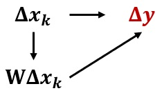
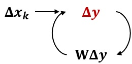
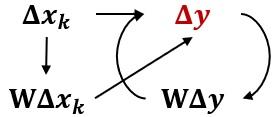
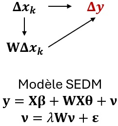
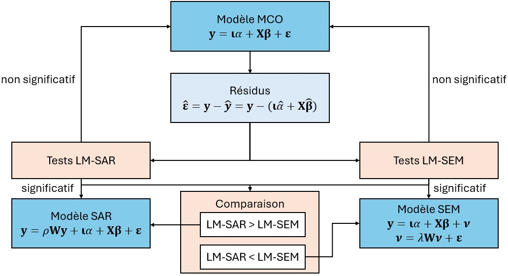
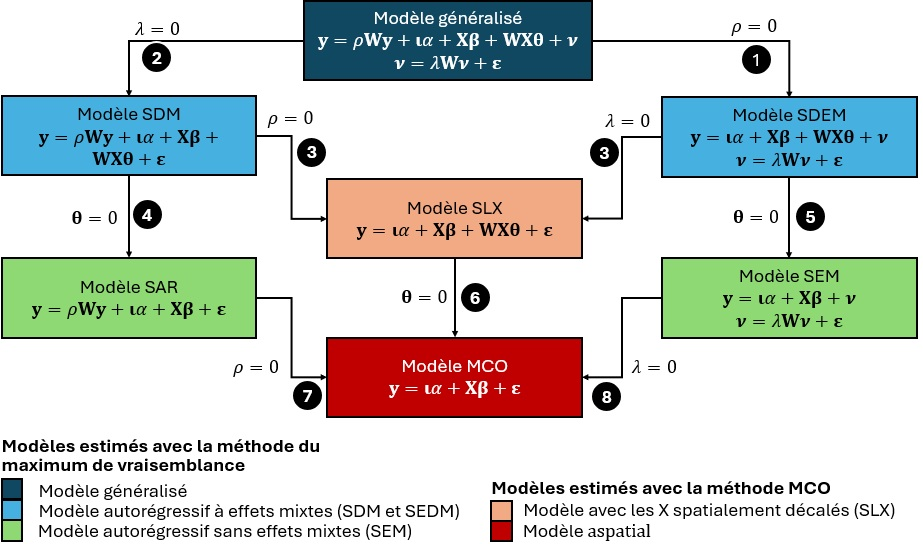

# Modèles d'économétrie spatiale {#sec-chap02}

Dans ce chapitre, nous décrivons uniquement les modèles économétriques spatiaux dont la variable dépendante est continue. Sommairement, ces modèles sont des extensions de la régression linéaire multiple, mais dans lequel une spécification explicite des relations spatiales entre les observations est introduite. Cette spécification vise ultimement à capter des effets spatiaux qui influencent le processus générateur de données (PGD), c'est-à-dire le modèle économétrique que l'on spécifie.

::: bloc_objectif
::: bloc_objectif-header
::: bloc_objectif-icon
:::

**Objectifs d'apprentissage visés dans ce chapitre**
:::

::: bloc_objectif-body
À la fin de ce chapitre, vous devriez être en mesure de :

-   Saisir les raisons motivant le choix d'un modèle de régression (externalités, effets d’entraînement, effets mixtes, etc.).
-   Comprendre les différents modèles spatiaux autorégressifs (SLX, SAR, SEM, SDM, SDEM, Manski).
-   Utiliser une stratégie pour choisir un modèle (tests du multiplicateur de Lagrange, tests du ratio de vraisemblance, critère d’information d’Akaike).
-   Vérifier si le modèle autorégressif a corrigé ou non la dépendance spatiale du modèle MCO.
-   Mettre en pratique ces modèles spatiaux dans R.
:::
:::

::: bloc_package
::: bloc_package-header
::: bloc_package-icon
:::

**Liste des *packages* utilisés dans ce chapitre**
:::

::: bloc_package-body
-   Pour importer et manipuler des fichiers géographiques :
    -   `sf` pour importer et manipuler des données vectorielles.
-   Pour construire des cartes et des graphiques :
    -   `tmap` est certainement le meilleur *package* pour la cartographie.
    -   `ggplot2` et `ggpubr` pour construire des graphiques.
-   Pour construire des modèles spatiaux :
    -   `spdep` pour construire des matrices de pondération spatiales et calculer le *I* de Moran.
    -   `spatialreg` pour construire des modèles économétriques spatiaux.
:::
:::

::: bloc_attention
::: bloc_attention-header
::: bloc_attention-icon
:::

**Régression linéaire multiple et modèles économétriques spatiaux**
:::

::: bloc_attention-body
Avant de lire ce chapitre, il convient de bien maîtriser la régression linéaire multiple. Une brève récapitulation est proposée dans la [section @sec-015].
:::
:::

## Les différents modèles spatiaux autorégressifs {#sec-021}

Selon Jean Dubé et Diègo Legros, quelques raisons expliquent « le choix d'un modèle autorégressif : la présence d'externalités, les effets d'entraînement, l'omission de variables importantes, la présence d'hétérogénéité spatiale des comportements, les effets mixtes » [-@dube2014econometrie, p. 120]. Les effets mixtes représentent une combinaison d'effets spatiaux. Dans tous les cas, la prise en compte des effets spatiaux passe par la spécification d'une matrice de pondérations spatiales, notée $W$ et de dimension ($N \times N$). Une synthèse des différents modèles spatiaux autorégressifs, décrits dans les sections suivantes, est présenté au @tbl-synthese, indiquant s'ils sont ou non mixtes, et le type d'effet qu'ils permettent de prendre en compte.

```{r}
#| label: tbl-synthese
#| tbl-cap: Synthèse des différentes modèles d'économétrie spatiale
#| echo: false
#| message: false
#| warning: false
#| eval: true
library(knitr)
library(kableExtra)

Modeles <- c("SLX", "SAR", "SEM", "SDM", "SDEM")
TablSynth <- data.frame(
              SLX  = c("X", " ", " ", " ", " ", "VI"),
              SAR  = c(" ", "X", " ", " ", " ", "VD"),
              SEM  = c(" ", " ", "X", "X", " ", "TE"),
              SDM  = c("X", "X", " ", " ", "X", "VI et VD"), 
              SDEM = c("X", " ", "X", "X", "X", "VI et TE")
              )
rownames(TablSynth) <- c(
                         "Externalités spatiale",
                         "Effets d'entraînement",
                         "Omission de variables",
                         "Hétérogénéité spatiale",
                         "Effets mixtes",
                         "Application de la matrice de pondération spatiale"
                         )

note <- "VD = Variable dépendante. VI = Variables indépendantes. TE = terme d'erreur."

kbl(TablSynth,
			row.names = TRUE,
			align= c("c", "c", "c", "c", "c", "c"),
			format = "markdown",
			linesep = "") %>%
      kable_styling() %>%
      footnote(general_title = "",
               general = note)

```

### Modèle SLX : prise en compte des caractéristiques des voisins {#sec-0211}

#### Description du modèle SLX {#sec-02111}

Dans un modèle SLX (***s**patial **l**ag of **X** model*), la dimension spatiale est intégrée par une possible influence des variables indépendantes des observations voisines, ou des caractéristiques des voisins. Cette spécification vise habituellement à intégrer ce que l'on identifie dans la littérature par les effets d'externalités spatiaux, c'est-à-dire capter l'influence des caractéristiques d'un voisin ($\mathbf{W}\Delta x_k$) sur le comportement d'intérêt d'une observation donnée ($\Delta \mathbf{y}$) (@fig-EffetMargSLX).

{#fig-EffetMargSLX width="22%" fig-align="center"}

Deux principaux avantages sont liés à cette spécification. Premièrement, cette approche peut se faire simplement en ajoutant des variables à l'équation de départ, soit la spécification du PGD original. La création de variables indépendantes, supposées exogènes, décalées spatialement peut être effectuée de manière simple ([section @sec-013]). Deuxièmement, ce modèle peut être estimé par moindres carrés ordinaires (MCO), ce qui n'est pas possible avec les autres spécifications.

::: bloc_notes
::: bloc_notes-header
::: bloc_notes-icon
:::

**Rappel sur les variables spatialement décalées**
:::

::: bloc_notes-body
Dans le premier chapitre ([section @sec-013]), nous avons vu comment calculer une variable spatialement décalée avec une matrice de pondérations spatiales (@fig-Chap01FigureVariableSpatialementDecalee). À titre de rappel, lorsque cette dernière est standardisée en ligne, elle correspond à la valeur moyenne dans les unités voisines ou proches (dépendamment si la matrice est définie selon la contiguïté ou la proximité).
:::
:::

Le modèle SLX prend la spécification suivante :

$$
\mathbf{y}=\mathbf{\iota}\alpha+\mathbf{X\beta}+\mathbf{WX\theta}+\mathbf{\varepsilon}
$$ {#eq-SLX1}

Où :

-   $\mathbf{y}$, est la variable dépendante, soit un vecteur de dimension $(N \times 1)$ où N est le nombre total d'observations mobilisées dans l'analyse, avec $i=1,2,\dots,N$.

-   $\iota$ est un vecteur de dimension $(N \times 1)$ comportant uniquement des valeurs de 1.

-   $\mathbf{X}$, une matrice de dimension $(N \times K)$ renfermant l'ensemble des $K$ vecteurs de variables explicatives en plus d'une colonne de 1, dans la première colonne de la matrice, pour la constante, d'où $(K+1)$.

-   $\alpha$ est un scalaire identifiant l'ordonnée à l'origine.

-   $\beta$, est un vecteur de dimension $(K+1)$ qui renferme l'ensemble des coefficients de régression, pour les $K$ variables indépendantes et la constante.

-   $\mathbf{WX}$ est une matrice de variables indépendantes décalées spatialement, résultant d'une opération matricielle simple, soit $\mathbf{WX} = \mathbf{W} \times \mathbf{X}$, où $W$ est de dimension $(N×N)$, $\mathbf{X}$ est de dimension $(N \times K)$, d'où $\mathbf{WX}$ est de dimension $(N \times K)$, où chaque observation représente la moyenne des valeurs des variables indépendantes autour d'une observation donnée.

-   $\theta$ est un vecteur de coefficients associés aux valeurs décalées spatialement des variables indépendantes (excluant la constante) de dimension $(K \times 1)$.

-   $\varepsilon$, un vecteur de dimension $(N \times 1)$ des termes d'erreurs.

Le PGD suggère que la valeur de chaque unité spatiale du modèle est ainsi expliquée à la fois par ses propres caractéristiques et celles de ses voisins ou des observations à proximité en fonction de la matrice de pondérations spatiales ($\mathbf{W}$).

Une des particularités du modèle SLX est qu'il introduit une complexité dans l'interprétation des résultats et le calcul des effets marginaux puisque la variable $x_k$ apparaît à deux endroits dans le modèle : d'abord dans la matrice des variables indépendantes originales ($\mathbf{X}$) et ensuite dans la matrice de variables indépendantes décalées spatialement ($\mathbf{WX}$). Lorsque la matrice de pondérations est standardisée en ligne, le calcul des effets marginaux est alors donné par la dérivée partielle suivante :

$$
\frac{\partial y}{\partial x_k} = \mathbf{I} \beta_k + \mathbf{W} \theta_k
$$ {#eq-SLX2}

Pour une matrice de pondérations standardisées en ligne, cette expression se réduit à la valeur du coefficient associé à la variable indépendante originale, $\beta_k$, en plus de la valeur du coefficient associé à la variable décalée spatialement, $\theta_k$. L'expression synthétise l'effet marginal total, alors que le coefficient $\beta_k$ est habituellement désigné par l'effet direct et le coefficient $\theta_k$ synthétise l'effet indirect, puisque venant des voisins.

C'est d'ailleurs la valeur du coefficient $\theta_k$ qui introduit ce que l'on qualifie d'**externalité spatiale**. Elle exprime comment la variable dépendante varie lorsque les caractéristiques des voisins changent. Les changements dans la variable d'intérêt peuvent ainsi venir d'une variation des caractéristiques des voisins.

Ce modèle est aussi désigné sous le terme d'effet spatial local, par opposition à l'effet global (voir modèle SAR, [section @sec-0212]). La variation des caractéristiques des voisins a une portée limitée sur le changement de valeurs de la variable dépendante. Seulement certaines observations sont affectées : celles dont les caractéristiques des voisins ont changé.

::: bloc_attention
::: bloc_attention-header
::: bloc_attention-icon
:::

**Modèle SLX et correction de la dépendance spatiale du modèle MCO de départ**
:::

::: bloc_attention-body
Si le modèle SLX offre une solution intéressante pour régler le potentiel problème d'autocorrélation spatiale des résidus, rien n'assure pour autant qu'il permet de régler tous les problèmes, même si les coefficients associés aux variables décalées spatialement sont statistiquement significatifs. L'inclusion de variables indépendantes additionnelles peut ne pas suffire à capter ce qui, au départ dans la régression par MCO, se cache dans les résidus du modèle. Un test d'autocorrélation spatiale sur les résidus du modèle SLX est un réflexe nécessaire à avoir.
:::
:::

#### Modèle SLX dans R {#sec-02112}

Pour illustrer la mise en œuvre dans R des différentes modèles d'économétrie spatiale, nous utilisons le jeu de données sur Lyon ([section @sec-0111]). Les modèles seront construits avec comme variable dépendante le dioxyde d'azote (NO~2~) et cinq variables sociodémographiques comme variables indépendantes ([section @sec-0111]). Le modèle MCO (non spatial) a déjà été présenté à la [section @sec-0171].

Le modèle SLX est construit avec la fonction `lmSLX` du *package* `spatialreg` [@bivand2021review]. Dans le code ci-dessous, remarquez le paramètre `listw = W.Rook` qui est utilisé pour spécifier la matrice de pondérations spatiales.

```{r}
#| echo: true 
#| message: false 
#| eval: true
#| warning: false
## Chargemement des packages et des données
library(sf)
library(tmap)
library(spdep)
library(spatialreg)
load("data/Lyon.Rdata")
## Matrice de contiguïté selon le partage d'un segment (Rook)
Rook <- poly2nb(LyonIris, queen=FALSE)
W.Rook <- nb2listw(Rook, zero.policy=TRUE, style = "W")
## Construction du modèle MCO
Modele.MCO <- lm(NO2 ~ Pct0_14+Pct_65+Pct_Img+Pct_brevet+NivVieMed,
                 data = LyonIris)
## Construction du modèle SLX
Modele.SLX <- spatialreg::lmSLX(NO2 ~ Pct0_14+Pct_65+Pct_Img+Pct_brevet+NivVieMed,
                   listw = W.Rook,   # matrice de pondérations spatiales
                   data = LyonIris)  # dataframe
## Résultats du modèle
summary(Modele.SLX)
```

::: bloc_attention
::: bloc_attention-header
::: bloc_attention-icon
:::

**Effets directs, indirects et totaux**
:::

::: bloc_attention-body
La formulation d'un modèle SLX implique deux types d'effets pour les variables indépendantes ($X$) :

-   les **effets directs**, soit ceux des caractéristiques des entités spatiales. Ils correspondent aux coefficients $\beta$ des variables indépendantes ($\mathbf{X}$). Autrement dit, pour une observation $i$, à chaque augmentation d'une unité d'une caractéristique $\mathbf{X}$, la valeur de $y_i$ va varier (augmenter ou diminuer) en fonction du coefficient $\beta$.

-   les **effets indirects**, soit ceux des caractéristiques des entités spatiales voisines ou proches définies selon la matrice de pondérations spatiales. Ils correspondent aux coefficients $\theta$ des variables indépendantes spatialement décalées ($\mathbf{WX}$). Autrement dit, les valeurs de $\mathbf{WX}$ des entités spatiales proches ou voisines $j$ de $i$ vont aussi être amenées à varier, impactant alors les valeurs $y_i$ selon les coefficients $\theta$.

-   Pour calculer l'impact total, il suffit de sommer son effet direct ($\beta_k$) et son effet indirect ($\theta_k$) pour obtenir son effet total.
:::
:::

Le code suivant permet de calculer ces effets directs et indirects.

```{r}
#| echo: true 
#| message: false 
#| eval: true
## Effets directs, indirects et totaux (uniquement les coefficients)
impacts(Modele.SLX)
## Effets directs, indirects et totaux (coefficients, valeurs de z et de p)
summary(impacts(Modele.SLX))
```

À la lecture des valeurs de *p*, nous constatons que seule la variable `Pct0_14` a des impacts direct et indirect significatifs au seuil 0,01. L'augmentation d'un point de pourcentage de la population de moins de 15 ans est associé localement à une réduction de 0,20 de la concentration annuelle du dioxyde d'azote. La même augmentation d'un point de pourcentage dans les entités voisines, entraîne une réduction de 0,78. L'effet total est donc une réduction de 0,98.

**Dépendance spatiale du modèle SLX?**

Ce modèle a-t-il corrigé le problème de dépendance spatiale du modèle de régression linéaire classique? Avec une valeur du *I* de Moran de 0,605 (*p* \< 0,001), les résidus sont toujours fortement autocorrélés spatialement (@fig-figCartoResSLX).

```{r}
#| echo: true 
#| eval: true 
#| message: false 
#| warning: false
#| label: fig-figCartoResSLX
#| fig-align: center
#| fig-cap: Cartographie des résidus du modèle SLX
#| out-width: 85%
legende.parametres <- list(text.separator = "à", 
                           decimal.mark = ",", 
                           big.mark = " ")
lm.morantest(Modele.SLX, W.Rook, alternative="two.sided")
LyonIris$SLX.Residus <- residuals(Modele.SLX)
tm_shape(LyonIris)+
  tm_fill(col="SLX.Residus", n = 5, style = "quantile", 
          legend.format = legende.parametres,
          palette = "-RdBu", title = "Résidus") +
  tm_layout(frame=FALSE) + 
  tm_scale_bar(breaks = c(0,5))
```

### Modèle SAR : autocorrélation spatiale sur la variable dépendante {#sec-0212}

#### Description du Modèle SAR {#sec-02121}

Une autre spécification consiste à inclure, comme variable additionnelle au modèle de départ, la variable dépendante spatialement décalée, notée $\mathbf{Wy}$. Le modèle, généralement désigné par le terme SAR (***s**patial **a**uto**r**egressive*), le modèle prend la forme suivante :

$$
\mathbf{y} = \rho \mathbf{Wy} + \iota \alpha + \mathbf{X} \beta + \epsilon
$$ {#eq-SAR1}

Où :

-   $\mathbf{Wy}$, est un vecteur de la variable dépendante spatialement décalée de dimension $(N \times 1)$.

-   $\rho$ est un paramètre (scalaire, donc de dimension ($1 \times 1$)) autorégressif, qui varie habituellement entre -1 et 1 (autrement un problème de non-stationnarité survient).

Par opposition au modèle SLX, cet ajout nécessite une autre méthode d'estimation que les moindres carrés ordinaires puisque la variable additionnelle du côté droit de l'équation est endogène, elle dépend des valeurs de la variable dépendante, qui elles, dépendent des valeurs prises par les caractéristiques des observations. La simple construction de variables spatialement décalées ne peut être considérée. Le processus générateur des données (PGD) s'exprime donc sous une forme un peu plus complexe, soit :

$$
y = (\mathbf{I} - \rho W)^{-1} \left[ \iota \alpha + X \beta + \varepsilon \right]
$$ {#eq-SAR2}

Où :

-   $\mathbf{I}$, est une matrice identité, c'est-à-dire une matrice où la diagonale comporte des 1 et où les autres éléments sont nuls, de dimension $(N \times N)$.

Le modèle nécessite une méthode d'estimation appropriée. La première approche, par maximum de vraisemblance, fut proposée dès le départ par Luc Anselin [-@anselin1988]. Cette approche a été largement mobilisée dans les premières applications. Bien qu'intéressante, cette approche repose sur certaines hypothèses, dont la distribution du terme d'erreur et l'absence d'hétéroscédasticité.

Plus récemment, Kelejian et Prucha [-@kelejian1998generalized] ont proposé une approche basée sur les moindres carrés généralisés (MCG). Cette approche a l'avantage d'être plus rapide en plus de permettre de corriger pour la présence d'hétéroscédasticité. Elle a cependant le désavantage de reposer sur l'hypothèse importante d'exogénéité de la matrice de pondérations spatiales, qui sert d'instrument lors du processus d'estimation.

Ce modèle est habituellement qualifié d'**effet de débordement** ou d'**effet d'entraînement**, puisqu'une variation de la valeur de la variable dépendante d'une observation. Comparativement au modèle SLX, les effets marginaux sont identifiés comme étant globaux puisqu'une variation de la valeur de la variable dépendante, introduit une variation dans la valeur des variables dépendantes décalées spatialement qui, à leur tour, influence la variation dans les valeurs dépendantes des observations voisines et ainsi de suite (@fig-EffetMargSAR). Cette boucle de rétroaction peut être interprétée comme la résultante d'un équilibre général spatial.

{#fig-EffetMargSAR width="22%" fig-align="center"}

La dérivée partielle du modèle SAR procure une forme plus complexe :

$$
\frac{\partial \mathbf{y}}{\partial x_k}=\left(\mathbf{I}-\rho\mathbf{W}\right)^{-1}\beta_k
$$ {#eq-SAR3}

C'est donc dire que les effets marginaux sont un peu plus complexes à analyser et à calculer. Une approche classique, celle proposée par LeSage et Pace [-@lesage2008introduction], consiste à calculer le résultat du produit matriciel, à partir d'une approximation basée sur une somme à perpétuité, et d'extraire la diagonale de la matrice résultante, qui représente l'effet direct, et la somme des éléments hors diagonale, qui représente les effets indirects, afin d'obtenir l'effet marginal total. C'est habituellement cette décomposition qui est proposée par la plupart des logiciels, incluant R. Cette approche peut paraître un peu plus complexe et plus difficilement interprétable puisque les effets marginaux directs ne sont pas définies par les coefficients $\beta_k$.

Deux autres approches sont également proposées. Une première, proposée par Abreu *et al.* (2004), reprend la sommation matricielle, mais en proposant une décomposition différente sur la base d'un vocabulaire différent également. Les auteurs proposent néanmoins que le coefficient de régression, $\beta_k$, s'interprète comme un effet direct.

Une seconde, proposée par Kim *et al.* [-@kim2003measuring], Steimetz [-@steimetz2010spatial], Dubé et Legros [-@dube2014econometrie] et Dubé *et al.* [-@dube2017measuring] consiste essentiellement à tirer profit des propriétés de la matrice de pondérations standardisées en ligne afin d'y proposer une décomposition simple. Dans ce cas, les auteurs proposent les règles suivantes pour calculer les effets marginaux :

-   $\beta_k$ représente l'effet marginal direct.

-   $\beta_k\left(1-\rho\right)^{-1}$, ou encore $\frac{\beta_k}{\left(1-\rho\right)}$, identifie l'effet marginal total.

-   ${\rho\beta}_k\left(1-\rho\right)^{-1}$, ou encore $\frac{\rho\beta_k}{\left(1-\rho\right)}$, représente l'effet marginal indirect peut être obtenu en retranchant l'effet direct de l'effet total.

Des tests non-linéaires peuvent être mobilisés afin de tester la significativité des effets marginaux indirects et totaux, alors que le test de significativité du paramètre procure une façon simple de vérifier si l'effet direct est statistiquement significatif.

Tout comme pour la spécification SLX, rien n'indique pour autant que le modèle SAR permet de capter l'essentiel de l'autocorrélation spatiale résiduelle. Un test sur les résidus doit idéalement être mobilisé pour vérifier cette hypothèse critique. La détection d'une autocorrélation spatiale résiduelle significative peut invalider les résultats obtenus par cette approche.

#### Modèle SAR dans R {#sec-02122}

Le modèle SAR est construit avec la fonction `lagsarlm` du *package* `spatialreg`.

```{r}
#| echo: true 
#| message: false 
#| eval: true
## Construction du modèle
Modele.SAR <- lagsarlm(NO2 ~ Pct0_14+Pct_65+Pct_Img+Pct_brevet+NivVieMed,
                              listw=W.Rook,    # matrice de pondérations spatiales
                              data = LyonIris, # dataframe
                              type = 'lag')    # Modèle lag par défaut
## Résultats du modèle
summary(Modele.SAR, Nagelkerke=TRUE)
```

Dans les résultats ci-dessus, la valeur de *Rho* est de 0,88 (LR = 620, *p* \< 0,001), traduisant un très fort effet d'entraînement. Autrement dit, lorsqu'en moyenne la concentration de dioxyde d'azote augmente dans les IRIS voisines ($\mathbf{Wy}$), elle augmente aussi fortement chaque IRIS ($\mathbf{y}$).

**Effets directs, indirects et totaux**

À nouveau, il est possible d'utiliser la fonction `impacts` pour obtenir les effets marginaux direct et indirects.

```{r}
#| echo: true 
#| message: false 
#| eval: true
## Effets directs, indirects et totaux (uniquement les coefficients)
impacts(Modele.SAR, listw = W.Rook, R = 999)
## Effets directs, indirects et totaux (coefficients, valeurs de z et de p)
summary(impacts(Modele.SAR, listw = W.Rook, R = 999), zstats = TRUE, short = TRUE)
```

L'interprétation des effets directs se rapproche de celle des coefficients classiques. Ainsi, selon ce modèle, l'augmentation du niveau de vie médian de 1000 € dans un IRIS est associée avec une diminution moyenne de la concentration de dioxyde d'azote de 0,14 dans cet IRIS. L'effet total est de -0,82, indiquant qu'en moyenne, l'augmentation de 1000 € du niveau de vie médian dans un IRIS est associée avec une diminution moyenne de 0,82 de la concentration de dioxyde d'azote dans l'ensemble des IRIS. Au final, l'effet indirect est simplement la différence entre l'effet total et l'effet direct. Nous pouvons constater ici que les effets indirects sont plus importants que les effets directs.

**Dépendance spatiale du modèle SAR?**

Ce modèle a-t-il corrigé le problème de dépendance spatiale du modèle de régression linéaire classique? Avec une valeur du *I* de Moran de -0,014 (*p* = 0,654), les résidus ne sont plus spatialement autocorrélés (@fig-figCartoResSAR).

```{r}
#| echo: true 
#| eval: true 
#| message: false 
#| warning: false
#| label: fig-figCartoResSAR
#| fig-align: center
#| fig-cap: Cartographie des résidus du modèle SAR
#| out-width: 85%

## Autocorrélation spatiale des résidus
moran.mc(resid(Modele.SAR), W.Rook, nsim=999)
## Cartographie des résidus
legende.parametres <- list(text.separator = "à", 
                           decimal.mark = ",", 
                           big.mark = " ")
LyonIris$SAR.Residus <- resid(Modele.SAR)
tm_shape(LyonIris)+
  tm_fill(col="SAR.Residus", n = 5, style = "quantile", 
          legend.format = legende.parametres,
          palette = "-RdBu", title = "Résidus") +
  tm_layout(frame=FALSE) + 
  tm_scale_bar(breaks = c(0,5))
```

### Modèle SEM : autocorrélation spatiale sur le terme d'erreur {#sec-0213}

#### Description du modèle SEM {#sec-02131}

L'autocorrélation spatiale résiduelle peut être liée à deux explications simples. La première est liée à **l'omission de variables spatiales importantes et significatives**, et pour laquelle on ne dispose d'aucune information spécifique. La seconde peut provenir d'une **forme d'hétérogénéité spatiale** qui n'est, autrement, pas intégrée à l'analyse. On peut ainsi imaginer que les comportements sont liés dans l'espace pour des raisons qui ne sont pas observables, et encore moins mesurables.

Dans les deux cas, on peut simplement corriger le problème sans pour autant tenter de tirer profit d'une forme spécifique de relations spatiales (externalités, effets d'entraînement). C'est essentiellement dans ces cas que les modèles avec une spécification autorégressive sur les termes d'erreurs (ou SEM -- ***s**patial **e**rror **m**odel*) peuvent être intéressants : ils ne permettent pas d'apporter une richesse supplémentaire à l'analyse et l'interprétation, mais ils permettent vraisemblablement de corriger pour le problème d'interdépendance des termes d'erreurs. Plus spécifiquement, le modèle SEM s'exprime par la spécification suivante :

$$
\mathbf{y}=\mathbf{\iota}\alpha+\mathbf{X\beta}+\mathbf{\nu}
$$ {#eq-SEM1}

$$
\mathbf{\nu}=\lambda\mathbf{W\nu}+\mathbf{\varepsilon}
$$

Où :

-   $\mathbf{W}$ est une matrice de pondérations spatiales, standardisée en ligne, de dimension $\left(N\times N\right)$.

-   $\lambda$ est un paramètre (scalaire, donc de dimension $\left(1\times1\right)$) autorégressif, qui varie habituellement entre -1 et 1 (autrement un problème de non-stationnarité survient).

-   $\mathbf{\nu}$ est un vecteur de termes d'erreurs spatialement autocorrélés de dimension $\left(N\times1\right)$.

-   $\mathbf{\varepsilon}$ est un vecteur de termes supposés indépendants de dimension $\left(N\times1\right)$.

La forme réduite du PGD est donné par l'expression suivante :

$$
\mathbf{y}=\mathbf{\iota}\alpha+\mathbf{X\beta}+\left(\mathbf{I}-\lambda\mathbf{W}\right)^{-1}\mathbf{\varepsilon}
$$ {#eq-SEM2}

Où :

-   $\mathbf{I}$ est une matrice identité, c'est-à-dire une matrice où la diagonale comporte des 1 et où les autres éléments sont nuls, de dimension $\left(N\times N\right)$.

Tout comme pour le cas du modèle SAR, le modèle SEM ne peut être estimé par moindres carrés ordinaires vu la forme complexe que prend le terme d'erreur dans la forme réduite du PGD. Le modèle est habituellement estimé par maximum de vraisemblance.

Un des avantages avec le modèle SEM est que l'interprétation des résultats est similaire à celle que l'on retrouve dans les régressions linéaires classiques. La dérivée partielle de la forme réduite du PGD est simplement égale au coefficient lié à la variable souhaitée :

$$
\frac{\partial\mathbf{y}}{\partial\mathbf{x}_k}=\mathbf{I}\beta_k
$$ {#eq-SEM3}

Or, l'avantage de la structure spatiale des données est justement d'apporter une richesse supplémentaire à l'analyse que l'on ne peut intégrer avec des données a-spatiales. Pour cette raison, les modèles SEM ne sont pas particulièrement prisés par les chercheuses et chercheurs qui tentent d'intégrer l'espace aux modèles. Ils représentent une forme de solution de dernier recours lorsqu'il est impossible de capter la structure résiduelle spatiale autrement.

Tout comme pour les autres spécifications, il est judicieux de vérifier si le modèle permet adéquatement de contrôler pour l'autocorrélation résiduelle. À noter que le modèle SEM peut également mener à une réécriture qui, elle, permet d'intégrer des effets spatiaux qui permettent d'influencer l'interprétation des résultats. Cette forme est désignée par la spécification du modèle Durbin spatial.

#### Modèle SEM dans R {#sec-02132}

Le modèle SEM est construit avec la fonction `errorsarlm` du *package* `spatialreg`.

```{r}
#| echo: true 
#| message: false 
#| eval: true
## Construction du modèle
Modele.SEM <- errorsarlm(NO2 ~ Pct0_14+Pct_65+Pct_Img+Pct_brevet+NivVieMed,
                         listw=W.Rook,    # matrice de pondérations spatiales
                         data = LyonIris) # dataframe
## Résultats du modèle
summary(Modele.SEM, Nagelkerke=TRUE)
```

Dans les résultats ci-dessus, la valeur de *lambda* est de 0,91 (LR = 613, *p* \< 0,001), traduisant une très forte autocorrélation spatiale sur le terme d'erreur.

**Dépendance spatiale du modèle SEM?**

Ce modèle a-t-il corrigé le problème de dépendance spatiale du modèle de régression linéaire classique? Avec une valeur du *I* de Moran de -0,013 (*p* = 0,614), les résidus ne sont plus spatialement autocorrélés.

```{r}
#| echo: true 
#| message: false 
#| eval: true
## Autocorrélation spatiale des résidus
moran.mc(resid(Modele.SEM), W.Rook, nsim=999)
```

**Les modèles MCO et SEM sont-ils différents**

Pour le vérifier, Pace et Lesage [-@pace2008spatial] propose d'appliquer le test de Hausman qui s'interprète comme suit :

-   Si *p* \< 0,05, alors les coefficient du modèle MCO sont biaisés par l'erreur spatiale et il est préférable d'utiliser le modèle SEM. Cela est le cas pour notre modèle.

-   Si *p* \> 0,05, les résultats des modèles ne sont différents et l'on peut conserver le modèle MCO.

```{r}
#| echo: true 
#| message: false 
#| eval: true
Hausman.test(Modele.SEM)
```

### Modèle SDM : autocorrélation spatiale sur la variable dépendante et les variables indépendantes {#sec-0214}

#### Description du modèle SDM {#sec-02141}

Le modèle spatial Durbin (SDM - ***S**patial **D**urbin **M**odel*) est un modèle mixte qui permet à la fois d'intégrer la relation spatiale sur la variable dépendante (**effets d'entraînement ou de débordement**) et sur les variables indépendantes (**externalités**). Elle permet, explicitement, de combiner les modèles SLX et SAR bien que son inspiration est issue d'une réécriture de la forme réduite du modèle SEM, où chaque élément est multiplié par le terme $\mathbf{I}-\lambda\mathbf{W}$ :

$$
\mathbf{y}=\lambda\mathbf{Wy}+\mathbf{\iota}\alpha+\mathbf{X\beta}+\mathbf{WX\beta}\lambda+\mathbf{\varepsilon}
$$

Où :

-   $\mathbf{\beta}\lambda$ est un nouvel ensemble de paramètres liés aux variables indépendantes spatialement décalées, qui est habituellement substitué par $\mathbf{\theta}$.

Tout comme pour le SEM et le SAR, le modèle SDM ne peut être estimé par moindres carrés ordinaires. Il faut recourir à la méthode du maximum de vraisemblance ou encore à la méthode des moments généralisés. Cette dernière approche offrant une flexibilité plus intéressante pour la présence d'hétéroscédasticité.

De la même manière, les coefficients estimés par le modèle permettent une décomposition plus sophistiquée des effets marginaux. La forme réduite du PGD est donnée par :

$$
\mathbf{y}=\left(\mathbf{I}-\lambda\mathbf{W}\right)^{-1}\left[\mathbf{\iota}\alpha+\mathbf{X\beta}+\mathbf{WX\theta}+\mathbf{\varepsilon}\right]
$$ Ainsi, le calcul des effets marginaux est donné par :

$$
\frac{\partial\mathbf{y}}{\partial\mathbf{x}_k}=\left(\mathbf{I}-\lambda\mathbf{W}\right)^{-1}\left[{\mathbf{I}\beta}_k+\mathbf{W}\theta_k\right]
$$

En revenant à la proposition de certains auteurs [@kim2003measuring; @steimetz2010spatial; @dube2014econometrie; @dube2017measuring], les effets marginaux (@fig-EffetMargSDM) peuvent être exprimés par la décomposition suivante lorsque la matrice de pondérations en standardisée en ligne :

-   Effet direct : $\beta_k$.

-   Effet total : $\frac{{(\beta}_k+\theta_k)}{(1-\rho)}$.

-   Effet indirect : effet total -- effet direct = $\frac{{(\rho\beta}_k+\theta_k)}{(1-\rho)}$.

{#fig-EffetMargSDM width="22%" fig-align="center"}

À noter que les logiciels statistiques retournent les effets marginaux sur la base de la décomposition suggérée par LeSage et Pace [-@lesage2008introduction], issue de l'approximiation du produit matriciel. Si l'effet marginal total est identique dans les deux cas, la différence vient essentiellement de la manière de calculer l'effet marginal direct, qui influence également le calcul de l'effet marginal indirect, obtenu par soustraction.

#### Modèle SDM dans R {#sec-02142}

Le modèle SDM est construit avec la fonction `lagsarlm` du *package* `spatialreg`. Notez que le paramètre `type = "mixed"` spécifie l'utilisation d'un modèle mixte.

```{r}
#| echo: true 
#| message: false 
#| eval: true
## Construction du modèle
Modele.DurbinSpatial <- lagsarlm(NO2 ~ Pct0_14+Pct_65+Pct_Img+Pct_brevet+NivVieMed,
                       listw = W.Rook,    # matrice de pondérations spatiales
                       data = LyonIris,   # dataframe
                       type = "mixed")
## Résultats du modèle
summary(Modele.DurbinSpatial, Nagelkerke=TRUE)
```

**Effets directs, indirects et totaux**

```{r}
#| echo: true 
#| message: false 
#| eval: true
# Effets directs, indirects et totaux (uniquement les coefficients)
impacts(Modele.DurbinSpatial, listw = W.Rook, R = 999)
# Effets directs, indirects et totaux (coefficients, valeurs de z et de p)
summary(impacts(Modele.DurbinSpatial, listw = W.Rook, R = 999), zstats = TRUE, short = TRUE)
```

**Dépendance spatiale du modèle SDM?**

Avec une valeur du *I* de Moran de -0,005 (*p* = 0,498), les résidus du modèle SDEM ne sont pas spatialement autocorrélés.

```{r}
#| echo: true 
#| message: false 
#| eval: true
moran.mc(resid(Modele.DurbinSpatial), W.Rook, nsim=999)
```

### Modèle SDEM : autocorrélation spatiale sur les variables indépendantes et sur le terme d'erreur {#sec-0215}

#### Description du modèle SDEM {#sec-02151}

Une autre variante permettant de tirer profit de l'avantage des régressions spatiales, c'est-à-dire l'introduction d'effets liés aux externalités spatiales des observations, consiste à jumeler les modèles SLX et SEM pour obtenir le modèle Durbin avec termes d'erreurs spatialement liés (SDEM - ***S**patial **D**urbin **E**rror **M**odel*). Le modèle s'écrit :

$$
\mathbf{y}=\mathbf{\iota}\alpha+\mathbf{X\beta}+\mathbf{WX\theta}+\mathbf{\nu} \\
$$ {#eq-SDEM1}

$$
\mathbf{\nu}=\lambda\mathbf{W\nu}+\mathbf{\varepsilon}
$$

Tout comme pour les spécifications SAR, SEM et SDM, le modèle SDEM ne peut être estimé par la méthode des moindres carrés ordinaires et nécessite une méthode d'estimation appropriée.

Entre le modèle SEM et le modèle SDEM, il est clairement avantageux d'opter pour une spécification SDEM si le but est d'intégrer des effets spatiaux et de tenir compte des possibles relations spatiales dans l'interprétation des résultats de régression. Le calcul des effets marginaux (@fig-EffetMargSDEM) permet de tenir compte de la spécificité des externalités spatiales.

$$
\frac{\partial\mathbf{y}}{\partial\mathbf{x}_\mathbf{k}}={\mathbf{I}\beta}_k+\mathbf{W}\theta_k
$$ {#eq-SDEM2}

{#fig-EffetMargSDEM width="22%" fig-align="center"}

Dans le cas où la matrice de pondérations spatiales, $\mathbf{W}$, est standardisée en ligne, l'interprétation des effets marginaux est plutôt simple et directe :

-   $\beta_k$ est l'effet marginal direct.

-   $\theta_k$ est l'effet marginal indirect et l'effet d'externalité spatiale.

-   $\beta_k+\theta_k$ est l'effet marginal total.

Finalement, comme pour les spécifications précédentes, il est sage de vérifier, avec l'aide d'une statistique générale, si les résidus du modèle permettent de ne pas rejeter l'hypothèse d'indépendance entre les termes d'erreurs. Or, puisque la structure spatiale est explicitement intégrée dans le terme d'erreur du modèle, cette spécification réussit à contrôler le problème de manière efficace.

#### Modèle SDEM dans R {#sec-02152}

**Construction du modèle SDEM dans R**

Le modèle SDEM est construit avec la fonction `errorsarlm` du *package* `spatialreg`. Notez que le paramètre `etype = "mixed"` spécifie l'utilisation d'un modèle mixte.

```{r}
#| echo: true 
#| message: false 
#| eval: true
## Construction du modèle
Modele.DurbinErreur <- errorsarlm(NO2 ~ Pct0_14+Pct_65+Pct_Img+Pct_brevet+NivVieMed,
                                  listw=W.Rook,    # matrice de pondérations spatiales
                                  data = LyonIris, # dataframe
                                  etype = 'emixed')
## Résultats du modèle
summary(Modele.DurbinErreur, Nagelkerke=TRUE)
```

**Effets directs, indirects et totaux**

```{r}
#| echo: true 
#| message: false 
#| eval: true
## Effets directs, indirects et totaux (uniquement les coefficients)
impacts(Modele.DurbinErreur, listw = W.Rook, R = 999)
## Effets directs, indirects et totaux (coefficients, valeurs de z et de p)
summary(impacts(Modele.DurbinErreur, listw = W.Rook, R = 999), zstats = TRUE, short = TRUE)
```

**Dépendance spatiale du modèle SDEM?**

Avec une valeur du *I* de Moran de -0,010 (*p* = 0,619), les résidus du modèle SDEM ne sont pas spatialement autocorrélés.

```{r}
#| echo: true 
#| message: false 
#| eval: true
moran.mc(resid(Modele.DurbinErreur), W.Rook, nsim=999)
```

### Modèle généralisé : autocorrélation spatiale de l'ensemble des variables et composantes du modèle {#sec-0216}

#### Description du modèle généralisé {#sec-02161}

Le modèle spatial généralisé (*Manski model* en anglais), qui est essentiellement une extension du modèle SDM lorsque le processus autorégressif est ajouté aux termes d'erreurs, permet une représentation complète des possibilités. Il permet également de réfléchir à une stratégie du général vers le particulier pour la sélection de la spécification finale :

$$
\mathbf{y}=\lambda\mathbf{Wy}+\mathbf{\iota}\alpha+\mathbf{X\beta}+\mathbf{WX\theta}+\mathbf{\nu}
$$ {#eq-Manski}

$$
\mathbf{\nu}=\lambda\mathbf{W\nu}+\mathbf{\varepsilon}
$$

La spécification tient compte, tout comme le modèle SDM, des effets de débordements (ou effets d'entraînement) spatiaux ainsi que des effets d'externalités spatiales.

Le modèle spatial généralisé ne peut être estimé par moindres carrés ordinaires. Il faut recourir à la méthode du maximum de vraisemblance ou encore à la méthode des moments généralisés. Cette dernière approche offrant une flexibilité intéressante pour la présence d'hétéroscédasticité.

D'une part, certains auteurs notent que des problèmes peuvent survenir lorsque les matrices de pondérations spatiales mobilisées pour estimer le modèle sont identiques pour l'ensemble des processus autorégressifs [@Gallo2002; @AnselinBera1998]. D'autre part, Elhorst [-@elhorst2014spatial] suggère d'estimer d'abord cette spécification afin de faire un choix de modèle, puisqu'il procure une structure emboîtée (voir section suivante).

#### Modèle généralisé (Manski) dans R

```{r}
#| echo: true 
#| message: false 
#| eval: true
## Construction du modèle
Modele.Manski <- sacsarlm(NO2 ~ Pct0_14+Pct_65+Pct_Img+Pct_brevet+NivVieMed,
                          listw=W.Rook,    # matrice de pondérations spatiales
                          data = LyonIris, # dataframe
                          type="sacmixed")
## Résultats du modèle
summary(Modele.Manski, Nagelkerke=TRUE)
## Effets marginaux
impacts(Modele.Manski, listw=W.Rook)
summary(impacts(Modele.Manski,listw=W.Rook,R=500),zstats=TRUE)
## Autocorrélation spatiale des résidus
moran.mc(resid(Modele.Manski), W.Rook, nsim=999)
```

## Quel modèle choisir? {#sec-022}

Évidemment, la question qui brûle les lèvres est de savoir quelle spécification devrait-on retenir pour l'analyse empirique et la présentation des résultats? Deux avenues sont possibles.

D'une part, il est possible que **certains impératifs théoriques guident la chercheuse ou le chercheur vers une spécification particulière**. Ainsi, si l'on souhaite vérifier comment les caractéristiques des milieux avoisinants influencent une variable d'intérêt, alors les spécifications SLX ou SDEM sont à privilégier puisqu'elle permet explicitement d'aborder la question. Si l'intérêt est de voir comment une variation locale d'une variable d'intérêt peut avoir des influences à la grandeur du territoire, alors la spécification SAR est probablement à privilégier puisqu'elle permet d'évaluer l'impact spatial « global » d'un changement à microéchelle. Il est également possible qu'une question de recherche trouve un écho parmi les deux possibilités, dans lequel des cas le modèle SDM d'avère intéressant.

Si une chercheuse ou un chercheur **souhaite essentiellement corriger la présence d'autocorrélation spatiale entre les résidus** sans intégrer explicitement de liens spatiaux dans l'interprétation du modèle, alors la spécification SEM peut s'avérer intéressante. Il faut néanmoins avouer que cette correction de l'autocorrélation spatiale n'apporte que peu d'intérêt au niveau de l'interprétation outre corriger les écarts-types des coefficients estimés.

D'autre part, **le choix peut également être basé sur des considérations plus statistiques**. En lequel des cas le chercheur souhaite identifier, sur la base de critères préalablement définis, le modèle qui offre la performance la meilleure. Bien que le test de Moran permette de détecter la présence d'autocorrélation spatiale dans les résidus, le test n'est malheureusement pas mobilisable pour tenter d'identifier une spécification préférable.

Il existe trois différentes stratégies de tests : les tests de ratio de vraisemblance, qui nécessitent l'estimation des modèles contraints (les spécifications linéaires classiques) et non contraints (les modèles économétriques spatiaux); les tests de Wald, qui nécessitent aussi l'estimation des modèles contraints et non contraints; et les tests du multiplicateur de Lagrange (ou test LM), qui nécessitent uniquement l'estimation des modèles contraints.

### Tests du multiplicateur de Lagrange (LM) sur le modèle MCO {#sec-0221}

Une procédure relativement simple existe pour discriminer entre les spécifications SAR, SEM et MCO. Puisque les modèles contraints sont relativement simples et directs, les tests LM sont souvent privilégiés en pratique. Ces tests (en version simple et robuste) ont été largement popularisés par Anselin *et al.* [-@anselin1996simple] pour vérifier si le recours à un modèle autorégressif est nécessaire, comparativement à un modèle de régression classique (MCO).  

Les tests sont calculés sur la base des estimations obtenues par MCO pour la spécification linéaire classique et avec l’aide d’une matrice de pondérations spatiales préalablement identifiées et calculées. Pour chaque spécification des modèles économétriques spatiaux, il existe une forme spécifique pour les tests-LM. Comment alors comparer les différentes statistiques pour identifier la spécification à retenir?

{#fig-SARversusSEM width="80%" fig-align="center"}

La démarche générale suivante, schématisée à la @fig-SARversusSEM, peut être utilisée pour guider le choix d’une spécification :

1.  Si toutes les valeurs des tests (simples et robustes) sont non significatives (*p* \> 0,05), alors le recours à un modèle autorégressif n'est pas nécessaire. Nous pouvons conserver le modèle de régression classique (MCO).

2.  Si les valeurs de `LMlag` ou `RLMlag` sont non significatives (*p* \> 0,05), alors le recours au modèle SAR n'est pas nécessaire.

3.  Si les valeurs de `LMerr` ou `RLMerr` sont non significatives (*p* \> 0,05), alors le recours au modèle SEM n'est pas nécessaire.

4.  Si les valeurs de `RLMlag` et `RLMerr` sont significatives (*p* \< 0,001), nous choisissons le modèle ayant la plus forte statistique.

    -   Si `RLMlag` \> `RLMerr` , il est suggéré d'utiliser la spécification SAR.

    -   Si `RLMerr` \> `RLMlag` , il est suggéré d'utiliser la spécification SEM.


Dans R, ces tests LM sont calculés sur le modèle MCO avec la fonction `lm.LMtests` et une matrice de pondérations spatiales. Dans les résultats ci-dessous, nous ne retenons pas le modèle SEM car la valeur de 0,740 pour le `RLMerr` n'est pas significative (*p* = 0,3898). Par contre, les valeurs de `LMlag` et de `RLMlag` (555 et 123) sont significatives, ce qui justifie la sélection du modèle SAR.

```{r}
#| echo: true 
#| message: false 
#| eval: true
summary(lm.LMtests(model = Modele.MCO,
                   listw = W.Rook,
                   test = c("LMlag","LMerr","RLMlag","RLMerr")))
```

### Tests du ratio de vraisemblance sur les modèles spatiaux {#sec-0222}


En partant de la structure emboîtée que représente le modèle spatial généralisé, il est possible de proposer une stratégie qualifiée de « général vers le particulier » à partir de la significativité des différents paramètres associés aux variables décalées spatialement (@fig-ChoixBaseSurManski). Cette stratégie, basée sur les tests de ratios de vraisemblance qui sont issus de l’estimation des modèles non contraints, de la forme la plus générale, et des modèles contraints, la forme la plus spécifique [@elhorst2014spatial]. 

En comparant la vraisemblance des modèles, il est possible de vérifier si les deux spécifications sont relativement similaires. Si les vraisemblances sont similaires, la spécification contrainte est préférée à celle non contrainte puisque plus parcimonieuse, c’est-à-dire qu’elle permet d’exprimer le même type de relations avec moins de paramètres. Si les vraisemblances sont trop différentes, la spécification générale est alors préférée puisqu’elle permet de mieux expliquer la variable dépendante.

Cette procédure permet également de discriminer entre certaines spécifications intégrant plusieurs processus autorégressifs, tels que les modèles SDM et SDEM par rapport, respectivement, aux modèles SAR et SLX, et SEM et SLX. Elle permet également d’orienter le choix d’une forme fonctionnel sur un processus de sélection complet puisqu’il considère toutes les formes fonctionnelles et les variantes possibles. 

{#fig-ChoixBaseSurManski width="80%" fig-align="center"}

::: bloc_notes
::: bloc_notes-header
::: bloc_notes-icon
:::
**Description de la stratégie « général vers le particulier »**
:::
::: bloc_notes-body
Globalement, la procédure est la suivante :

**Étape A. Sélection d'un modèle modèle mixte à partir des coefficients autorégressifs du modèle généralisé** :


1.   Si la valeur du coefficient $\rho$ (rho) n'est pas significativement différente de 0, alors nous calculons le modèle mixte SDEM.

2.   Si la valeur du coefficient $\lambda$ (lambda) n'est pas significativement différente de 0, alors nous calculons le modèle mixte SDM.


**Étape B. Sélection du modèle SLX**

3.   Si les valeurs des coefficients $\rho$ du modèle SDM et $\lambda$ du modèle SDEM ne sont pas significativement différentes de 0 alors nous retenons le modèle SLX.

**Étape C. Sélection d'un modèle sans effets mixtes**

4.   Si la valeur du coefficient $\rho$ du SDM est significativement différente de 0, mais que toutes les coefficients $\theta$ (theta) des variables indépendantes spatialement décalées $\mathbf{WX}$ ne sont pas différentes de 0, alors nous retenons le modèle SAR.

5.   Si la valeur du coefficient $\lambda$ du SDEM est significativement différente de 0, mais que toutes les coefficients $\theta$ (theta) des variables indépendantes spatialement décalées $\mathbf{WX}$ ne sont pas différentes de 0, alors nous retenons le modèle SEM.

**Étape D. Choix du modèle MCO**

6. Si les tous coefficients $\theta$ (theta) des variables indépendantes spatialement décalées $\mathbf{WX}$ du modèle SLX ne sont pas différentes de 0, alors nous retenons le modèle aspatial (MCO).

7. Si le coefficient $\rho$ (rho) du modèle SAR n'est pas significativement différent de 0, alors nous retenons le modèle aspatial (MCO).

8. Si le coefficient $\lambda$ (lambda) du modèle SEM n'est pas significativement différent de 0, alors nous retenons le modèle aspatial (MCO).
:::
:::


Appliquons la stratégie « général vers le particulier » à notre jeu de données. Pour l'étape A, nous constatons que le coefficient lambda n'est pas significativement différent de 0 ($\lambda =$ -0,028, p = 0,811), contrairement à celle de rho ($\rho =$ 0,848, p < 0,001). Par conséquent, nous construisons uniquement le modèle SDM.

```{r}
formule <- 'NO2 ~ Pct0_14+Pct_65+Pct_Img+Pct_brevet+NivVieMed'
# Étape A. Sélection d’un modèle modèle mixte à partir 
# des coefficients autorégressifs du modèle généralisé
Manski  <- sacsarlm(formule, listw=W.Rook, data = LyonIris, type="sacmixed")
Manski.lambda <- list(lambda = Manski$lambda,
                      se     = Manski$lambda.se,
                      z      = Manski$lambda / Manski$lambda.se,
                      p      = 2 * (1 - pnorm(abs(Manski$lambda / Manski$lambda.se))))
  
Manski.rho <- list(rho = Manski$rho,
                   se  = Manski$rho.se,
                   z   = Manski$rho / Manski$rho.se,
                   p   = 2 * (1 - pnorm(abs(Manski$rho / Manski$rho.se))))

Resultats.Manski <- data.frame(Parametre = c("lambda", "Rho"),
                               Coef      = c(Manski.lambda$lambda, Manski.rho$rho),
                               z         = c(Manski.lambda$z, Manski.rho$z),
                               p         = c(Manski.lambda$p, Manski.rho$p)
                              )
```

```{r}
#| label: tbl-ChoixManski1
#| tbl-cap: Résultats des coefficients autorégressifs du modèle généralisés
#| echo: false
#| message: false
#| warning: false
#| eval: true
kbl(Resultats.Manski,
		row.names = FALSE,
    digits = 3,
		format.args = list(decimal.mark = ',', big.mark = " "),
    align= c("l", "c", "c", "c"),
		format = "markdown",
		linesep = "") %>%
    kable_styling()

```

Les résultats du modèle SDM montre que :

1. Le coefficient rho ($\rho =$ 0,841, p < 0,001) est différent de 0, nous écartons le modèle SLX.

2. Plusieurs coefficients $\theta$ (theta) des variables indépendantes spatialement décalées $\mathbf{WX}$ sont pas différentes de 0, notamment 
`lag.Pct_Img` et `lag.Pct_brevet`, nous écartons aussi le modèle SAR.

3. Au final, nous retenons donc le modèle SDM.

```{r}
Manski  <- sacsarlm(formule, listw=W.Rook, data = LyonIris, type="sacmixed")
SDM <- lagsarlm(formule, listw = W.Rook, data = LyonIris, type = "mixed")
summary(SDM)
```


### Comparaison des modèles mixtes et non mixtes {#sec-0223}

Avec les tests du ratio de vraisemblance sur les modèles spatiaux, nous pouvons vérifier dans R de vérifier si le recours d'un modèle mixte est justifié comparativement à un modèle non mixte. Dans le code ci-dessous, nous vérifions si le modèle SDM est statistiquement différent du modèle SAR avec les fonctions `LR.Sarlm` et `anova`. Les résultats signalent un écart significatif des valeurs du log-vraisemblance (26,101, *p* \< 0,001). Par conséquent, ce modèle mixte a un apport significatif.

```{r}
#| echo: true 
#| message: false 
#| eval: true
## SDM et SEM sont-ils significativement différents?
LR.Sarlm(Modele.DurbinSpatial, Modele.SAR)
anova(Modele.DurbinSpatial, Modele.SAR)
```

À l'inverse, la différence entre les valeurs du log-vraisemblance des modèles SDEM et SEM n'est pas significative (4,9728, *p* = 0,42), signalant que l'utilisation d'un modèle SDEM comparativement à un modèle SEM n'est pas nécessaire.

```{r}
#| echo: true 
#| message: false 
#| eval: true
## SDEM et SEM sont-ils significativement différents?
LR.Sarlm(Modele.DurbinErreur, Modele.SEM)
anova(Modele.DurbinErreur, Modele.SEM)
```

### Mesures AIC et BIC et dépendance spatiale {#sec-0224}

Bien que la procédure de test précédente soit intéressante, elle peut néanmoins mener à une certaine difficulté dans l'identification de la forme fonctionnelle préférable. Un arbitrage peut alors être mené à partir de statistiques alternatives telles que les critères d'information.

Le critère d'information d'Akaike (AIC) et le critère d'information bayésien (BIC) sont largement utilisés pour évaluer la qualité d'ajustement du modèle. Plus leurs valeurs sont faibles, plus la spécification est intéressante pour expliquer la variabilité de la variable dépendante, et moins la variabilité du terme d'erreur est grande. Il est donc possible de comparer les valeurs des différents critères afin d'orienter le choix de la spécification finales (MCO, SLX, SAR, SEM, SDM et SDEM).

Nous pouvons aussi comparer l'autocorrélation spatiale des résidus des modèles avec le *I* de Moran.

```{r}
#| echo: true 
#| message: false 
#| eval: true
## Valeurs d'AIC et de BIC
AICs <- AIC(Modele.MCO, Modele.SLX, Modele.SAR, Modele.SEM, 
            Modele.DurbinSpatial, Modele.DurbinErreur)
BICs <- BIC(Modele.MCO, Modele.SLX, Modele.SAR, Modele.SEM, 
            Modele.DurbinSpatial, Modele.DurbinErreur)
## Autocorrélation spatiale des résidus
IMoran.MCO <- moran.mc(resid(Modele.MCO), W.Rook, nsim=999)
IMoran.SLX <- moran.mc(resid(Modele.SLX), W.Rook, nsim=999)
IMoran.SLM <- moran.mc(resid(Modele.SAR), W.Rook, nsim=999)
IMoran.SEM <- moran.mc(resid(Modele.SEM), W.Rook, nsim=999)
IMoran.DurbinS <- moran.mc(resid(Modele.DurbinSpatial), W.Rook, nsim=999)
IMoran.DurbinE <- moran.mc(resid(Modele.DurbinErreur), W.Rook, nsim=999)
MoranI.s <- c(IMoran.MCO$statistic, IMoran.SLX$statistic,
             IMoran.SLM$statistic, IMoran.SEM$statistic,
             IMoran.DurbinS$statistic, IMoran.DurbinE$statistic)
MoranI.p <- c(IMoran.MCO$p.value, IMoran.SLX$p.value,
             IMoran.SLM$p.value, IMoran.SEM$p.value,
             IMoran.DurbinS$p.value, IMoran.DurbinE$p.value)
## Tableau
Comparaison <- data.frame(Modele = c("MCO", "SLX", "SAR", "SEM", "SDM", "SDEM"),
                          AIC = AICs$AIC,
                          BIC = BICs$BIC,
                          dl = AICs$df,
                          MoranI = MoranI.s,
                          MoranIp = MoranI.p)
Comparaison
```

Quelques lignes de code suffisent pour créer deux graphiques permettant de comparer visuellement les résultats des différents modèles (@fig-GraphComparaison). Les résultats démontrent que :

-   Les modèles MCO et SLX ont un problème de dépendance spatiale puisque leurs résidus sont significativement autocorrélés spatialement. Par conséquent, ils ne devraient pas être retenus.
-   Les modèles SDM, SAR et SEM sont les plus performants avec les valeurs d'AIC les plus faibles.

```{r}
#| echo: true 
#| eval: true 
#| message: false 
#| warning: false
#| label: fig-GraphComparaison
#| fig-align: center
#| fig-cap: Comparaison des différents modèles
#| out-width: 85%

library(ggplot2)
library(ggpubr)
## Graphique pour l'autocorrélation spatiale
g1 <- ggplot(data=Comparaison, aes(x=reorder(Modele,MoranI), y=MoranI)) +
      geom_segment(aes(x=reorder(Modele, MoranI),
                   xend=reorder(Modele, MoranI),
                   y=0, yend=MoranI)) +
  geom_point( size=4,fill="red",shape=21)+
  xlab("Modèle") + ylab("I de Moran")+
  labs(title="Autocorrélation spatiale des résidus",
       caption="Plus la valeur du I de Moran est faible, \nmoins il y a d'autocorrélation spatiale.")
## Graphique pour les valeurs d'AIC
g2 <- ggplot(data=Comparaison, aes(x=reorder(Modele,AIC), y=AIC)) +
  geom_segment(aes(x=reorder(Modele, AIC),
                   xend=reorder(Modele, AIC),
                   y=0, yend=AIC)) +
  geom_point( size=4,fill="red",shape=21)+
  xlab("Modèle") + ylab("AIC")+
  labs(title="Qualité d'ajustement du modèle",
       caption="Plus la valeur d'AIC est faible, \nplus le modèle est performant.")
## Figure avec les deux graphiques
ggarrange(g1, g2)
```


::: bloc_astuce
::: bloc_astuce-header
::: bloc_astuce-icon
:::
**Quelques lignes de code pour tous les modèles!**
:::
::: bloc_astuce-body

```{r}
#| echo: true 
#| eval: flase 
#| message: false 
#| warning: false
formule <- 'NO2 ~ Pct0_14+Pct_65+Pct_Img+Pct_brevet+NivVieMed'
MCO     <- lm(formule, data = LyonIris)
SLX     <- lmSLX(formule, listw = W.Rook, data = LyonIris)
SDM     <- lagsarlm(formule, listw = W.Rook, data = LyonIris, type = "mixed")
SDEM    <- errorsarlm(formule, listw=W.Rook, data = LyonIris, etype = 'emixed')
SAR     <- lagsarlm(formule,listw=W.Rook, data = LyonIris, type = 'lag') 
SEM     <- errorsarlm(formule, listw=W.Rook, data = LyonIris)
Manski  <- sacsarlm(formule, listw=W.Rook, data = LyonIris, type="sacmixed")
```
:::
:::


## Quiz de révision {#sec-023}

```{r}
#| label: quizChapitre02
#| echo: false 
#| eval: true 
#| message: false 
#| warning: false 
#| results: asis
source("code_complementaire/QuizzFunctions.R")
Chap02Quiz <- quizz("quiz/Chap02.yml", "Chap07")
render_quizz(Chap02Quiz)
```

## Exercices de révision {#sec-024}

::: bloc_exercice
::: bloc_exercice-header
::: bloc_exercice-icon
:::

**Exercice 1.** Réalisation de modèles de régression autorégressifs spatiaux
:::

::: bloc_exercice-body
```{r}
#| echo: true 
#| message: false 
#| warning: false 
#| eval: false
library(sf)
library(spatialreg)
# Matrice de contiguïté selon le partage d'un segment (Rook)
load("data/Lyon.Rdata")
Rook <- poly2nb(LyonIris, queen=FALSE)
W.Rook <- nb2listw(Rook, zero.policy=TRUE, style = "W")
# Modèles
formule <- "PM25 ~  Pct0_14+Pct_65+Pct_Img+Pct_brevet+NivVieMed"
# Modèles MOC, SLX, SDM, SDEM, SAR, SEM, Manski
à compléter
```

Correction à la [section @sec-08021].
:::
:::

::: bloc_exercice
::: bloc_exercice-header
::: bloc_exercice-icon
:::

**Exercice 2.** Tests du multiplicateur de Lagrange (LM) sur le modèle MCO
:::

::: bloc_exercice-body
```{r}
#| echo: true 
#| message: false 
#| warning: false 
#| eval: false
à compléter
```

Correction à la [section @sec-08022].
:::
:::

::: bloc_exercice
::: bloc_exercice-header
::: bloc_exercice-icon
:::

**Exercice 3.** Mesures AIC et BIC et dépendance spatiale
:::

::: bloc_exercice-body
```{r}
#| echo: true 
#| message: false 
#| warning: false 
#| eval: false
## Valeurs d'AIC et de BIC
à compléter
## Autocorrélation spatiale des résidus
à compléter
## Tableau
Comparaison <- à compléter
Comparaison
```

Correction à la [section @sec-08023].
:::
:::
