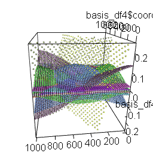
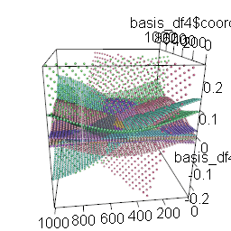
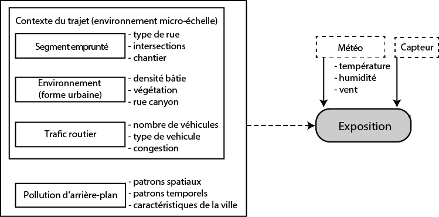

# Modèles généralisés additifs {#sec-chap07}

Dans ce chapitre, nous abordons deux formes de modèles généralisés additifs (*Generalized additive model* -- GAM) qui permettent d'introduire l'espace de deux manières différentes : les modèles GAM avec une spline bivariée avec les coordonnées géographiques (x, y) pour capturer les variations continues dans l'espace; les modèles GAM avec un lissage par champ aléatoire de Markov (*Markov random field* -- MRF) pour modéliser la dépendance spatiale entre les unités spatiales voisines.

::: bloc_objectif
::: bloc_objectif-header
::: bloc_objectif-icon
:::

**Objectifs d'apprentissage visés dans ce chapitre**
:::

::: bloc_objectif-body
À la fin de ce chapitre, vous devriez être en mesure de :

-   comprendre pourquoi utiliser un modèle GAM avec une spline bivariée sur les coordonnées géographiques ou avec un lissage par champ aléatoire de Markov;
-   analyser les résultats produits par ces deux types de modèles GAM;
-   mettre en pratique ces modèles dans R.
:::
:::

::: bloc_package
::: bloc_package-header
::: bloc_package-icon
:::

**Liste des *packages* utilisés dans ce chapitre**
:::

::: bloc_package-body
-   Pour importer et manipuler des fichiers géographiques :
    -   `sf` pour importer et manipuler des données vectorielles.
-   Pour mesurer l'autocorrélation :
    -   `spdep` pour construire des matrices de pondération spatiales et calculer le *I* de Moran.
-   Pour construire des cartes et des graphiques :
    -   `ggplot2` pour construire des graphiques.
    -   `tmap` est certainement le meilleur *package* pour la cartographie.
-   Pour construire des modèles GAM :
    -   `mcgv`, le *package* de référence pour ajuster des modèles GAM. De nombreux autres *packages* proposent des extensions pour ce type de modèle et se basent principalement sur les outils mis à disposition par `mgcv` pour créer des bases et leurs matrices de pénalisation (`gamm4`, `brms`, `gamlss`, `qgam`, etc.).
    -   `DHARMa`, un *package* permettant d'effectuer des diagnostics sur des résidus de modèles GLM.
:::
:::

## Bref retour sur les GAM {#sec-071}

Les modèles généralisés additifs (GAM) constituent une famille de modèles de régression très flexibles permettant notamment de modéliser des relations non paramétriques entre les variables indépendantes et la variable dépendante.

Dans un modèle de régression classique, nous partons du principe que les variables $\mathbf{X}$ (indépendantes) ont un impact linéaire sur la variable $\mathbf{Y}$ (dépendante). Cette hypothèse simplifie grandement les relations entre les variables observées et permet d'interpréter les résultats plus facilement (analyse des coefficients de régression). Or, cette hypothèse peut être fausse et les relations non linéaires ont plus tendance à être la norme que l'exception.

Dans un GAM, plutôt que modéliser une relation linéaire, nous partons du principe que la relation modélisée peut être non linéaire et suivre une fonction $f$. Il s’agit alors de relations non paramétriques, car la forme de cette fonction s'ajuste aux données et ne suit pas une forme prédéterminée.

Ces fonctions $f$ sont le plus souvent estimées avec des splines. Le fonctionnement de base est assez simple. Pour chaque variable $\mathbf{X}$ devant suivre une relation non linéaire, la variable est remplacée par $k$ sous-variable ($x_1$, $x_2$, ..., $x_k$). $k$ représente le niveau de complexité attendu de la relation : plus il est grand, plus l’ajustement de la fonction est complexe. Le modèle estime un coefficient pour chacune de ces sous-variables, et la somme des effets de ces sous-variables permet de reconstruire la relation non linéaire.

La @fig-gam1 permet d'illustrer ce principe. Les lignes grises représentent les sous-variables, aussi appelées bases, qui sont ensuite multipliées par leur coefficient respectif pour obtenir leurs effets (en couleur), puis la ligne bleue représente leur somme. La ligne bleue capture très efficacement la relation entre les variables $\mathbf{X}$ et $\mathbf{Y}$.

```{r}
#| echo: false 
#| message: false 
#| warning: false
#| label: fig-gam1
#| fig-cap: Exemple de spline
#| fig-align: center
#| out-width: 75%
library(splines)
library(mgcv)
library(ggplot2)
library(ggpubr)

dataset <- gamSim(eg = 1, n = 400, dist = "normal", scale = 1, verbose = FALSE)
basis <- bs(dataset$x2, df = 7, degre = 3)
model <- lm(y ~ basis, data = dataset)
coefs <- coefficients(model)[2:length(coefficients(model))]
prodbase <- sweep(basis, MARGIN = 2, coefs, `*`)
df <- data.frame(prodbase)
df$X <- dataset$x2
df <- reshape2::melt(df, id.vars = "X")
df$total <-  rowSums(prodbase) + coefficients(model)[1]
df2 <- data.frame(basis * 3)
df2$X <- dataset$x2
df2 <- reshape2::melt(df2, id.vars = "X")
ggplot() + 
  geom_point(aes(y = y, x = x2), size = 1, data = dataset) + 
  geom_line(mapping = aes(x = X, y = value, group = variable),
            color = 'grey',
            linetype = 'dashed', 
            data = df2, linewidth = 1) +
  labs(x = "X", y = "Y")+
  geom_line(aes(x = X, y = value, color = variable), linewidth = 1, data = df) +
  geom_line(aes(x = X, y = total), color = "blue", linewidth = 1, data = df) +
  theme(legend.position = "none") 
```

::: bloc_attention
::: bloc_attention-header
::: bloc_attention-icon
:::
**Modèles généralisés additifs**
:::
::: bloc_attention-body
Pour une explication détaillée du fonctionnement des splines, vous pouvez consulter le [chapitre sur les GAM](https://serieboldr.github.io/MethodesQuantitatives/11-GAM.html) du livre *Méthodes quantitatives en sciences sociales : un grand bol d'R* [@RBoldAirMethodesQuanti].
:::
:::

## Comment utiliser une spline pour ajouter l'espace dans un modèle GAM? {#sec-072}

Nous avons vu qu'une spline permet de modéliser l'impact potentiellement non linéaire d'une variable indépendante sur une variable dépendante. Or, il est possible d'utiliser des splines pour intégrer un effet spatial dans un modèle, et ce, en utilisant un type de spline particulier : la spline bivariée qui capture l'effet simultané de deux variables indépendantes sur une variable dépendante.

Dans un contexte spatial, une spline bivariée capture la façon dont un changement dans les coordonnées *X* et *Y* affecte la variable dépendante. De plus, compte tenu de la forme des fonctions de base utilisées, les splines sont particulièrement adaptées pour capturer des relations spatiales avec une forte autocorrélation spatiale positive.

Prenons un exemple avec un jeu de données fictif représentant des mesures de pollution relevées à différentes localisations sur un territoire (@fig-gam2).

```{r}
#| label: fig-gam2
#| echo: false
#| message: false
#| warning: false
#| fig-cap: Exemple d'un jeu de données fictif avec une forte dépendance spatiale
#| fig-align: center
#| out-width: 100%

library(geoR)
set.seed(666)

sim <- grf(500,
           xlims = c(0,1000),
           ylims = c(0,1000),
           cov.pars = c(0.1, 10000),
           messages = FALSE)

dataset <- data.frame(sim[[1]])
names(dataset) <- c('coordX', 'coordY')
dataset$Y <- sim[[2]]
dataset$pollution <- (abs(min(dataset$Y)) + dataset$Y) * 100


plot1 <- ggplot(dataset) + 
  geom_point(aes(x = coordX, y = coordY, color = pollution))+
  scale_color_binned(breaks = c(0,25,30,35,40,45,60), type = 'viridis') + 
  coord_equal() + 
  theme_bw()+
  labs(title = "Données fictives sur la pollution",
       x = "Coordonnée X",
       y = "Coordonnée Y")
plot1
```


Nous pourrions créer des bases d'une spline qui varient à la fois dans les coordonnées spatiales *X* et *Y*. L'animation à la @fig-gam3 illustre des bases obtenues (k = 25) pour les données ci-dessus. La hauteur dans la figure est utilisée pour représenter la variation originale des bases qui sera ensuite ajustée aux données grâce aux coefficients du modèle de régression.


```{r}
#| eval: false
#| echo: false
#| message: false
#| warning: false
#| include: false

library(rgl)
library(randomcoloR)

basis_fn <- smooth.construct(s(coordX, coordY, k = 25, fx = TRUE, bs = "gp"), data = dataset, knots = NULL)

locations <- expand.grid(
  coordX = seq(0,1000, 20),
  coordY = seq(0,1000, 20)
)

basis_real <- Predict.matrix(basis_fn, locations)
basis_df2 <- data.frame(basis_real)

names(basis_df2) <- paste0('b_',1:ncol(basis_df2))
basis_df3 <- cbind(locations, basis_df2)

basis_df4 <- reshape2::melt(basis_df3, id.vars = c('coordX', 'coordY'))

basis_df4 <- subset(basis_df4, abs(basis_df4$value) < 0.25)

vals <- unique(basis_df4$variable)
dico <- data.frame(
  code = vals,
  color =  distinctColorPalette(k = length(vals), altCol = FALSE, runTsne = FALSE)
)

plot3d(basis_df4$coordX,
       basis_df4$coordY,
       basis_df4$value, 
       type="s",size = 0.5,
       col=dico$color[match(basis_df4$variable, dico$code)])

usr_mat <- rbind(
  c(-0.1332023, -0.99101442, 0.0115004,    0),
  c( 0.3392022, -0.03468365, 0.9400655,    0),
  c(-0.9312275,  0.12912087, 0.3407764,    0),
  c(0.0000000,  0.00000000, 0.0000000,    1)
)

view3d(
  zoom = 0.7756639,
  userMatrix = usr_mat
)

movie3d(spin3d(axis=c(0,0,1), rpm=10),
        duration=6,
        dir=getwd(),
        clean = FALSE,
        movie='images/Chap06/spin_gam/anim')

library(magick)

imgs <- list.files('images/Chap06/spin_gam', full.names = TRUE)
img_list <- lapply(imgs, image_read)
img_joined <- image_join(img_list)
img_animated <- image_animate(img_joined, fps = 4)
image_write(image = img_animated,
            path = "images/Chap06/spin_gam/anim.gif")

for(i in 1:length(imgs)){
  if(i > 2){
    file.remove(imgs[[i]])
  }
}

```

```{r}
#| eval: true
#| echo: false
#| message: false
#| warning: false
#| include: true
#| label: fig-gam3
#| fig-cap: Représentation des bases d'une spline bivariée
#| fig-align: center
#| out-width: '60%'

library(knitr)

if(is_latex_output()) {
  
}else{
  
}
```

En ajustant un coefficient pour chaque base et en combinant leurs effets, nous obtenons un effet spatial permettant de prédire la variable de pollution, cartographié à la @fig-gam4. Nous constatons ainsi que le modèle a été capable de reproduire les tendances principales des niveaux de pollution en retrouvant les secteurs avec des valeurs fortes et faibles. Plus l'autocorrélation spatiale est élevée, plus ce type de modèle est efficace pour capturer l'effet spatial.

```{r}
#| label: fig-gam4
#| echo: false
#| message: false
#| warning: false
#| out-width: '100%'
#| fig-cap: Captation de l'effet spatial par une spline bivariée
#| fig-align: center
library(ggpubr)
model <- gam(pollution ~ s(coordX, coordY, k = 25, bs = "gp"), data = dataset)
df_pred <- expand.grid(
  coordX = seq(0,1000,5),
  coordY = seq(0,1000,5)
)
df_pred$prediction <- predict(model, df_pred)
plot2 <- ggplot(df_pred) + 
  geom_raster(aes(x = coordX, y = coordY, fill = prediction)) + 
  scale_fill_binned(breaks = c(0,25,30,35,40,45,60), type = 'viridis') + 
  coord_equal() + 
  theme_bw() + 
  labs(title = 'Spline spatiale',
       x = "Coordonnée X",
       y = "Coordonnée Y")
plot3 <- ggarrange(plot1, plot2, common.legend = TRUE, ncol = 2)
plot3
```

D'un point de vue plus formel, un modèle GAM peut être décrit par l'équation suivante :

$$
\begin{aligned}
&y \sim D(\mu,\theta)\\
&g(\mu) = \beta_0 + \beta X + \sum^{n}_{j=1}(f_j(\zeta_j))\\
\end{aligned}
$$ {#eq-gam}

avec :

-   $y$, la variable dépendante.
-   $D$, une distribution avec une espérance $\mu$ et ses autres paramètres $\theta$.
-   $X$, les variables indépendantes dont l'effet est supposé linéaire par le modèle.
-   $\beta$, les coefficients des variables indépendantes.
-   $\beta_0$, la constante.
-   $\zeta$, les variables dont l'effet est supposé non linéaire par le modèle.
-   $f_j$, une fonction modélisant l'impact de la variable $\zeta_j$.

Pour un modèle incluant seulement une spline bivariée sur les coordonnées géographiques des observations, le modèle peut se résumer à l'équation suivante :

$$
\begin{aligned}
&y \sim D(\mu,\theta)\\
&g(\mu) = \beta_0 + \beta X + f(sp)\\
\end{aligned}
$$ {#eq-gam2}

avec $sp$ une matrice comprenant deux colonnes, soit les coordonnées cartésiennes des observations.

## Pourquoi recourir à un modèle GAM? {#sec-073}

Les modèles GAM sont très flexibles puisqu'ils sont une extension directe des modèles linéaires généralisés (GLM). Ils peuvent donc être appliqués à des variables dépendantes suivant de nombreuses distributions (normale, gamma, binomiale, Poisson, Tweedie, log-normal, etc.). Cependant, ils imposent une conceptualisation particulière de l'espace. En effet, un modèle GAM n'inclut pas directement la notion de dépendance spatiale dans sa formulation. L'hypothèse d'indépendance des observations est conservée (contrairement à un modèle des moindres carrés généralisés, GLS). Le modèle intègre simplement un terme flexible correspondant à l'ajout d'un ensemble de nouvelles variables $\mathbf{X}$ structurées afin de capturer un effet spatialement positivement autocorrélé.

Si nous reprenons l'exemple de la pollution atmosphérique, le modèle est un simple GLM dans lequel nous supposons que les niveaux de pollution suivent une distribution normale et que les observations sont indépendantes. Cependant, la moyenne de cette distribution peut être prédite avec une spline calculée à partir des coordonnées spatiales des observations. Le modèle ne part donc pas du principe que deux observations proches sont plus similaires, mais plutôt qu'il existe un effet spatial permettant de prédire les niveaux moyens de pollution attendus. Un modèle GAM ne vise donc pas explicitement à corriger l'effet de la dépendance spatiale, mais plutôt à capturer un effet spatialement structuré et non capturé par les variables indépendantes $\mathbf{X}$. Sans l'ajout de la spline, cet effet se serait retrouvé dans les résidus du modèle.

La cartographie de l'effet spatial dans un modèle GAM permet de visualiser les secteurs de l'espace d'étude dans lesquels, **toutes choses étant égales par ailleurs**, la variable dépendante est plus forte ou plus faible que la moyenne régionale. Cet effet spatial peut être vu comme un ajustement local de la prédiction. Une forme de malus ou de bonus que le modèle ajoute à sa prédiction pour tenir compte de la variation spatiale de la variable dépendante qui n'a pas été expliquée par les variables indépendantes.

Puisqu'un modèle GAM ne prend pas directement en compte l'autocorrélation spatiale, il est tout à fait possible qu'il échoue à réduire suffisamment la dépendance spatiale des résidus d'un modèle global (non spatial). Il faudra alors privilégier d'autres formes de modèles. De même, si notre cadre théorique nous amène à penser que nos observations s'influencent mutuellement dans l'espace, il sera beaucoup plus cohérent d'utiliser un modèle économétrique ([chapitre @sec-chap02]).

Prenons un exemple concret pour lequel l'utilisation d'un modèle GAM serait particulièrement pertinente. Dans une étude récente, Gelb et Apparicio [-@gelb2022cyclists] cherchent à modéliser les niveaux d'exposition de cyclistes aux pollutions atmosphériques et sonores. Les données utilisées ont été collectées par des cyclistes qui parcouraient différents environnements urbains équipés de capteurs de bruit et de pollution. Plus spécifiquement, l'objectif de l'étude était de déterminer quelles caractéristiques de l'environnement urbain réduisent ou augmentent significativement les niveaux d'exposition des cyclistes. Dans leur cadre théorique (@fig-cadretheorique), les auteurs distinguent :

1.  Les effets du micro-environnement, causés par les caractéristiques locales comme le type de rue utilisé, la densité bâtie, la présence de végétation, etc.

2.  La pollution d'arrière-plan, causée par des phénomènes géographiques régionaux comme la localisation des industries et des autoroutes, la topographie, etc.

{#fig-cadretheorique width="90%" fig-align="center"}

L'exposition mesurée pour un cycliste à un endroit *t* dépend donc des caractéristiques propres de cet endroit, mais aussi de la pollution d'arrière-plan. Par exemple, si nous prenons une rue A, en tous points identique à une rue B, nous pouvons nous attendre à mesurer des niveaux de pollution plus élevés pour B si celle-ci est située dans un secteur plus industrialisé de la ville. Cette différence ne s'explique pas par des caractéristiques propres à A ou à B, puisqu'elles sont identiques, mais bien par un effet d'arrière-plan produit par différents phénomènes géographiques et donc spatialement autocorrélé. Par conséquent, dans cet exemple, l'intégration de la pollution d'arrière-plan avec une spline spatiale est particulièrement pertinente, car l'interprétation de l'effet produit par cette spline s'intègre directement dans le cadre théorique.

## *Markov random field* (MRF) ou spline bivariée? {#sec-074}

Nous avons vu jusqu'ici qu'il est possible d'incorporer un effet spatial dans un modèle GAM en intégrant une spline bivariée sur les coordonnées spatiales des observations. Cette approche est cependant moins pertinente quand les observations sont des polygones de tailles variées. En effet, intégrer les centroïdes des polygones dans le modèle revient à nettement déformer l'espace de nos données puisque des polygones voisins peuvent avoir des centroïdes très éloignés.

Lorsque les données ont une géométrie irrégulière et que le voisinage est plus important que la proximité (distance), il est recommandé d'utiliser un autre type de fonction appelée un champ de Markov aléatoire (*Markov random field, MRF*).

::: bloc_aller_loin
::: bloc_aller_loin-header
::: bloc_aller_loin-icon
:::

**Modèle CAR versus GAM avec MRF**
:::

::: bloc_aller_loin-body
Mathématiquement parlant, un modèle de type CAR (*conditionnal autoregressive model*) est très proche d'un modèle GAM intégrant un MRF puisque la structure spatiale intégrée par un modèle CAR est un MRF : la valeur de la variable dépendante d'une entité est **conditionnée** par la valeur de ses voisins.
:::
:::

Dans l'@eq-gam3, le terme $\eta$ représente l'effet spatial. Il est le plus souvent modélisé comme un effet provenant d'une distribution normale multivariée, centrée sur zéro et dont la matrice de covariance est calculée grâce à un terme $\lambda$ et à une matrice de pondération spatiale $W$. Ce type de modèle est communément appelé un modèle à effet mixte, car il combine des effets **fixes** (coefficients $\beta$) et des effets **aléatoires** ($\lambda$). Les effets aléatoires ne sont pas estimés de la même façon que les effets fixes : ils sont en fait pénalisés. Pour une introduction sur les modèles à effets mixtes, vous pouvez consulter [ce chapitre sur les GLMM](https://serieboldr.github.io/MethodesQuantitatives/09-GLMM.html) du livre *Méthodes quantitatives en sciences sociales : un grand bol d'R* [@RBoldAirMethodesQuanti].

$$
\begin{aligned}
&y \sim D(\mu,\theta)\\
&g(\mu) = \beta_0 + \beta X + \eta \\
&\eta \sim Normal(0,(I - \lambda W)\sigma^2)
\end{aligned}
$$ {#eq-gam3}

Il existe un lien direct entre les modèles à effets mixtes et les GAM. En effet, il est possible de reformuler un GLMM comme un GAM et vice-versa, ce qui signifie qu'une spline pénalisée peut être utilisée pour représenter un effet aléatoire [@wood2017generalized].

Dans R, avec le *package* `mgcv`, il est possible d'utiliser une spline pénalisée par une matrice de pondération spatiale *W* pour approximer l'effet aléatoire que nous aurions modélisé avec un modèle de type CAR. L'intérêt d'utiliser un GAM plutôt qu'un CAR est que nous pouvons contrôler directement le degré de lissage (autocorrélation spatiale) du terme spatial dans le modèle grâce au nombre de degrés de liberté (*k*) de la spline. En utilisant un nombre de degrés de liberté maximal ($k = n-1$), soit une base par observation, alors nous obtenons un *full rank MRF*, autorisant de facto la plus grande variance possible du terme spatial. En réduisant *k*, nous obtenons des modèles d'ordre inférieur (*lower rank MRF*) dont le terme spatial est plus lisse et moins complexe.

$$
\begin{aligned}
&y_i \sim D(\mu_i,\theta)\\
&g(\mu_i) = \beta_0 + \beta X_i + f(W_i) \\
\end{aligned}
$$ {#eq-gam4}

## Mise en œuvre et analyse dans R {#sec-075}

Pour illustrer la réalisation des différents modèles GAM (non spatiale, avec une spline bivariée sur les coordonnées géographiques et avec une spline spatiale de type MRF), nous utilisons le jeu de données sur les parts modales dans la région métropolitaine de Montréal ([section @sec-0112]). Ce jeu de données comprend trois variables mesurant respectivement la proportion des individus utilisant la voiture, le transport collectif ou un mode actif (marche ou vélo) comme mode de transport principal pour leurs déplacements domicile-travail en 2021 pour les secteurs de recensement (@fig-datamtlCarto).

Lorsqu'un ensemble de variables sont des proportions d'un total (leur somme donne 1 ou 100), alors l'ensemble de ces variables est désigné comme des données compositionnelles. Ces données doivent être analysées avec des méthodes spécifiques, car elles ont un comportement particulier. La diminution de l'une d'entre elles provoque nécessairement l'augmentation d'une autre. Elles ne sont donc pas indépendantes et certaines catégories ont même tendance à exister simultanément ou au contraire à se repousser. L'analyse de données compositionnelles est un domaine en soit et sort du matériel que nous souhaitons couvrir dans ce livre. Il existe d'excellentes ressources et *packages* R sur le sujet [@van2013analyzing; @comp_pkg2024; @comp_pkg2025].

Nous utilisons ici l'approche du log des ratios (*alr*). Il s'agit d'une transformation qui peut appliquée aux données compositionnelles pour pouvoir les analyser avec des méthodes classiques de statistiques. On lui préfère généralement une autre méthode de transformation, soit celle isométrique des log ratios (*ilr*), mais cette dernière produit des résultats plus difficiles à interpréter [@greenacre2021compositional]. Nous utiliserons donc l'approche *alr* dans cet exemple. La transformation *alr* est décrite par la formule suivante :

$$
\operatorname{alr}(x)=\left[\log \frac{x_1}{x_D}, \cdots, \log \frac{x_{D-1}}{x_D}\right]
$$ {#eq-ALR}

Pour une variable compositionnelle *x* comprenant *D* dimensions (*catégories*), la transformation *alr* consiste à calculer *D-1* log de ratio entre les différentes dimensions *D* et une référence parmi *D*. Ainsi, le nombre de dimensions de la version transformée de *x* est toujours de *D-1*.

Dans cet exemple, nous utilisons le ratio entre les personnes utilisatrices du transport collectif (TC) et de l'automobile. Puisque la transformation *alr* implique une division, puis un log, il est important que ni le numérateur ni le dénominateur ne soit égal à 0. Or, nous avons quelques secteurs de recensement (SR) avec des parts modales TC à 0. Puisqu'il semble peu probable qu'aucune personne dans un SR n'utilise le transport collectif, nous remplaçons les 0 par le plus faible pourcentage trouvé dans les SR avec la valeur supérieure à 0.

```{r}
#| echo: true 
#| message: false 
#| eval: true
#| warning: false
#| label: fig-gamhist
#| fig-cap: Distributions du ratio et du log ratio entre les parts modales TC et automobile
#| fig-align: center
library(sf, quietly = TRUE)
library(ggplot2, quietly = TRUE)
library(tmap, quietly = TRUE)
library(dplyr, quietly = TRUE)
library(ggpubr, quietly = TRUE)

# Chargement des données
load("data/Mtl.Rdata")

# Nous préparons ici les données en calculant les ratios
# remplaçant les 0 et calculant la transformation alr
data_mtl <- data_mtl %>% 
  mutate(
    prt_tc = ifelse(prt_tc == 0, min(prt_tc[prt_tc>0]) ,prt_tc)
  ) %>% 
  mutate(
    ratio = (prt_tc / prt_auto),
    alr_val = log(prt_tc / prt_auto)
  )

plot1 <- ggplot(data_mtl) + 
  geom_histogram(aes(x = ratio), fill = 'grey', color = 'black', bins = 30) + 
  theme_bw() + 
  labs(x = 'part modale TC / part modale auto',
       y = 'effectif'
       )

plot2 <- ggplot(data_mtl) + 
  geom_histogram(aes(x = alr_val), fill = 'grey', color = 'black', bins = 30) + 
  theme_bw() + 
  labs(x = 'log(part modale TC / part modale auto)',
       y = 'effectif'
       )

ggarrange(plot1, plot2, nrow = 2)

```

La @fig-gamhist illustre la distribution de la variable que nous souhaitons modéliser. Le simple ratio a des valeurs comprises entre 0 et 2,5. Une valeur de 0 signifie que personne dans le secteur de recensement n'utilise le transport collectif comme mode principal pour ses déplacements pendulaires. Une valeur de 1 indique que cette proportion est égale à celle des personnes utilisant la voiture. Une valeur plus grande que 1 indique une dominance du mode TC plutôt que de l'automobile. Sans surprise, pour la majorité des secteurs de recensement, la valeur est inférieure à 1. Le log du ratio suit une distribution moins asymétrique qui sera probablement plus facile à modéliser.

```{r}
#| echo: true 
#| message: false 
#| eval: true
#| warning: false
#| label: fig-gammapy
#| fig-cap: Distribution géographique de la variable dépendante
#| fig-align: center
library(spdep, quietly = TRUE)
library(dplyr, quietly = TRUE)

# Matrice de de contiguïté selon le partage d'un nœud 
queen_nb <- poly2nb(data_mtl, queen = TRUE)
queen_w <- nb2listw(queen_nb, style = 'W', zero.policy = TRUE)

# Calcul du I de moran de la variable ratio
moran_i <- moran.mc(data_mtl$alr_val, 
                    listw = queen_w, 
                    zero.policy = TRUE, nsim = 999)
moran_text <- format(as.numeric(round(moran_i$statistic,3)) , decimal.mark =",")

# Cartographie de la variable
tm_shape(data_mtl) +
  tm_fill(col="alr_val", n = 7,
          style = "jenks",
          midpoint = log(1),
          legend.format = list(text.separator = "à", 
                               decimal.mark = ",", 
                               big.mark = " ",
                               digits = 2),
          palette = "-RdBu", title = 'part modale TC / part modale auto') +
tm_layout(frame=FALSE, legend.outside = TRUE) + 
tm_scale_bar(breaks = c(0,10)) + 
tm_xlab(paste0('I de Moran = ', moran_text,
               " (matrice de contiguïté selon le partage d’un nœud)."))
```

Sans surprise, notre variable dépendante est fortement spatialement autocorrélée. Plus un secteur est éloigné du centre-ville, plus le transport collectif est délaissé au profit de la voiture. Les secteurs dans lesquels la part modale du TC est supérieure à celle de l'automobile sont situés au centre de l'île de Montréal, à proximité des lignes de métro.


### Modèles GAM sans intégration de l'espace {#sec-0751}

Pour modéliser cette variable, nous utilisons deux ensembles de variables indépendantes extraites du recensement de 2021 de Statistique Canada pour les secteurs de recensement de la région métropolitaine de Montréal :

1.  Des variables sociodémographiques :

-   Pourcentage de personnes issues des minorités visibles (`prt_minorite_vis`).
-   Pourcentage de ménages monoparentaux (`prt_monoparental`).
-   Taux de chômage (`prt_chomage`).
-   Revenu médian des ménages en milliers de dollars (`revenu_median`).
-   Pourcentage de personnes à faible revenu (`prt_personnes_faibles_revenu`).

2.  Des variables mesurant les niveaux d'accessibilité :

-   Niveau d'accessibilité aux emplois en heure de pointe en transport collectif (`acs_idx_emp_tc_peak`).
-   Niveau d'accessibilité aux emplois à pied : (`acs_idx_emp_pieton`).

Les indicateurs d'accessibilité sont exprimés comme un score variant de 0 (pire accessibilité au Canada) à 1 (meilleure accessibilité au Canada). Ils servent à capturer la mesure dans laquelle le transport collectif ou la marche permet d'atteindre des emplois (lieux d'activités et de consommation). Dans ce modèle relativement simple, nous nous attendons à ce que des secteurs avec des populations plus vulnérables (variables sociodémographiques) présentent une part modale du transport collectif plus élevée que celle de l'automobile (dépendance au TC). Nous souhaitons cependant vérifier si cette relation tient toujours une fois que nous prenons en considération la performance du transport collectif et la possibilité d'atteindre des activités à pied.

```{r}
#| echo: true 
#| message: false 
#| eval: true
#| warning: false
library(mgcv)
library(car)

# Vérification de la multicolinéarité avant d’ajuster un premier modèle
vif(lm(alr_val ~ prt_minorite_vis + prt_monoparental + 
         prt_chomage + revenu_median + prt_personnes_faibles_revenu + 
         acs_idx_emp_tc_peak + acs_idx_emp_pieton, 
       data = data_mtl
         ))

```

Les valeurs du facteur d'inflation de la variance (VIF) sont relativement faibles, excepté celle du pourcentage de personne à faible revenu qui dépasse 5. Par conséquent, nous décidons de la retirer du modèle.

Nous commençons par ajuster un simple GLM (non spatial), assumant une distribution normale de la variable dépendante, une fois que sont contrôlées les variables indépendantes (`family = gaussian`). Pour valider les résidus de ce modèle, nous utilisons la méthode des résidus simulés.

::: bloc_aller_loin
::: bloc_aller_loin-header
::: bloc_aller_loin-icon
:::

**Les résidus simulés**
:::

::: bloc_aller_loin-body
Pour une description des résidus simulés, vous pourrez consulter [ce chapitre sur les GLM](https://serieboldr.github.io/MethodesQuantitatives/09-GLMM.html) du livre *Méthodes quantitatives en sciences sociales : un grand bol d'R* [@RBoldAirMethodesQuanti].
:::
:::

```{r}
#| echo: true 
#| message: false 
#| eval: true
#| warning: false
#| label: fig-gamresidA
#| fig-cap: Résidus du GLM avec une distribution gaussienne
#| fig-align: center
#| out-width: 85%
library(DHARMa)
library(mgcViz)

# Modèle GLM avec une distribution normale
glm_base <- gam(alr_val ~ prt_minorite_vis + prt_monoparental + revenu_median +
                          acs_idx_emp_tc_peak + acs_idx_emp_pieton,
                data = data_mtl, 
                family = gaussian)

# Validation des résidus
res <- simulateResiduals(glm_base, plot = FALSE)
plot(res)
```

La @fig-gamresidA indique que les résidus simulés ne suivent pas vraiment une distribution uniforme et sont marqués par des valeurs extrêmes. Pour améliorer ce premier modèle, nous utilisons une distribution de Student (`family = scat`). Cette dernière ressemble beaucoup à la distribution normale, mais admet davantage de valeurs extrêmes. Autrement dit, elle permet donc de réduire l'impact des valeurs extrêmes dans le modèle.

```{r}
#| echo: true 
#| message: false 
#| eval: true
#| warning: false
#| label: fig-gamresidB
#| fig-cap: Résidus du GLM avec une distribution de Student
#| fig-align: center
#| out-width: 85%
# Modèle GLM avec une distribution normale de Student
glm_base <- gam(alr_val ~ prt_minorite_vis + prt_monoparental + revenu_median +
                          acs_idx_emp_tc_peak + acs_idx_emp_pieton,
                data = data_mtl, 
                family = scat)

# Validation des résidus
res <- simulateResiduals(glm_base, plot = FALSE)
plot(res)
```

Une nette amélioration est observable à la @fig-gamresidB, bien que les quantiles des résidus tendent encore à dévier des valeurs attendues. Plusieurs raisons pourraient expliquer cette situation, mais il est fort probable qu'elle soit provoquée par l'autocorrélation spatiale dans les résidus.

```{r}
#| echo: true 
#| message: false 
#| eval: true
#| warning: false
#| label: fig-gamresid1
#| fig-cap: Cartographie des résidus du modèle GLM
#| fig-align: center
# I de Moran des résidus des deux modèles (gaussien et Student)
moran.mc(residuals(glm_base, type = 'pearson'), 
                   listw = queen_w, nsim = 999,
                   zero.policy = TRUE)

moran_i <- moran.mc(residuals(res), 
                    listw = queen_w, nsim = 999, 
                    zero.policy = TRUE)

print(moran_i)

moran_text <- format(as.numeric(round(moran_i$statistic,3)), 
                     decimal.mark =",")

data_mtl$base_residual <- residuals(glm_base, type = 'response')

# Cartographie
tm_shape(data_mtl) +
  tm_fill(col="base_residual", n = 7,
          style = "jenks",
          midpoint = 0,
          legend.format = list(text.separator = "à", 
                               decimal.mark = ",", 
                               big.mark = " ",
                               digits = 2),
          palette = "-RdBu", title = 'résidus simulés') +
tm_layout(frame=FALSE, legend.outside = TRUE) + 
tm_scale_bar(breaks = c(0,10))+
tm_xlab(paste0('I de Moran = ', moran_text,
               " (matrice de contiguïté selon le partage d’un nœud)."))
```

En effet, la @fig-gamresid1 démontre clairement que la distribution des résidus du modèle GLM (avec une distribution de Student) n'est pas aléatoire spatialement. Les valeurs négatives indiquent des secteurs dans lesquels le modèle tend à prédire un log ratio trop favorable au transport collectif et inversement dans les secteurs avec des valeurs positives.

### GAM avec spline spatiale bivariée sur les coordonnées géographiques {#sec-0752}

Nous ajustons ici un modèle GAM en y intégrant une spline bivariée sur les coordonnées des centroïdes des secteurs de recensement. Le rôle de cette spline est de capturer une tendance spatiale à l'utilisation plus ou moins prononcée du transport collectif. Cet effet correspond à l'agrégat d'un ensemble de variables que nous n'avons pas pu mesurer, par exemple la revendication écologique, la difficulté de stationner une voiture, la présence d'autres modes de déplacement durables connecté au transport en commun, la démographie, etc. Notons ici que nous utilisons une spline de type processus gaussien (`bs = 'gp', m = 3`) avec une structure de covariance Matérn qui est communément utilisée en géostatistique pour le krigeage.

```{r}
#| echo: true 
#| message: false 
#| eval: true
#| warning: false
#| label: fig-gamxy
#| fig-cap: Résidus du modèle GAM avec une spline bivariée sur les coordonnées géographiques
#| fig-align: center
#| out-width: 85%
# Coordonnées X et Y
XY <- st_coordinates(st_centroid(data_mtl))
data_mtl$X <- XY[,1]
data_mtl$Y <- XY[,2]

# Modèle GAM avec une spline bivariée sur les coordonnées géographiques
gam1 <- gam(alr_val ~ prt_minorite_vis + prt_monoparental + revenu_median +
                      acs_idx_emp_tc_peak + acs_idx_emp_pieton +
                      s(X,Y, bs = 'gp', m = 3),
            data = data_mtl, 
            family = scat)

# Résidus du modèle
res <- simulateResiduals(gam1, plot = FALSE)
plot(res)
```

Les résidus simulés de ce nouveau modèle se comportent bien mieux que les résidus que nous avions obtenus pour les deux modèle GLM n'intégrant pas l'espace (@fig-gamxy). Nous pouvons maintenant nous pencher sur l'autocorrélation spatiale des résidus simulés qui devraient suivre une distribution uniforme et aléatoire spatialement.

```{r}
#| echo: true 
#| message: false 
#| eval: true
#| warning: false
#| label: fig-gamxycarto
#| fig-cap: Cartographie des résidus du modèle GAM avec une spline bivariée sur les coordonnées géographiques
#| fig-align: center
data_mtl$sim_residual <- residuals(res)
test <- moran.mc(data_mtl$sim_residual, listw = queen_w, nsim = 999, zero.policy = TRUE)
print(test)
moran_text <- format(as.numeric(round(test$statistic, 3)), 
                     decimal.mark =",")

tm_shape(data_mtl) +
  tm_fill(col="sim_residual", n = 7,
          style = "jenks",
          midpoint = 0.5,
          legend.format = list(text.separator = "à", 
                               decimal.mark = ",", 
                               big.mark = " ",
                               digits = 2),
          palette = "-RdBu", 
          title = 'résidus simulés') +
tm_layout(frame=FALSE, legend.outside = TRUE) + 
tm_scale_bar(breaks = c(0,10))+
tm_xlab(paste0('I de Moran = ', moran_text,
               " (matrice de contiguïté selon le partage d’un nœud)."))
```

La valeur du I de Moran (I = `r format(round(as.numeric(test$statistic),3), decimal.mark =",")`), calculée à partir de la matrice de contiguïté selon le partage d'un nœud (*Queen*), indique toujours une autocorrélation spatiale non négligeable des résidus (@fig-gamxycarto).

Toutefois, le modèle GAM n'est pas basé sur les relations de voisinage entre les observations (contiguïté), mais sur la localisation de leurs centroïdes (proximité) pour estimer le terme spatial. Dans ce contexte, il serait plus judicieux d'évaluer l'autocorrélation des résidus du modèle en utilisant une matrice de pondération spatiale basée sur l'inverse des distances.

```{r}
#| echo: true 
#| message: false 
#| eval: true
#| warning: false
dists <- 1/as.matrix(dist(XY))
diag(dists) <- 0
dist_w <- mat2listw(dists)
moran.mc(data_mtl$sim_residual, listw = dist_w, nsim = 999)
```

Nous constatons alors que le modèle est parvenu à retirer l'autocorrélation spatiale des résidus (I de Moran de 0,026), si elle est évalué avec la façon dont l'espace est pris en compte dans le modèle. Interprétons maintenant les résultats du modèle avec la fonction `summary`.

```{r}
#| echo: true 
#| message: false 
#| eval: true
#| warning: false
results <- summary(gam1)
print(results)
```

Le R^2^ ajusté est très élevé (`r format(round(results$r.sq,3), decimal.mark =",")`), indiquant que le modèle est capable d'expliquer une part significative de la déviance de nos données. Chacune des variables explicatives a un impact significatif sur le ratio entre les parts modales de TC et de l'automobile. Pour interpréter leurs effets, nous devons tenir compte de l'impact de la transformation *alr*. Pour rappel, notre modèle prédit la moyenne de notre log du ratio entre la part TC et la part automobile. Il est possible de passer de l'échelle log à l'échelle naturelle en utilisant la fonction exponentielle (`exp`). Si nous transformons les coefficients obtenus avec la fonction `exp`, alors ils expriment l'impact **multiplicatif** des variables indépendantes sur le ratio entre la part TC et la part automobile. Si ce ratio augmente, c'est que l'automobile est moins utilisée et/ou que le TC est plus utilisé et inversement.

```{r}
#| echo: false 
#| message: false 
#| warning: false
#| eval: true
#| label: tbl-GamSpatialSpline
#| tbl-cap: Résultats du modèle GLM avec une spline bivariée sur les coordonnées géographiques
library(knitr)
library(kableExtra)
tab_coeff <- data.frame(
  variable = names(results$p.coeff),
  coeff = results$p.coeff,
  exp_coeff = exp(results$p.coeff),
  p_val = results$p.pv)
tab_coeff[1, 1] <- "Constante"
R2adj <- as.character(round(results$r.sq,4))
note <- paste0("R2 ajusté = ", gsub("\\.", ",", R2adj), ".")

kbl(tab_coeff,
    digits = 3,
    row.names = FALSE,
  	format.args = list(decimal.mark = ',', big.mark = " "),
  	col.names=c('Variable',"Coefficient","exp(coefficent)","Valeur de p"),
  	align= c('l',"r","r","r"),
  	format = "markdown", linesep = "") %>%
        kable_styling() %>%
        footnote(general_title = "", general = note)
```

Voici une interprétation des effets obtenus (@tbl-GamSpatialSpline) :

-   Comparativement à un SR avec 0 % de personnes issues des minorités visibles, un SR avec 25 % de ce groupe de la population verrait augmenter la moyenne du log du ratio de $0,876 \times 0,25 = 0,219$, ce qui correspond à une multiplication par `r format(round(exp(tab_coeff$coeff[[2]] * 0.25),3), decimal.mark =",")` du ratio, ou encore à une augmentation de 24,5 % du ratio. Il semblerait donc que toutes choses étant égales par ailleurs, la concentration des minorités visibles soit associée à une plus grande proportion d'utilisation du TC et inversement, à une plus faible utilisation de la voiture.

-   Comparativement à un SR avec 0 % de ménages monoparentaux, un SR avec 25 % de ce groupe de la population verrait augmenter la moyenne du log du ratio de $1,398 \times 0,25 = 0,3495$, ce qui correspond à une multiplication par 1,418 du ratio, ou encore à une augmentation de 41,8 % du ratio. Il semblerait donc que toutes choses étant égales par ailleurs, la concentration des ménages monoparentaux soit associée à une plus grande proportion d'utilisation du TC et inversement, à une plus faible utilisation de la voiture.

-   Lorsque le revenu médian dans un SR augmente de 1000 dollars, nous observons une réduction de la moyenne du log du ratio de `r format(round(tab_coeff$coeff[[4]], 3), decimal.mark =",")`, soit une multiplication du ratio par `r format(round(exp(tab_coeff$coeff[[4]]), 3), decimal.mark =",")`. En d'autres termes, le ratio diminue de `r paste0(format((1 - round(exp(tab_coeff$coeff[[4]]), 3)) * 100, decimal.mark =","),' %')` à chaque millier de dollars supplémentaire. Il semblerait donc que dans les SR les plus nantis, l'utilisation du TC soit plus délaissée au profit de la voiture.

-   Lorsque l'accessibilité aux emplois en transport collectif est plus élevée, la moyenne du log du ratio augmente. Dans un SR avec le pire niveau d'accessibilité possible, augmenter l'accessibilité au niveau du premier quartile (au moins mieux que 25% des SR) serait associé à une augmentation de la moyenne du log du ratio de $3,936 \times 0,25 = 0,984$, ce qui correspond à une multiplication par `r format(round(exp(tab_coeff$coeff[[5]] * 0.25),3), decimal.mark =",")` du ratio.

-   Cependant, lorsque l'accessibilité à pied augmente, nous observons une réduction de la moyenne du log du ratio. Dans un SR avec le pire niveau d'accessibilité possible, augmenter l'accessibilité au niveau du premier quartile (au moins mieux que 25 % des SR) serait associé à une augmentation de la moyenne du log du ratio de $-1,549 \times 0,25 = -0,387$, ce qui correspond à une multiplication par `r format(round(exp(tab_coeff$coeff[[6]] * 0.25),3), decimal.mark =",")` du ratio, ou encore à une réduction de `r paste0(format(100*(1 - round(exp(tab_coeff$coeff[[6]] * 0.25),3)), decimal.mark =","),' %')`. Ce résultat s'explique vraisemblablement par l'utilisation des modes de transport actifs plutôt que par une utilisation accrue de la voiture.

Dans le résumé du modèle, nous pouvons observer que la spline utilisée pour capturer l'effet spatial à un impact significativement différent de 0 et comporte environ `r round(results$edf)` degrés de liberté. Afin d'observer l'effet de cette spline, nous utilisons l'approche des effets marginaux. Cette approche consiste à effectuer une prédiction avec le modèle de la valeur attendue de la variable dépendante en conservant identiques toutes les variables indépendantes, sauf la localisation dans l'espace. En d'autres termes, nous essayons de voir comment le modèle s'ajuste lorsque'il doit prédire la valeur *Y* pour une observation spécifique, mais que celle-ci est déplacée dans l'espace. Ainsi, la variation de la prédiction est affectée uniquement par l'espace.

Pour obtenir l'effet uniquement spatial, nous pouvons mettre arbitrairement toutes les valeurs à 0 des différentes variables indépendantes du modèle. Ainsi, même multipliées par leurs coefficients, leur contribution dans la prédiction restera 0. Il suffit ensuite de retirer la constante pour ne bien conserver que l'effet de la spline.

```{r}
#| echo: true 
#| message: false 
#| eval: true
#| warning: false
#| label: fig-gamspline1
#| fig-cap: Représentation de l'impact de la spline spatiale bivariée
#| fig-align: center

#' Nous commençons par construire un dataframe de prédictions. Toutes les 
#' variables indépendantes sont fixées à 0 et nous allons 
#' prédire les valeurs tous les 500 m

bbox <- st_bbox(data_mtl)
df_pred <- expand.grid(
  prt_minorite_vis = 0,
  prt_monoparental = 0,
  revenu_median = 0,
  acs_idx_emp_tc_peak = 0,
  acs_idx_emp_pieton = 0,
  X = seq(bbox[[1]], bbox[[3]], 500),
  Y = seq(bbox[[2]], bbox[[4]], 500)
) 

# Nous effectuons ensuite la prédiction sur le prédicteur linéaire
df_pred$pred_log <- predict.gam(gam1, newdata = df_pred, type = 'link')

# Nous retirons ensuite la constante pour ne garder que l’effet spatial
df_pred$pred_log_cent <- df_pred$pred_log  - gam1$coefficients[[1]]

# Nous pouvons ensuite utiliser la fonction exp pour faciliter l’interprétation 
# puisque le ratio sera plus facile à lire que le log ratio
df_pred$pred_exp <- exp(df_pred$pred_log_cent)

# Il ne reste ensuite qu’à cartographier notre effet spatial
sf_pred <- df_pred %>% 
  st_as_sf(coords = c('X', 'Y'), crs = st_crs(data_mtl)) %>% 
  subset(lengths(st_intersects(.,data_mtl)) > 0)

map_spline <- tm_shape(sf_pred) +
                tm_dots(col="pred_exp", n = 7,
                        style = "fisher",
                        midpoint = 1,
                        legend.format = list(text.separator = "à", 
                                             decimal.mark = ",", 
                                             big.mark = " ",
                                             digits = 2),
                        palette = "-RdBu", 
                        title = paste0('effet de la spline bivariée\n(edf = ', 
                                       round(results$edf), ')')) +
              tm_shape(data_mtl) + 
                tm_borders('darkgrey', lwd = 0.01) + 
              tm_layout(frame=FALSE, legend.outside = TRUE) + 
              tm_scale_bar(breaks = c(0,10))

map_spline
```

La @fig-gamspline1 permet de visualiser l'effet multiplicatif de la spline spatiale sur le ratio prédit par le modèle. Ainsi, toute chose étant égale par ailleurs, le ratio de part modale TC/auto est de 30 % à 70 % plus fort dans les quartiers centraux de Montréal, allant de Lachine à Anjou. L'extrémité ouest de Longueuil fait aussi partie de cette zone avec le bonus spatial le plus important. Aussi, on constate que l'effet spatial diminue avec la distance au centre-ville. Pour la majeure partie de Laval, le ratio est réduit de près de 50 %.

### GAM avec spline spatiale de type MRF {#sec-0753}

Puisque nos observations sont des polygones, utiliser leurs centroïdes pour représenter l'espace est une approximation maladroite. Nous allons donc opter pour un *Markov random field* afin de modéliser les variations spatiales en fonction du voisinage.

L'enjeu avec ce type de modèle est de sélectionner son rang (*k*). Pour cela, nous testons plusieurs valeurs allant de 10 à 250 autorisant une complexité grandissante du terme spatial. Notons d'emblée que notre spline bivariée précédente avait nécessité seulement 25 degrés de liberté supplémentaires. La sélection de *k* (le nombre de degrés de liberté accordé au MRF) reposera sur deux critères : l'autocorrélation spatiale encore présente dans les résidus (*I* de Moran calculé sur les résidus de Pearson) et l'AIC (pénalisant la complexité des modèles).

Pour accélérer le calcul, nous réalisation cette opération en traitement parallèle (*multiprocessing*). Quatre cœurs indépendants s'occuperont d'ajuster les différents modèles.

```{r}
#| echo: false 
#| message: false 
#| eval: false
#| warning: false
#| include: false

# Ce code est invisible dans le livre. Il est seulement utile pour reproduire
# les résultats. Il est désactivé par défaut car il nécessite un temps de calcul 
# un peu long

library(future)
library(future.apply)

# Nous préparons les informations de voisinage pour le terme MRF
nb <- poly2nb(data_mtl)
names(nb) <- as.integer(attr(nb, "region.id"))
data_mtl$ID_LOC <- as.integer(attr(nb, "region.id"))

ks <- seq(10,250,20)

# Nous itérerons sur les valeurs de ks et ajuster nos modèles
# nous récupérons à chaque fois les informations pertinentes dans nos 
# résidus

S0 <- sum(sapply(queen_w$weights, sum))

future::plan(future::multisession(workers = 4))

resultats <- future_sapply(ks, function(k){
  
  model <- gam(alr_val ~ prt_minorite_vis + prt_monoparental + revenu_median +
                  acs_idx_emp_tc_peak + acs_idx_emp_pieton + 
              s(ID_LOC, bs = 'mrf', xt = list(nb = nb), k = k),
         data = data_mtl, family = scat)
  
  resid <- residuals.gam(model, type = 'scaled.pearson')
  I <- moran(resid, queen_w, n = length(resid), S0 = S0, zero.policy = TRUE)
  aic_score <- AIC(model)
  return(c(I[[1]],aic_score,k))
})

df_plot <- data.frame(t(resultats))
names(df_plot) <- c('moranI', 'aic', 'k')

saveRDS(df_plot, file = 'data/chap06/results_mrf.rds')

```

```{r}
#| echo: false 
#| message: false 
#| eval: true
#| warning: false
#| include: false

# Nous préparons les informations de voisinage pour le terme MRF
nb <- poly2nb(data_mtl)
names(nb) <- as.integer(attr(nb, "region.id"))
data_mtl$ID_LOC <- as.integer(attr(nb, "region.id"))
df_plot <- readRDS('data/chap06/results_mrf.rds')
```

```{r}
#| echo: true 
#| message: false 
#| eval: false
#| warning: false
#| include: true

library(future)
library(future.apply)

# nous préparons les informations de voisinage pour le terme MRF
nb <- poly2nb(data_mtl)
names(nb) <- as.integer(attr(nb, "region.id"))
data_mtl$ID_LOC <- as.integer(attr(nb, "region.id"))

ks <- seq(10,250,20)

# nous allons itérer sur les valeurs de ks et ajuster nos modèles
# nous récupérons à chaque fois les informations pertinentes dans nos 
# résidus

S0 <- sum(sapply(queen_w$weights, sum))

future::plan(future::multisession(workers = 4))

resultats <- future_sapply(ks, function(k){
  
  model <- gam(alr_val ~ prt_minorite_vis + prt_monoparental + revenu_median +
                  acs_idx_emp_tc_peak + acs_idx_emp_pieton + 
              s(ID_LOC, bs = 'mrf', xt = list(nb = nb), k = k),
         data = data_mtl, family = scat)
  
  resid <- residuals.gam(model, type = 'scaled.pearson')
  I <- moran(resid, queen_w, n = length(resid), S0 = S0, zero.policy = TRUE)
  aic_score <- AIC(model)
  return(c(I[[1]],aic_score,k))
})

df_plot <- data.frame(t(resultats))
names(df_plot) <- c('moranI', 'aic', 'k')
```

```{r}
#| echo: true 
#| message: false 
#| eval: true
#| warning: false
#| label: fig-gammrf1
#| include: true
#| fig-cap: Critères de sélection de k
#| fig-align: center
plot1 <- ggplot(df_plot) + 
  geom_line(aes(x = k, y = moranI), color = 'black') +
  geom_point(aes(x = k, y = moranI), color = 'red') + 
  labs(x = 'k', y = 'I de Moran') + 
  theme_bw()
plot2 <- ggplot(df_plot) + 
  geom_line(aes(x = k, y = aic), color = 'black') + 
  geom_point(aes(x = k, y = aic), color = 'red') + 
  labs(x = 'k', y = 'AIC')+ 
  theme_bw()
ggarrange(plot1, plot2)
```

La @fig-gammrf1 permet de constater que l'AIC et le *I* de Moran diminuent à mesure que *k* augmente. Pour le *I* de Moran, nous constatons qu'au-delà de k = 100, nous passons à des valeurs inférieures à 0,05. Aussi l'AIC semble se stabiliser lorsque k = 150. Nous pourrions donc ajuster un modèle avec k = 150 pour avoir un bon compromis entre AIC et réduction du *I* de Moran des résidus.

```{r}
#| echo: true 
#| message: false 
#| eval: true
#| warning: false

gam2 <- gam(alr_val ~ prt_minorite_vis + prt_monoparental + revenu_median +
                  acs_idx_emp_tc_peak + acs_idx_emp_pieton + 
              s(ID_LOC, bs = 'mrf', xt = list(nb = nb), k = 150),
         data = data_mtl, family = scat)

res <- simulateResiduals(gam2, plot = FALSE)
plot(res)
summary(gam2)
```


```{r}
#| echo: false 
#| message: false 
#| warning: false
#| eval: true
#| label: tbl-GamSpatialMRF
#| tbl-cap: Résultats du modèle GLM avec spatiale de type MRF
library(knitr)
library(kableExtra)
results <- summary(gam2)
tab_coeff <- data.frame(
  variable = names(results$p.coeff),
  coeff = results$p.coeff,
  exp_coeff = exp(results$p.coeff),
  p_val = results$p.pv)
tab_coeff[1, 1] <- "Constante"
R2adj <- as.character(round(results$r.sq,4))
note <- paste0("R2 ajusté = ", gsub("\\.", ",", R2adj), ".")

kbl(tab_coeff,
    digits = 3,
    row.names = FALSE,
  	format.args = list(decimal.mark = ',', big.mark = " "),
  	col.names=c('Variable',"Coefficient","exp(coefficent)","Valeur de p"),
  	align= c('l',"r","r","r"),
  	format = "markdown", linesep = "") %>%
        kable_styling() %>%
        footnote(general_title = "", general = note)
```


Il apparaît que les résidus simulés de ce modèle suivent une distribution assez proche d'une distribution uniforme. Nous constatons aussi que toutes les variables indépendantes sont encore significatives et affectent notre variable dépendante dans la même direction (@tbl-GamSpatialMRF).

```{r}
#| echo: true 
#| message: false 
#| eval: true
#| warning: false
moran.mc(residuals(res), listw = queen_w, nsim = 999, zero.policy = TRUE)
```

Nous avons bien résolu le problème de l'autocorrélation spatiale de résidus. Nous pouvons donc à présent visualiser l'effet spatial de notre *Markov random field*. Pour cela, nous allons une fois encore appliquer la méthode des effets marginaux.

```{r}
#| echo: true 
#| message: false 
#| eval: true
#| warning: false
#| label: fig-gammrf3
#| fig-cap: Comparaison de la spline bivariée et du MRF
#| fig-align: center
# On extrait toutes les observations du jeu de données
pred_df <- data_mtl[c('prt_minorite_vis', 'prt_monoparental', 'revenu_median',
                      'acs_idx_emp_tc_peak', 'acs_idx_emp_pieton', 'ID_LOC')]

# On met toutes les valeurs à 0 sauf l’identifiant des SR
pred_df[c(1:5)] <- 0

# On effectue la prédiction
pred_df$log_ratio <- predict.gam(gam2, newdata = pred_df, type = 'link')

# On retire l’effet de la constante
pred_df$log_ratio <- pred_df$log_ratio - gam2$coefficients[[1]]

# On bascule en exponentiel pour avoir l’effet sur le ratio
pred_df$effet_sp <- exp(pred_df$log_ratio)
results_mrf <- summary(gam2)

# on peut maintenant cartographier cet effet
map_mrf <- tm_shape(pred_df) +
  tm_fill(col="effet_sp", n = 7,
          style = "jenks",
          midpoint = exp(0),
          legend.format = list(text.separator = "à", 
                               decimal.mark = ",", 
                               big.mark = " ",digits = 2),
          palette = "-RdBu", title = paste0('effet du MRF\n(edf = ', round(results_mrf$edf), ')')) +
  tm_layout(frame=FALSE, legend.outside = TRUE) + 
  tm_scale_bar(breaks = c(0,10))
tmap_arrange(map_spline, map_mrf, nrow = 2)
```

Ce terme spatial ressemble beaucoup à celui que nous avions obtenu avec la spline bivariée construite avec les coordonnées des centroïdes. Cependant, nous lui avons accordé un plus grand nombre de degrés de liberté et il s'ajuste mieux à la géographie de nos secteurs de recensement (polygones). Il aurait été possible de donner plus de flexibilité à la spline bivariée en utilisant également le paramètre `k`, elle serait cependant restée moins adaptée que le MRF. Par contre, l'avantage intéressant de l'approche par spline bivariée est qu'elle permet de prédire des valeurs à de nouvelles localisations, ce que ne permet pas le MRF.

## Quiz de révision {#sec-076}

```{r}
#| label: quizChapitre07
#| echo: false 
#| eval: true 
#| message: false 
#| warning: false 
#| results: asis
source("code_complementaire/QuizzFunctions.R")
Chap07Quiz <- quizz("quiz/Chap07.yml", "Chap07")
render_quizz(Chap07Quiz)
```

## Exercices de révision {#sec-077}

::: bloc_exercice
::: bloc_exercice-header
::: bloc_exercice-icon
:::

**Exercice 1.** Réalisation d'un modèle GAM aspatiale
:::

::: bloc_exercice-body
```{r}
#| echo: true 
#| message: false 
#| warning: false 
#| eval: false
library(sf)
library(mgcv)
library(car)
library(DHARMa)
library(mgcViz)
# Chargement du jeu de données sur l’agglomération lyonnaise
load("data/Lyon.Rdata")

# Vérification de la multicolinéarité (VIF)
vif(lm(NO2 ~ Pct0_14+Pct_65+Pct_Img+Pct_brevet+NivVieMed, data = LyonIris))

# Construction du modèle GLM gaussien
Modele.GAM1 <- gam(à compléter)
# Résidus simulés du modèle gaussien
GAM1.res <- à compléter
plot(GAM1.res)

# Construction du modèle GLM avec une distribution de Student
Modele.GAM2 <- gam(à compléter)
# Résidus simulés avec une distribution de Student
GAM2.res <- à compléter
plot(GAM2.res)

# Comparaison des deux modèles
AIC(Modele.GAM1, Modele.GAM2)

# Résultats du modèle gaussien
summary(à compléter)

# Matrice de contiguïté selon le partage d’un nœud 
queen_nb <- à compléter
queen_w <- à compléter

# I de Moran sur les résidus gaussiens
moran.mc(residuals(à compléter))

# I de Moran sur les résidus simulés
moran.mc(à compléter)
```

Correction à la [section @sec-10071].
:::
:::


::: bloc_exercice
::: bloc_exercice-header
::: bloc_exercice-icon
:::

**Exercice 2.** Réalisation d'un modèle GAM avec une spline bivariée
:::

::: bloc_exercice-body

```{r}
#| echo: true 
#| message: false 
#| warning: false 
#| eval: false
# Chargement du jeu de données sur l’agglomération lyonnaise
load("data/Lyon.Rdata")
# Ajout des coordonnées x et y dans la couche sf LyonIris
à compléter
# Modèle GAM avec la distribution de student et une spline
# sur les coordonnées x et y avec la distribution de Student
Modele.GAMSpline <- à compléter
summary(Modele.GAMSpline)
```

Correction à la [section @sec-10072].
:::
:::


