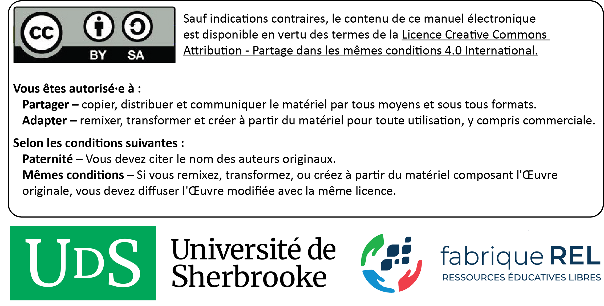
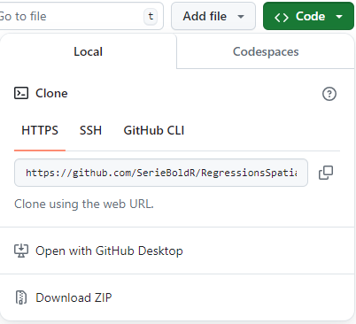

```{=tex}
\renewcommand{\partname}{} % Réinitialiser partie
```
**Résumé :** Ce livre vise à décrire une panoplie de méthodes de régression spatiale avec le logiciel ouvert R. La philosophie de ce livre est de donner toutes les clefs de compréhension et de mise en œuvre des méthodes abordées dans R. La présentation des méthodes est basée sur une approche compréhensive et intuitive plutôt que mathématique, sans pour autant négliger la rigueur statistique.

**Remerciements :** Ce manuel a été réalisé avec le soutien de la fabriqueREL. Fondée en 2019, la fabriqueREL est portée par divers établissements d'enseignement supérieur du Québec et agit en collaboration avec les services de soutien pédagogique et les bibliothèques. Son but est de faire des ressources éducatives libres (REL) le matériel privilégié en enseignement supérieur au Québec.

**Maquette de la page couverture et identité graphique du livre :** Andrés Henao Florez.

**Mise en page :** Philippe Apparicio et Marie-Hélène Gadbois Del Carpio.

**Révision linguistique :** Denise Latreille.

© Philippe Apparicio, Jean Dubé, Jérémy Gelb et Joan Carles Martori.

**Pour citer cet ouvrage :** Apparicio P., J. Dubé, J. Gelb et J. C. Martori (2025). *Méthodes de régression spatiale : un grand bol d'R*. Université Laval et Université de Sherbrooke. fabriqueREL. Licence CC BY-SA. <br /> <br />

{width="80%" fig-align="left"}

# Préface {.unnumbered}

## Un manuel sous la forme d'une ressource éducative libre {#sect001 .unnumbered}

**Pourquoi un manuel sous licence libre?**

Les logiciels libres sont aujourd'hui très répandus. Comparativement aux logiciels propriétaires, l'accès au code source permet à quiconque de l'utiliser, de le modifier, de le dupliquer et de le partager. Le logiciel R, dans lequel sont mises en œuvre les méthodes de régression spatiale décrites dans ce livre, est d'ailleurs à la fois un langage de programmation et un logiciel libre (sous la licence publique générale [GNU GPL2](https://fr.wikipedia.org/wiki/Licence_publique_g%C3%A9n%C3%A9rale_GNU)). Par analogie aux logiciels libres, il existe aussi des **ressources éducatives libres (REL)** « dont la licence accorde les permissions désignées par les 5R (**Retenir --- Réutiliser --- Réviser --- Remixer --- Redistribuer**) et donc permet nécessairement la modification » ([***fabriqueREL***](https://fabriquerel.org/rel/)). La licence de ce livre, CC BY-SA (@fig-Licence), permet donc de :

-   **Retenir**, c'est-à-dire télécharger et imprimer gratuitement le livre. Notez qu'il aurait été plutôt surprenant d'écrire un livre payant sur un logiciel libre et donc gratuit. Aussi, nous aurions été très embarrassés que des personnes étudiantes avec des ressources financières limitées doivent payer pour avoir accès au livre, sans pour autant savoir préalablement si le contenu est réellement adapté à leurs besoins.

-   **Réutiliser**, c'est-à-dire utiliser la totalité ou une section du livre sans limitation et sans compensation financière. Cela permet ainsi à d'autres personnes enseignantes de l'utiliser dans le cadre d'activités pédagogiques.

-   **Réviser**, c'est-à-dire modifier, adapter et traduire le contenu en fonction d'un besoin pédagogique précis puisqu'aucun manuel n'est parfait, tant s'en faut! Le livre a d'ailleurs été écrit intégralement dans R avec [Quarto](https://quarto.org/). Quiconque peut ainsi télécharger gratuitement le code source du livre sur [github](https://github.com/SerieBoldR/RegressionsSpatiales) et le modifier à sa guise (voir l'encadré intitulé *Suggestions d'adaptation du manuel*).

-   **Remixer**, c'est-à-dire « combiner la ressource avec d'autres ressources dont la licence le permet aussi pour créer une nouvelle ressource intégrée » ([***fabriqueREL***](https://fabriquerel.org/rel/)).

-   **Redistribuer**, c'est-à-dire distribuer, en totalité ou en partie le manuel ou une version révisée sur d'autres canaux que le site Web du livre (par exemple, sur le site Moodle de votre université ou en faire une version imprimée).

La licence de ce livre, CC BY-SA (@fig-Licence), oblige donc à :

-   Attribuer la paternité de l'auteur dans vos versions dérivées, ainsi qu'une mention concernant les grandes modifications apportées, en utilisant la formulation suivante : Apparicio Philippe et Jérémy Gelb (2024). *Méthodes d'analyses spatiales : un grand bol d'R*. Université de Sherbrooke. fabriqueREL. Licence CC BY-SA.

-   Utiliser la même licence ou une licence similaire à toutes versions dérivées.

{#fig-Licence width="80%" fig-align="center"}


::: bloc_astuce
::: bloc_astuce-header
::: bloc_astuce-icon
:::

**Suggestions d'adaptation du manuel**
:::

::: bloc_astuce-body
Pour chaque méthode d'analyse spatiale abordée dans le livre, une description détaillée et une mise en œuvre dans R sont disponibles. Par conséquent, plusieurs adaptations du manuel sont possibles :

-   Conserver uniquement les chapitres sur les méthodes ciblées dans votre cours.

-   En faire une version imprimée et la distribuer aux personnes étudiantes.

-   Modifier la description d'une ou de plusieurs méthodes en effectuant les mises à jour directement dans les chapitres.

-   Insérer ses propres jeux de données dans les sections intitulées *Mise en œuvre dans R*.

-   Modifier les tableaux et figures.

-   Ajouter une série d'exercices.

-   Modifier les quiz de révision.

-   Rédiger un nouveau chapitre.

-   Modifier des syntaxes R. Plusieurs *packages* R peuvent être utilisés pour mettre en œuvre telle ou telle méthode. Ces derniers évoluent aussi très vite et de nouveaux *packages* sont proposés fréquemment! Par conséquent, il peut être judicieux de modifier une syntaxe R du livre en fonction de ses habitudes de programmation dans R (utilisation d'autres *packages* que ceux utilisés dans le manuel par exemple) ou de bien mettre à jour une syntaxe à la suite de la parution d'un nouveau *package* plus performant ou intéressant.

-   Toute autre adaptation qui permet de répondre au mieux à un besoin pédagogique.
:::
:::

## Comment lire ce manuel? {#sect002 .unnumbered}

Le livre comprend plusieurs types de blocs de texte qui en facilitent la lecture.

::: bloc_package
::: bloc_package-header
::: bloc_package-icon
:::

**Bloc *packages***
:::

::: bloc_package-body
Habituellement localisé au début d'un chapitre, il comprend la liste des *packages* R utilisés pour un chapitre.
:::
:::

::: bloc_objectif
::: bloc_objectif-header
::: bloc_objectif-icon
:::
**Bloc objectif**
:::
::: bloc_objectif-body
Il comprend une description des objectifs d'un chapitre ou d'une section.
:::
:::

::: bloc_notes
::: bloc_notes-header
::: bloc_notes-icon
:::

**Bloc notes**
:::

::: bloc_notes-body
Il comprend une information secondaire sur une notion, une idée abordée dans une section.
:::
:::

::: bloc_aller_loin
::: bloc_aller_loin-header
::: bloc_aller_loin-icon
:::

**Bloc pour aller plus loin**
:::

::: bloc_aller_loin-body
Il comprend des références ou des extensions d'une méthode abordée dans une section.
:::
:::

::: bloc_astuce
::: bloc_astuce-header
::: bloc_astuce-icon
:::

**Bloc astuce**
:::

::: bloc_astuce-body
Il décrit un élément qui vous facilitera la vie : une propriété statistique, un *package*, une fonction, une syntaxe R.
:::
:::

::: bloc_attention
::: bloc_attention-header
::: bloc_attention-icon
:::

**Bloc attention**
:::

::: bloc_attention-body
Il comprend une notion ou un élément important à bien maîtriser.
:::
:::

::: bloc_exercice
::: bloc_exercice-header
::: bloc_exercice-icon
:::

**Bloc exercice**
:::

::: bloc_exercice-body
Il comprend un court exercice de révision à la fin de chaque chapitre.
:::
:::

## Comment utiliser les données du livre pour reproduire les exemples? {#sect003 .unnumbered}

Ce livre comprend des exemples détaillés et appliqués dans R pour chacune des méthodes abordées. Ces exemples se basent sur des jeux de données structurés et mis à disposition avec le livre. Ils sont disponibles sur le *repo github* dans le sous-dossier `data`, à l'adresse <https://github.com/SerieBoldR/RegressionsSpatiales/tree/main/data>.

Une autre option est de télécharger le *repo* complet du livre directement sur *github* (<https://github.com/SerieBoldR/RegressionsSpatiales>) en cliquant sur le bouton `Code`, puis le bouton `Download ZIP` (@fig-downloaffromgit). Les données se trouvent alors dans le sous-dossier nommé `data`.

{#fig-downloaffromgit width="40%" fig-align="center"}

## Liste des *packages* utilisés {#sect004 .unnumbered}

Dans ce livre, nous utilisons de nombreux *packages* R que vous pouvez installer avec le code ci-dessous.

```{r}
#| echo: true
#| eval: false
#| message: false
#| warning: false

# Liste des packages
ListePackages <- c("adespatial",  "car", "corrplot", "DHARMa", "dplyr", 
                   "future", "future.apply",  "GGally", "ggplot2",  "ggpubr", 
                   "GWmodel", "mcgv", "mgcViz", "mgwrsar", "plm", 
                   "RColorBrewer", "sf", "spatialreg", "spdep", "spgwr", 
                  "splm", "spmoran", "tmap") 
# Packages non installés dans la liste
PackagesNonInstalles <- ListePackages[!(ListePackages %in% installed.packages()[,"Package"])]
# Installation des packages manquants
if(length(new.packages)) install.packages(PackagesNonInstalles)
```


## Bref historique sur les modèles de régressions spatiales en économie et en géographie {#sect005 .unnumbered}

Depuis une cinquantaine d’années, les économistes et les géographes conçoivent et utilisent largement des méthodes de régression prenant en compte la dimension spatiale : modèles d'économétrie spatiale, régressions géographiquement pondérées, modèles généralisés additifs intégrant une dimension spatiale, modèles avec des vecteurs propres spatiaux, etc.

La notion d’autocorrélation spatiale, étroitement liée aux régressions spatiales, remonte à une période encore plus ancienne. Elle a été introduite notamment par les travaux de Patrick Moran, d’abord en 1948 puis en 1950, suivis par ceux de Robert Geary en 1954 et de Nathan Mantel en 1967 [@moran1948interpretation; @moran1950test; @geary1954contiguity; @mantel1967detection]. La formalisation des relations spatiales trouve son origine, plus précisément, dans la première loi de la géographie énoncée par Waldo Tobler qui stipule que « tout interagit avec tout, mais les objets proches ont plus de chance de le faire que les objets éloignés \[*Everything is related to everything else, but near things are more related than distant things*\] » [@tobler1970computer].


En économie, le terme « économétrie spatiale » a été utilisé pour la première fois par Jean Paelinck [-@paelinck1978spatial] à la fin des années 1970. Cependant, il est resté relativement peu exploité jusqu'aux travaux de Luc Anselin, qui publie en 1988 un ouvrage de référence sur le sujet intitulé *Spatial econometrics: methods and models* [@anselin1988]. Il faut néanmoins attendre le développement des outils informatiques avant de voir les applications affluées. Ainsi, au début des années 1990, l’économétrie spatiale a véritablement pris son essor (voir Anselin [-@anselin2010thirty] pour un historique détaillé). Depuis, ce domaine a gagné en importance, s’établissant presque comme un incontournable pour la prise en compte des effets spatiaux, mais aussi, et surtout, des fameux efforts de débordements (nous y reviendrons). Ces dernières décennies, plusieurs ouvrages traitant des modèles économétriques spatiaux ont été publiés, principalement en anglais [@anselin1995new; @anselin2013advances; @lesage2008introduction; @bivand2008applied; @anselin2014modern]. Ils méritent grandement d’être consultés, surtout celui de LeSage et Pace [-@lesage2008introduction]. Peu de références sont disponibles en français. Le livre de référence de Dubé et Legros [-@dube2014econometrie] constitue vraisemblablement une référence intéressante, notamment par la présentation vulgarisée des modèles et des concepts. 


En géographie, Daniel Griffith est certainement l’un des géographes les plus actifs dans le domaine des régressions spatiales, y allant de plusieurs propositions dans le but de contrôler pour la présence d’autocorrélation spatiale résiduelle. Ses premiers travaux remontent aux années 1980, et il a publié depuis un grand nombre d’ouvrages [notamment, @Griffith1988; @griffith2003spatial; @griffith2019spatial]. Puis, dans les années 1990, trois géographes – Stewart Fotheringham, Chris Brunsdon et Martin Charlton – ont introduit la régression géographiquement pondérée (GWR), une méthode permettant d’analyser localement les relations entre la variable dépendante et les variables indépendantes d'un modèle de régression [@stewart1996geography; @brunsdon1996geographically; @brunsdon1998spatial]. En 2003, la parution de leur ouvrage intitulé *Geographically weighted regression: the analysis of spatially varying relationships* [@fotheringham2003geographically] a largement contribué à la popularisation de cette méthode. Depuis, de nombreuses extensions de la GWR ont été proposées (nous y reviendrons).


## Structure du livre {#sect006 .unnumbered}

Depuis une cinquantaine d’années, les économètres, les épidémiologistes et les géographes conçoivent et utilisent largement des méthodes de régression prenant en compte la dimension spatiale, dont les principales sont présentées dans ce manuel. Ce dernier est structuré en cinq grandes sections.

**Partie 1. Notions de base.** Dans cette première partie, nous présentons les jeux de données utilisées pour mettre en œuvre les différentes méthodes de régression spatiale présentées dans le livre ([chapitre @sec-chap01]). Nous discutons aussi de plusieurs notions fondamentales et méthodes qu'il importe de bien maîtriser avant d'aborder les chapitres suivants consacrés aux méthodes de régression spatiale, notamment : l'autocorrélation spatiale (globale et locale), la notion de variable spatialement décalée et la régression linéaire multiple. Nous conclurons ce chapitre en exposant les raisons qui justifient l’utilisation de différentes formes de régressions spatiales pour modéliser des données spatiales ou spatiotemporelles. [chapitre @sec-chap02]

**Partie 2. Modèles d'économétrie spatiale**. Cette seconde partie est consacrée aux modèles d'économétrie spatiale qui vise à modéliser la **dépendance spatiale**. Dans le [chapitre @sec-chap02], nous décrivons ainsi les principaux modèles spatiaux autorégressifs qui permettent d'introduire l'autocorrélation spatiale sur les variables indépendantes (modèle SLX), la variable dépendante (SAR), sur le terme d'erreur (SEM), à la fois sur la variable dépendante et les variables indépendantes (SDM) ou à la fois sur le sur les variables indépendantes et sur le terme d’erreur (SDEM). Dans le [chapitre @sec-chap03], nous abordons une extension des modèles autorégressifs, soit les modèles spatiaux par panel qui permettent de modéliser des données spatiales longitudinales.


**Partie 3. Régressions géographiquement pondérées**. Dans cette partie, nous abordons les régressions géographiquement pondérées (GWR) qui permettent de modéliser l'**hétérogénéité spatiale**, soit l'instabilité des relations entre la variable dépendante et celles indépendantes. Premièrement, nous décrirons les formes dites classiques de la GWR qui s'appliquent à des variables dépendantes continues, dichotomiques (logistique) et de comptage (Poisson) ([chapitre @sec-chap04]). Deuxièmement, nous abordons des extensions des la GWR, particulièrement la GWR mixte, la GWR multiéchelle et les GWR mixtes avec des variables spatialement décalées (MGWR-SAR) ([chapitre @sec-chap05]).

**Partie 4. Autres modèles de régressions spatiales**. Cette quatrième et dernière partie comprend deux chapitres. Le [chapitre @sec-chap06] est consacré aux modèles généralisés additifs qui permettent d'introduire l’espace deux manières différentes : les modèles GAM avec une *spline* bivariée avec les coordonnées géographiques (x, y) pour capturer les variations continues dans l'espace; les modèles GAM avec un lissage par champ aléatoire de Markov (*random markov field* – RMF) pour modéliser la dépendance spatiale entre les unités spatiales voisines. Dans le [chapitre @sec-chap07], nous nous abordons les modèles linéaires généralisés avec des vecteurs spatiaux proposés par Daniel Griffith [-@fotheringham2003geographically; @griffith2019spatial].

## Remerciements {#sect007 .unnumbered}

De nombreuses personnes ont contribué à l'élaboration de ce manuel.

Ce projet a bénéficié du soutien pédagogique et financier de la [***fabriqueREL***](https://fabriquerel.org/) (ressources éducatives libres). Les différentes rencontres avec le comité de suivi nous ont permis de comprendre l'univers des ressources éducatives libres (REL) et notamment leurs [fameux 5R](https://fabriquerel.org/rel/) (Retenir --- Réutiliser --- Réviser --- Remixer --- Redistribuer), de mieux définir le besoin pédagogique visé par ce manuel, d'identifier des ressources pédagogiques et des outils pertinents pour son élaboration. Ainsi, nous remercions chaleureusement les membres de la *fabriqueREL* pour leur soutien inconditionnel :

-   Marianne Demers-Desmarais, bibliothécaire, Université Laval.

-   Julie-Christine Gagné, conseillère en pédagogie universitaire, Université Laval.

-   Claude Potvin, conseiller pédagogique à la fabriqueREL, Université Laval.

-   Nadia Villeuneuve, bibliothécaire, Université Laval.


À MODIFIER PLUS TARD.
Nous remercions aussi les membres du comité de révision pour leurs commentaires et suggestions très constructifs. Ce comité est composé de quatre personnes étudiantes du [Département de géomatique appliquée](https://www.usherbrooke.ca/geomatique/) de l'[Université de Sherbrooke](https://www.usherbrooke.ca/) :

-  À modifier, personnes étudiantes à la [maîtrise en géomatique appliquée et télédétection (type recherche)](https://www.usherbrooke.ca/geomatique/etudes/programmes/2e-cycle/maitrise-en-geomatique-appliquee-et-teledetection-type-recherche).

-   À modifier, étudiante à la maîtrise [en géomatique appliquée et télédétection](https://www.usherbrooke.ca/admission/programme/622/maitrise-en-geomatique-appliquee-et-teledetection/).

-   Marie-Hélène Gadbois Del Carpio, étudiante à la maîtrise [en géomatique appliquée et télédétection](https://www.usherbrooke.ca/admission/programme/622/maitrise-en-geomatique-appliquee-et-teledetection/) a participé activement à la mise en page du manuel; elle est désormais une grande spécialiste des feuilles de style en cascade (CSS) et de Quarto.

Finalement, nous remercions Denise Latreille, réviseure linguistique et chargée de cours à l'Université Sherbrooke, pour la révision du manuel.

```{r}
#| echo: false
#| eval: true
#| message: false
#| warning: false

# Chargement des fonctions supplémentaires
source("code_complementaire/QuizzFunctions.R")
```
